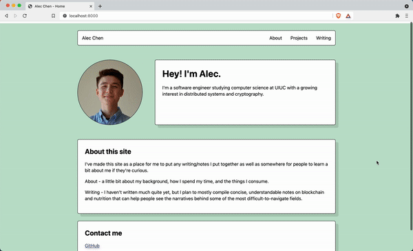
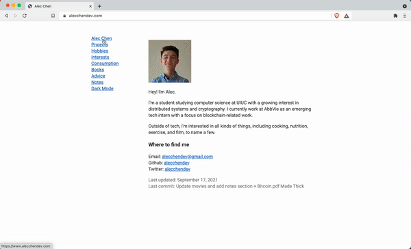
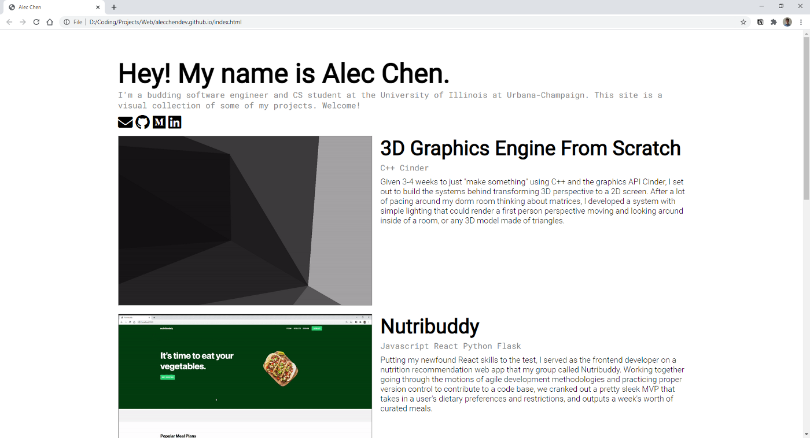

# alecchendev.github.io
A simple personal website that people can check out if they want to learn more about me.

### V5.5

### V5

### V4

### V3
...

### V2

### V1

Article on the process of making the first version: https://medium.com/swlh/building-a-personal-coding-portfolio-website-60ccc6137f3?sk=b3b77ab2ea1d144e32b017093f374f4b