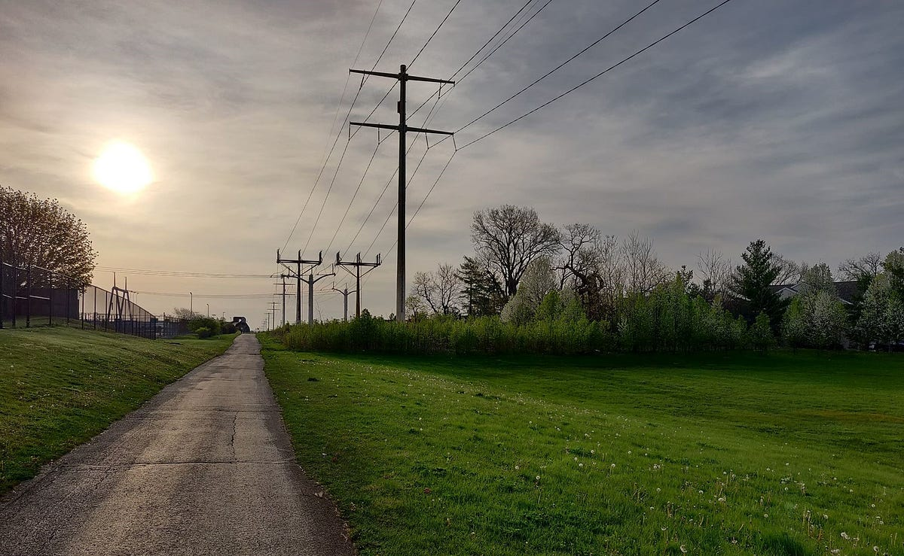

### 9pm

The night before, I started getting ready for bed earlier than normal. I usually sleep around 12, however I was participating in Google Code Jam Round 1C, which would start at 4am in my time zone.

### 4am

I didn’t sleep super well; I got up a few times, but when it came to actually waking up for the competition, I felt wide awake.

### 7am

By the time the contest finished, light had started to leak in through the blinds onto my desk. I usually exercise first thing in the morning, so I get a drink of water and go on a run.

Pro tip: Get up within an hour of sunrise to take pictures. I don’t actually know much about photography, but at this time the sun casts a somewhat soft light on everything from a distinct direction, and I imagine this allows for more purposeful lighting. Also, there’s no one around.

I ran much farther than I normally do, this time naturally embracing the journey of running itself, rather than telling myself to do so. The barren quiet of the pathway and the soft light of the early morning made just being outside so pleasant. I usually focus on my music while I run, but it faded away and blended into the ambient sounds of nature around me.

Eventually I become worn with fatigue and stop at a scene that looks like cover art for a fantasy book. The blacktop path swerved subtly into the vertical arch of a short bridge that traversed a stream running from a wide lake to the right. The surrounding plant life was perfect, and while sitting down on a bench overlooking the water, I saw wildlife that was completely foreign to me. A white swan, another swan or goose with an exotic pattern, and a crow with glossy black feathers and a red accent towards its head. It felt like a depiction of the afterlife.

I sat for a while, partly because everything was so serene, and partly because I was tired. The whole setting was euphoric, and it made it refreshing just to be. Even something as ordinary as a man walking two black labs felt surreal.

I eventually ruined it by trying to take a panorama and failing, but it was nice for those brief 10–15 minutes, and I headed back having experienced something new.

### 8am

I took a refreshing cold shower, and put on an outfit I’d been looking forward to wearing for a couple days. I prepared breakfast and sat down at my desk to enjoy it while watching an episode of my favorite show. Losing track of time, I started another programming contest 18 minutes late, but performed better than I usually do. Before I could continue my day, a friend messaged me to try out a new biking path.

### 12pm

We got a bit lost, or as lost as you can get with a map in your pocket, and we stumbled upon places we’d never seen before, and none of them were more than a couple miles from where we’ve grown up.

There was a stable with horses sauntering around, and it was just crazy to see with my own eyes. They were these enormous masses of muscle walking on bones and skin. One of them had some sort of harness covering its eyes and ears, but it walked around nibbling at dirt and grass just like the others. There was a large wooden building next to the stable, and it just posed the notion of a life so different from our own.

After crossing some train tracks, we arrived at a ton of propane tanks behind a fence next to this building labeled AmeriGas. It felt like fiction. It was a small home, the design and condition of which resembled two motel rooms joined together, compounded with a brick one story unit. To us it, this building was from a time long passed, having been surrounded by the same suburban homes, restaurants, and facilities for the majority of our lives.

I recognized a lot of the places we went, but very vaguely, and I realized how much of a bubble I’ve been in, not only with regards to the places I visit, but also to the extent to which I engage with my surroundings when I travel places. The difference between biking along a path amidst these places and passing them by in a car is illuminating. My friend and I, about a year and half ago, took a road trip down three hours south of our area, and were awestruck driving through acres of desolate farmland. We imagined it again crossing it on bike. As we returned, our conversation spiraled, and we talked about the many things in life that are beyond the scope of our imagination. The sinking sense of isolation and void in space, the historic domestication and manipulation of animals for warfare, revolutionary breakthroughs in transportation like flight and locomotives, and other concepts and human milestones that we take for granted in our lives.

### 3pm

I had left just before lunch, so I was extremely hungry by the time I returned home. I finished off leftovers from dinner the day before and from lunch that day, and went to lie down having diminished much of my physical energy.

### 5pm

I woke up an hour later, dehydrated and fatigued. By now it was dinner time for the rest of my family, and so I ate with them for a bit before sitting down to write this.

### Closing Remarks

I ended up being awake for almost 20 hours that day, and by the end of it, morning felt days away. I was exhausted, but it was good-exhausted. I’d not only exerted myself physically, but also experienced things that I hadn’t before.

I find that there’s value in reminiscing in a day, especially a long one like this. It puts things in perspective and helps me make sense of everything. If I can just understand my life each day that I live it, I feel that I’ll get more out of it.

On this day, I woke up early. I felt the sun rise while engaging in work that excites me. I ran more than I ever have before, and relearned the joys of serenity. I biked with a friend and saw places hidden in plain sight. We talked about everything in the world that we never really wrapped our heads around. I indulged in some much needed rest, and spent some time with my family. I enveloped my experiences in an article, and looked forward to looking back on this day.
