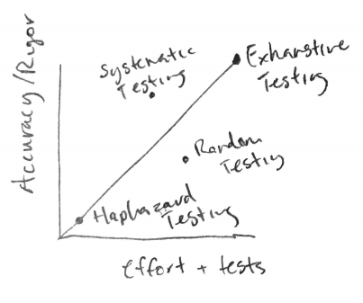

As software engineers, we want to write code that not only works, but works in every possible situation a user could find themselves in. Under any circumstance, we want our code to run the way we designed it to run, or at the very least communicate clearly what went wrong.

Enter *testing*.

Testing is the way we test our programs. Simple. The concept alone may be intuitive, but there’s a bit more nuance to how we design tests effectively and efficiently.

The great conflict of testing is that

1.  Everyone wants their code to work.
2.  No one wants to write tests to ensure their code works.

To wiggle their way out of this dilemma, software engineers devised methods so that they could rigorously derive as much confidence in their programs as possible whilst consuming the least amount of energy.

The way I think of it, we have a spectrum of tests starting with the most effort and the most confidence in our code working, to very little effort and less confidence in our testing. We want to make tests intelligently so we can fall above the line, so we are getting enough confidence in our program with the least amount of effort.



Before software engineers got to **systematic testing**, I imagine they went through something similar to the following intuition:

“Let’s just run our program and see if it works.” This is known as haphazard testing. When things started getting rough because they were ensuring little to no accuracy in their programs, they thought of something else.

“What if we tested *everything*?” This is called exhaustive testing. I made sure to say “what if” at the beginning because even if we were to just test a simple addition function exhaustively…

``` graf
def add(a, b):
    return a + b
```

We would have to test for 2⁶⁴ cases because there are a lot of integers. That’s just for a simple addition function, so you can imagine why they wouldn’t want to continue with this approach.

Sometime after this, they worked through many different approaches, one of which was random testing. This was an attempt to automate test creation by testing cases randomly and hopefully covering all the important bases. Of course, as you can tell, this was not sustainable, because many important cases, including boundary cases which I’ll talk more about later, can easily be skipped over when testing randomly. This is not to mention just the sheer lack of confidence that comes from not writing the tests yourself.

### Systematic testing

So eventually we arrived at systematic testing. With systematic testing, we write the tests ourselves, but we design them with intention so that they meet a set of three criteria. We want our test suite to be

1.  Correct. They should not only compile and run properly, but they should isolate and evaluate a single function output with accuracy.
2.  Thorough. The test suite should cover the entire input space, with the input space being anything that your user or program could input into a given function.
3.  Small. Refer to the great conflict of testing. No one wants to write tests, so we try to design them so that we can ensure quality and coverage whilst avoiding unnecessary tests. Also, they will be faster to run and easier to update, making testing easier going forward.

### **How to write tests**

So you understand what makes a good, systematic test suite, and you understand the importance of doing so, but how do you actually write them?

You want to be brutal.

As a test suite designer, your life is pretty rough, and you basically want to take it all out on the program. You want to make it fail as fast as you can, and you do this by poking at its insecurities. These insecurities, unlike a person’s, can be fixed with relative ease, but only if you write effective tests. Tests, in the end, are there to ensure functionality if your program passes, and make it easy to find what went wrong if your program fails.

For actually coming up with tests, you want to start with your input space. To cover the input space in an efficient manner, it’s easiest to divide it into subdomains where the program acts similarly among every input in the subdomain. Then you can write a single test for each subdomain and cover the whole input space. But don’t forget, that your input space also includes boundary/edge cases. These are the special cases in your program that often occur with null or empty values, first and last elements of lists, and other “boundaries” between spaces. Although they cover much smaller sections of your input space, they are just as important.

### **Black box vs. glass box testing**

It sounds simple to just cover the input space, but sometimes there is a bit of ambiguity in what that exactly means. In my first assignment in my software design class, we were given the task of testing and implementing a tic tac toe board evaluator. Some of the test cases included testing whether it correctly evaluated a win for X, a win for O, a draw, etc.


However, when it came time to test some of these things, I had I needed to test if it recognized a win in any row, and I was tasked with the decision as to whether I should write a test to ensure it checked every row, or just a single test evaluating a single arbitrary row. In a relatively small project like this, it is not much work to write a couple more tests to ensure accuracy, but it becomes trickier the larger and more complicated real software can be.

This is where it’s helpful to understand the distinction between black box and glass box testing.

Black box testing is writing tests without knowing how the function is implemented. This means you can’t use shortcuts to test different conditions in your function, and so it usually ends up with more tests. It also means that if you or another developer changes the function in the future, that the tests will need little to no changes to still ensure accuracy across the input space.

In an ideal world, we could seamlessly integrate black box testing for all of our testing needs, but in reality, it usually is more of a combination between black box, and glass box testing.

With glass box testing, you can see through the glass and into how your function works. In my tic tac toe example, I knew that my program looped through every row, and so I didn’t end up writing extra tests for each row. But if someone were to change the implementation because it was faster or more efficient somehow to check rows manually, then having a test for each row would have been valuable.

Glass box testing isn’t all bad. It allows you to more intentionally poke at specific areas and often more efficiently write tests for your code. It just also comes at the tradeoff of being less sustainable for changes in the implementation.

In the end, it’s up to you as the developer to read the situation and determine what is most valuable for your software.

### **Test-first programming**

With testing, it is most effective to design your functions and write the tests and specifications for your functions before implementing them. Going about the development process in this order or writing the spec, test, then implementation is referred to as test-first programming, and it prevents a lot of stress and frustration while debugging down the line.

Through this process, you can isolate functions and ensure accuracy along the way, so in the future when something goes wrong, you don’t have to think about if any of these many previous functions have problems. It makes debugging much easier, and as a system overall it keeps the development process more organized and intentional.

In a simple project like my tic tac toe board evaluator, test-first programming sounds like a brilliant and elegant software development practice, but when the school year picks up and things get more complex, it becomes more and more tempting to save tests for last.

#### My experience with test-last programming

In my most recent assignment in my software design class, I did what I call test-*last* programming. And although most of the time I could understand whether my code worked by haphazardly testing some cases while running it, I ended up redesigning and reimplementing significant portions of the program several times. Not only did this take tons of extra time, but as I rewrote my program for the third time, I had lost my excitement and enthusiasm I originally had for the assignment. I’d set myself up for disaster by not implementing good software practices and I was facing the consequences.

Test-first programming means that you design and write the specs for each function of the program from the beginning, so you get a thorough picture of how everything will work together, and you get it all out of your brain and into your program. Through this, you can catch design problems early on, and not need to waste energy rethinking and questioning fundamental aspects of your program.

Here, test-first programming wouldn’t have helped me out explicitly through the design of my tests, but by thinking about development with a testing mindset, I could have served myself better in the long term development process.

While in the midst of some deep, focused programming and in living life in general we will always be subject to unexpected problems, but through test-first programming, when we need water, we can focus on fixing the shower without worrying about broken pipes.
