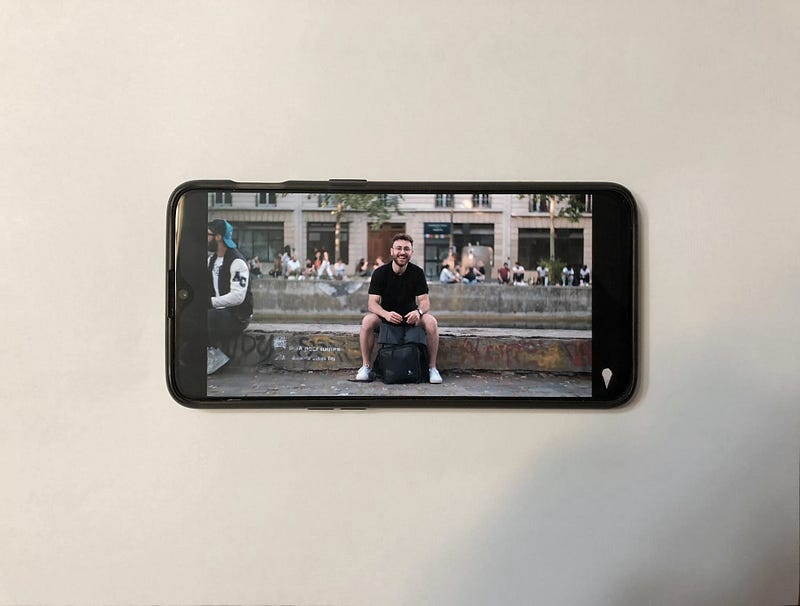

A friend asked me recently, *what force has influenced you the most?* If you had to point to the single greatest influence as to who you are today, what would you point to?

I answered with “content creators.”

I know for most people, watching tons of YouTube videos or browsing other social media sites doesn’t really have a positive impact on them, and it didn’t for me for a long time. But in the past year, the way I consume content has become something that I really appreciate and it’s ultimately contributed to a lot of positive change in my life.

My first step was becoming aware of how the content I consume impacts me.

### The Role of Content in Our Lives

No matter who you are, if you have access to the internet, you probably consume a fairly high amount of content each day.

The transition to shorter form content has been happening for a while now. We’ve gone from books to articles, from movies to TV shows, and now from articles to tweets, and TV shows to YouTube videos. This transition has made it much easier to integrate regular content consumption into our day-to-day lives. Before we might’ve watched some movies on the weekend, or read a book throughout several days or weeks, but now, I watch several YouTube videos every day, multiple times per day. We’re not just consuming more in general, but more consistently too. So it comes as no surprise that whether it’s positive or negative, content is playing a much larger role in our lives.

> “The people don’t just make the content, they *are* the content.”

Media has not only changed in its form, but also in the type of content. People used to read books and watch movies with titles and subjects that were of specific interest to them. If the material was created by a well-known author, director, or cast, that would add credibility and make it more likely for someone to watch or read it, but it was still ultimately about the content. Now, the majority of the content people consume is curated by the **people** they choose to get content from. We follow people; we subscribe to people. We don’t *really* subscribe to content anymore. And now, whether or not I’m particularly interested in a certain video doesn’t matter nearly as much; I usually watch something because I like the creator. The content, or at least how people choose the content they consume, has become more focused on the identity of the creator. And as content shifts toward revolving around people’s lives — that is, the increase in self-improvement, lifestyle, blogging/vlogging, and productivity content — the people don’t just make the content, they *are* the content.

This idea is nothing new. There has been extensive discussion in the business world on how to capitalize on this phenomenon, by the likes of people like Gary Vanderchuck and concepts like “1000 true fans,” that talk about building businesses and making money from your personal following. And if you spend any time watching YouTube, you’ve seen Squarespace, Audible, Skillshare, and other companies stockpiling sponsorships for influential creators.

Although businesses and creators may have already noticed and adapted to this change, the average consumer has not. And the way that we adapt to this change is different than how businesses do because of the way we’re specifically impacted.

The whole premise of these platforms is that they’re *social* media, and so for platforms like YouTube, where a lot of people are actually just sitting or standing in front of a camera talking to us, consuming content can feel less like watching a video and more like spending time with someone. It’s become more than just entertainment. We spend several hours or more each week consuming content, and for all that time that we spend, the people we consume will start to influence us similar to how real people in our lives would.

This idea, that **consuming content is like spending time with people** was fundamental in me finding more value in my content.

### Changing the Way You Consume Content

There are a few simple, actionable steps that have helped me change the way I consume content. A lot of the ideas I talk about were most beneficial to me when applied to self-improvement and productivity content, but they still apply to content consumption in general.

#### Shift your mindset

The most important step towards changing the way you consume content is to start looking at content creators as though they are people in your life. If they play a similar role to people you spend time with, you should see them similarly.

So when it comes to choosing these people, choose content creators like you would friends. Except for this time you can choose from the millions of people on the platform, and you have no obligation to hang out with them if you don’t want to anymore. The only catch is that they’ll try to sell you stuff from time to time.

These people now take up a significant portion of your time, so I would suggest choosing people that you genuinely appreciate in some way. For creators that make self-development and lifestyle content, I look for people with traits that I value in myself, as these people’s personalities are going to have a passive influence on mine. And although this genre of content has the largest influence on my life, I still consume content for entertainment purposes, and for those creators, I genuinely appreciate them for things like their style, storytelling, and humor.

#### Engage with the content (creator)

When you spend time with someone, you pay attention to them, right? You don’t just sit there aimlessly, half-listening to what they’re saying. You shouldn’t with content creators either, although many of us do.

Actively engage with the content you consume. It’s okay to have something playing in the background and zone out if that’s what you intend to do, but if not, you should get something out of the content. Sometimes if I’m watching self-improvement or productivity content, and I watch, read, or hear something that resonates with me, I’ll try to write it down. But actively engaging with content can be as simple as just paying more attention to what you’re watching. For TV shows, I try my best to stay attentive and think about what’s happening. I find that as long as I do something to engage with what I’m consuming, I get more out of it, whether that be more easily implementing lessons I learn into my life, or feeling more fulfilled from a connection to a story or joke.

#### Consume in moderation

Even if you have found content creators that you genuinely appreciate, and you’re actively engaging with the content you enjoy, still remember, *everything in moderation*. There are tons of tips and tricks people use to help them limit their consumption, but there are other quality articles and videos that do a much better job than I could at explaining them, so I’ll just recommend checking out <a href="https://www.youtube.com/playlist?list=PL-Saq7phAGKLhdPGxxut4U7JmfNpzYVYy" class="markup--anchor markup--p-anchor" data-href="https://www.youtube.com/playlist?list=PL-Saq7phAGKLhdPGxxut4U7JmfNpzYVYy" rel="noopener" target="_blank">this YouTube playlist</a> on digital minimalism, by one of my favorite creators, Nathaniel Drew.

All of these ideas fall under a broader idea of **living intentionally**. Curate your content purposefully, actively engage with it, and be mindful of the role it plays in your life. If you consume content with intention, you will do all these things subconsciously.

As always, this is just an article on the internet, so take what you want and apply it to your own life, whether that be all or none of it. And I hope this can help you find a way for content to bring as much value to your life as it has for mine.
