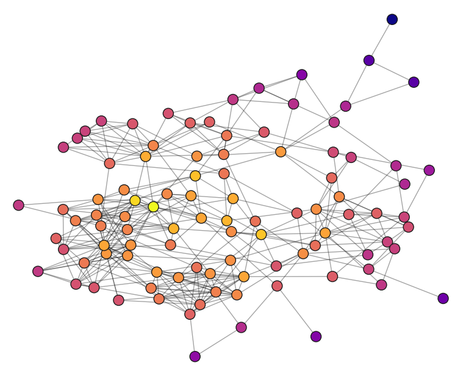

Around this time of year, seniors would usually be following in our previous upperclassmen’s footsteps and spending time with lots of people — especially those we’ve never reached out to before. And by the end of all of it, people might say we had a lot of “class unity.”

Besides that never happening, I personally have never been super optimistic about my class’s connectedness, but data has told me otherwise.

Also around this time of year, our school newspaper surveys the seniors and puts together a collection of articles, excerpts, and other information about them. Using data gathered from this survey, I’ve looked at my class’s social network, and broken it down into all kinds of different aspects, from how many friends we have to how clustered we are, to get to some closure on this whole class unity thing. This is what I found.

Although this will be more interesting to students and alumni of this school, I think there is still insight to be gathered from looking at this case, as it is one of many social microcosms around the world.

And for reference, I went to Illinois Mathematics and Science Academy (IMSA), a STEM-focused residential high school in Aurora, Illinois.

#### **Disclaimer**

Before getting into it, there are some things you should know about the data, and what it means for the rest of the article.

The data was collected through a survey that had just over 100 responses. With a bit more than 200 people in the senior class, this means this is a sample size of about 50 percent, which in most analysis would be fantastic, and certainly representative of the population; however for network analysis, the minimum sufficient sample size is currently inconclusive. It depends on what’s being measured, along with the structure of the whole network, which I don’t have. So for all of the conclusions I draw in this article, I am not saying them with full confidence, but just that this is what I found from what I received, so take everything with a very moderately sized grain of salt.

There are some characteristics that, given this form of sampling, tend to be over or underestimated, so I will try to make a note of it when necessary.

#### **Methods**

You don’t need to read the following about how the data was collected and handled, however it provides some helpful context and might answer some questions.

For collecting the data, participants were asked to list people who they considered close friends, and only people that also gave responses were included in the analysis. This does mean that some people whose majority of friends did not respond to the form have very few connections in this network. Although the numbers for these people will be inaccurate to real life, there were not many cases of this, so it doesn’t impact the overall results significantly.

All connections, mutual and non-mutual, were considered the same. This does cause some inconsistency, however, as far as I know there was no way for me to fully accommodate for this, so it’s another thing to keep in mind while reading.

Spelling errors were corrected using a program and all names were anonymized so I didn’t look at the responses except to debug for spell correction. Also I don’t really care.

Without further adieu, let’s get into it.

### **Part 1: Did someone say…class unity?**

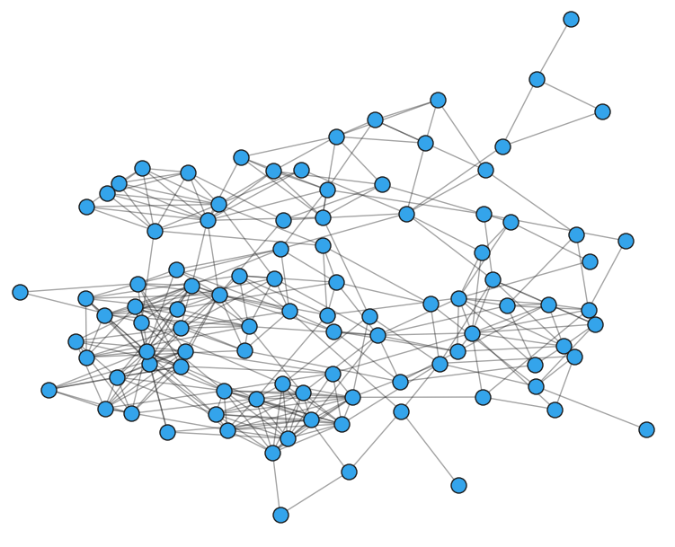

This is us. Each circle, called a node, represents one senior in the network. Each line, also known as an edge, expresses friendships between each pair of seniors.

Besides just a general big picture of our connections, it doesn’t tell us much. You could say there are a couple clumps, or that everyone in the network is connected somehow, but there’s a lot more to it than just what it looks like.

#### **Degree**

Starting off simple, we can look at purely how many friends people tend to have. The metric for this is called the degree, and it represents how many edges a node has, but for our sake it just means the number of friends someone has.

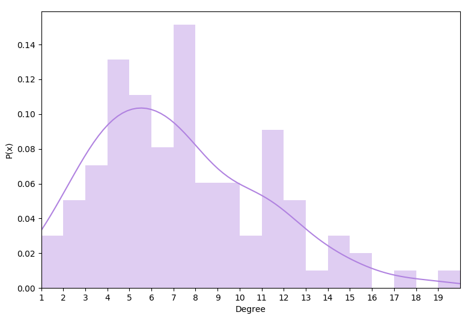

This is the distribution of degree. It shows how many people have a certain number of friends. It represents this as the probability (P(x)) of having x number of friends. Another way you can think about it is the percentage of people who have x number of friends, so you could say from this data that about 11 percent of people had 5 friends. The kernel density estimate (KDE) shows the same thing, but as a continuous function.

You can see that many people tend to have somewhere between 4 and 7 friends, with the average number of friends being 7.3. As interesting as this is, the shape of the distribution tells us a lot more about our unity. Let’s say we had somewhere between a uniform (flat curve) and bimodal (two peaks) distribution, it would mean that there’s a group of people that have significantly more friends than others, showing a divide between the “popular kids” and everyone else. The shape of the distribution of our network comes out to be closer to a normal distribution, which is great. It means everyone is on pretty equal playing ground socially, that there isn’t any really rigid social hierarchy.

It’s worth noting that there’s a large accumulation at 11–12 connections, but I would say this is somewhat negligible. The KDE is a better approximation for what we’re interpreting, as the real distribution is subject to the volatility that comes with the small amount of values available.

#### **Clustering**

This next statistic is known as clustering, or the clustering coefficient. It represents the tendency for nodes (people) to cluster together. It equates to the probability that a given node’s adjacent nodes are connected, which is how likely any two of a person’s friends are friends. You can think of it as how many friendships — between one person’s friends — exist out of how many could possibly exist.

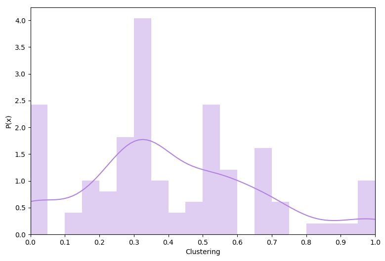

This distribution shows how many people cluster in different amounts. If you’re wondering why some y values can be greater than 1, check out this article:

<a href="https://towardsdatascience.com/pdf-is-not-a-probability-5a4b8a5d9531" class="markup--anchor markup--mixtapeEmbed-anchor" data-href="https://towardsdatascience.com/pdf-is-not-a-probability-5a4b8a5d9531" title="https://towardsdatascience.com/pdf-is-not-a-probability-5a4b8a5d9531"><strong>PDF is not a probability.</strong>  <em>The probability density at x can be greater than one but then, how can it integrate to one?</em>towardsdatascience.com</a>

Otherwise, just know that the shape is no different than the probability, so when comparing and interpreting you can treat it very similarly to the previous graph. The KDE curve once again shows the continuous estimate for this distribution. Unlike the previous graph, this acts similar to a traditional histogram, where the frequency corresponds to a range of values. So if we’re reading the bar from 0.5 to 0.55 on the x axis, it shows the portion of people that their friends have a 50 to 55 percent likelihood of being friends.

This one is a bit more all over the place. It’s got a lot of variance, which means that there are many different structures of friend groups in our class. One significant interval, from 0.3 to 0.35, shows that for many people, out of all the possible friendships between their friends, about 30 to 35 percent of them exist.

The fact that more people lean towards lower clustering values can mean a couple of things. If we are all in really distinct friend groups, then it means there are some shifty dynamics amongst ourselves, but if we’re not — which is much more likely the case at least to some degree — it means that we are spread out socially. We are friends with people outside our groups, the people who are less likely to be friends with our other friends. Even though there are many people who don’t fall into this category, it still shows that we tend not to isolate ourselves within our groups, rather that many of us across campus are “united” with each other to some extent.

#### **Degrees of Separation**

There is a well-known concept from Malcolm Gladwell’s *The Tipping Point* that states that everyone in the world is at most 6 connections away from everyone else. On top of that, he claimed that

> “Six degrees of separation doesn’t \[just\] mean that everyone is linked to everyone else in just six steps. It means that a very small number of people are linked to everyone else in a few steps, and the rest of us are linked to the world through those special few.”

Maybe this applies to the rest of the world, or to film and other industries, but does it apply here?

Well first, the senior class has a lot less people than the entire world, so the degrees of separation between all of us is generally much lower.

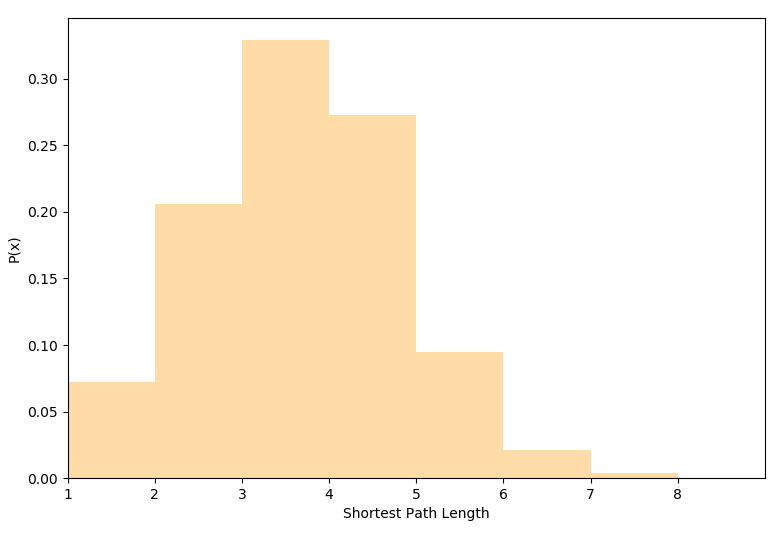

This idea of degrees of separation is equivalent to the shortest path between two people. The average path length for our class comes out to be 3.2, so most people are generally within 3 degrees of separation of each other. And to clarify this a bit, three degrees of separation would mean that the shortest path of friends between a person and another person is 3 steps. That is, one person is friends with another person, who’s friends with another person, who’s friends with the last person. And if you look closely at other values, you’ll see that on average, 20 percent of people are just one friend away. That’s crazy to think how close so many people are to each other. You want to meet someone? Well there’s about a 1 in 5 chance that you know someone that could introduce you.

So, does what Gladwell said apply to my school? Are there a few people in the senior class that link everyone together?

I would show the distribution of another metric, but the short answer is no. Betweenness centrality represents the proportion of how many shortest paths a certain node is on, or also the proportion of pairs someone helps connect. So if there were some people with very high betweenness centralities, we could say maybe Gladwell’s idea is true at my school, but it isn’t. Although there were a few people with higher values than others, none of them exceeded 0.15, so there really aren’t any of those super connecting people.

3 steps is not incredibly close, but it’s not far either, and a decent amount of people are even closer than that. And the fact that there aren’t any very connecting people means that there are no large separate groups to have bridges between. Our class is one solid unit in this way.

#### **Mutuality**

As I said earlier, for all my analysis, I considered mutual and non-mutual connections to be equally valid in this network. Putting that aside for a moment, we can look at the mutuality of our connections to help answer this whole question of class unity.

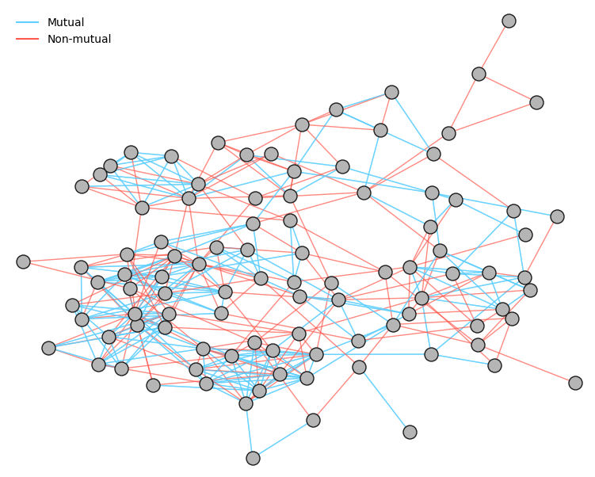

Our overall mutuality came out to be 68.0 percent, meaning 68 percent of the connections in this graph are mutual.

Now before you start looking at all the red lines, and thinking about the other 32 percent, I want to note that this is one of the major areas of inconsistency in the data, and many of the non-mutual connections are likely due to such. This mutuality is more of a reflection of the mismatch between how people decide who to note *in this survey* and the varying levels of friendship with people than the actual mutuality of our network. Originally I wanted to visualize this to see if there were more or less mutual connections in clusters, but honestly there are so many connections I can’t really tell. I still decided to include this because I thought that given everything I said, I think 68 percent is pretty good.

It could mean absolutely nothing, but I’d say this is another point for class unity!

#### **Gender**

Let’s revisit our network graphic.

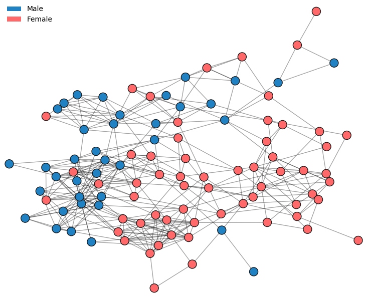

The way this visualization works can tell us about an apparent gender divide. It determines the positions of the nodes by assigning them a fixed mass, and treating the edges like springs, and it stops at equilibrium. This means that generally the more connected a group of nodes are, the closer they are in the visualization.

In this graph, the bottom right half has a significant majority of girls, and the other half includes mostly guys. The fact that it’s visualized this way shows that there is somewhat of a divide. Even if there are many connections between the two groups, there are many more within each group. This makes a lot of sense, and it’s not necessarily a good or bad thing. What’s interesting is that there are a lot more girls that are on the other side of the visual as compared to guys, meaning it’s more likely for a girl in this network to have more friends of the opposite gender.

The other aspect to mention is that this network has more girls and guys, at about a 6:4 ratio. I don’t know the actual breakdown of the entire class, but this large of an imbalance seems unlikely. This may have led to an emphasized effect of clumping amongst the genders but not by a significant margin.

#### **Part 1 Conclusion**

Either from upperclassmen influence, or comparing ourselves to others, I personally had always been under the impression that our class lacked unity. But even if we aren’t as united as some other classes, we certainly have some degree of unity. With a diverse spread of connections across campus, we’ve closed the distance between any two seniors. Our class doesn’t fall into the stereotypical high school social hierarchy, and we aren’t dependent on a few people to bridge any gaps between groups. From what I can tell, we’re more connected than not.

### **Part 2: What goes into two people being friends?**

We might be connected as a whole, but there’s a bit more to the story. What makes the social landscape of IMSA so unique is that we live in 7 residential buildings all with their own dynamics and people. There are a lot of circumstances that go into who we end up friends with, along with how our different living situations can influence it. This is some of the data to show it.

#### **Probability**

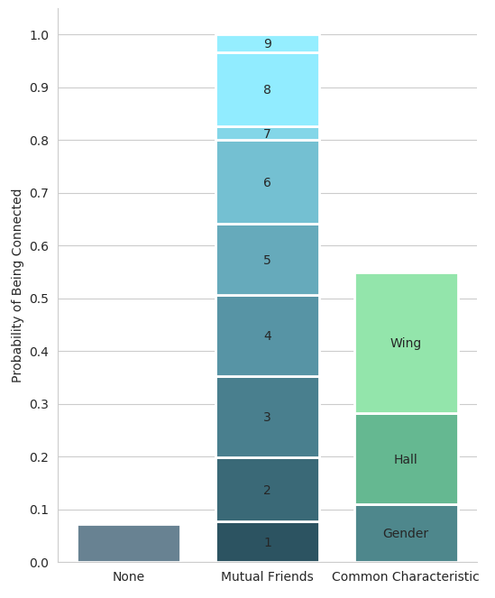

This graph shows the probability of two people being friends given they share certain characteristics. The probability of each category is not equal to its area, but its total height.

The left-most bar represents our class’s density. This is the proportion of how many connections there are out of how many there could be. It’s also the probability of any two people being friends, and it comes out to be about 7.3 percent. This is the equivalent of having a 1 in 14 chance of being friends with anybody else in the network. This aspect of the network is likely a bit of an overestimate.

If anything, this chart really shows the significance of living situations. Either that, or we’ve converged to living with our friends — or some combination of the two. You are almost 4 times as likely to be friends with someone if you live in the same hall, and twice as likely as that if you live in the same wing.

Although there’s not a lot of data for having many mutual friends, the rate that the probability increases with each mutual friend is very close to being linear. With no diminishing returns, at least up to 6 mutual friends, this means that there is a compounding effect in the likelihood of being friends with someone. When you’re more likely to be friends with someone in your hall, then having that connection will increase the chances of being friends with one of their friends, who is also more likely to be in your hall, and so on. And after 5 times of that, it only continues to increase the chances. The result of this will become more apparent later on.

These probabilities play a large role in who our friends are. This visual shows the percentage of our friends that each category makes up.

To put this into perspective, let’s take the average number of friends, being roughly 7, and look at what this comes out to be.

For the average senior, 5 out of 7 of their friends will be the same gender as them, 4 of which will live in their hall, and 2 of which will live in their wing. Then the remaining 2 of 7 will be of the opposite gender. And it might shift around by 1 person at least for people in 01 for when hall does not entirely overlap with gender.

It’s interesting to see that about 60 percent of our friends, among seniors, come from only one-seventh of the campus. Of course this would likely change a lot if more people or underclassmen were included, but it puts into perspective a part of our social nature at my school. It’s another instance in our lives that somewhat aligns with the Pareto principle, or the 80–20 rule, where it’s said that 80 percent of effects come from 20 percent of causes.

So we see the difference it makes to share similar living situations, but what about amongst those living situations? Differences between the halls is often a subject of discussion and source of stereotypes among students, however it’s never been backed up empirically until now.

#### **Halls**

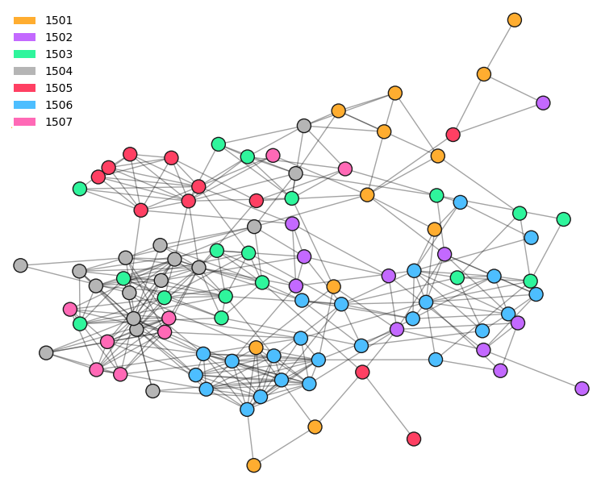

Color coded by the halls’ clash colors for this year, this visual can give you an idea of some actual groups and trends. For reference, clash is an annual competition amongst the halls in various creative pursuits and each hall is assigned a different color. Each hall is addressed by its number or colloquially by its last two digits, starting at 1501 (01) and ending at 1507 (07). 02, 03, and 06 are girls halls, 04, 05, and 07 are boys halls, and 01 is co-ed.

Just from this, I would say there is a relatively decent spread of halls’ connections across campus. There are a few significant clusters of 06, 07, 04, and 05, on the left side, but all halls have nodes separate from those clusters.

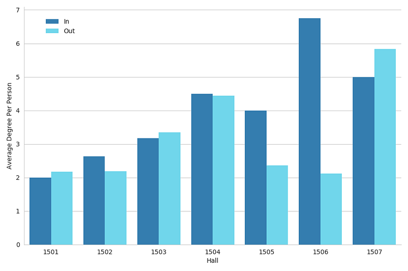

These are the average amounts of connections a person has inside and outside their hall, by hall. Not only this, but the sum of the two bars is the average amount of friends per person for each hall.

The first thing we can see is that a hall’s image is far from the truth. 01, 03, and 07, all halls that are often regarded as being either more studious or self-contained, were the only halls where people had more connections outside of their halls than inside.

And I can’t go on without mentioning the sheer abundance of connections that 06 has within itself. This doesn’t mean that 06 is necessarily more united than the other halls, or that it’s a better community or something, but just that out of the seniors that contributed to this data, many of them were friends with each other. It is still noteworthy that 06, along with 05, had so many more connections within their hall than outside their hall, and for 06, they just had so many in general.

All this being said, there is a surprising amount of variation socially throughout the halls, and that living in certain places makes it more likely for certain social behavior.

However, there is somewhat of a catch.

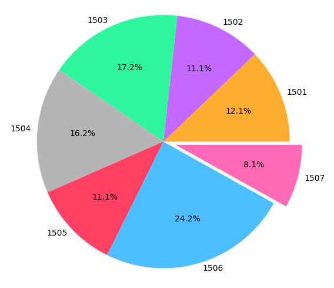

These are the proportions of the form responses that come from each hall.

06 did contribute by far the most responses to this form, so although this only brings us closer to the actual number, in comparison to other halls with far less submissions, it is an overestimate to some degree.

And where 06 has a surplus, 07 lacks. 07 was an outlier on the other end. With fewer submissions comes more volatility in the data, so what we’re seeing in these figures for 07 is subject to more inconsistency than the other halls. It is possible that many of the responses from 07 are of the more social bunch of the hall, however we can’t really say without the rest of the responses.

The last idea I want to touch on is hall interconnectivity. Being born into 01 as a sophomore, although I’m glad to have lived there and met all the people I did, I always felt that I might have been better connected with other halls if I had lived somewhere else. It seemed that living in certain halls would’ve brought me closer together with other ones.

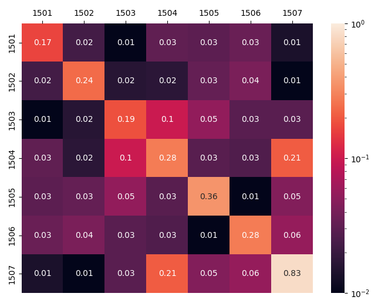

This is a heatmap of how connected the halls are to each other. To be specific, each square’s number is the percentage of all possible connections that are present between the two halls. To magnify the differences between some of the more minute percentages, the colors are scaled logarithmically. The matrix is symmetric along the diagonal.

Going back to what we saw in the previous chart, we see the result of the mutual friend compounding effect, that once again the halls are very social within themselves. The squares on the diagonal — squares denoting halls’ connections with themselves — are much brighter than the rest of the matrix. Only two other pairs come close to having this kind of connection, being 04 and 07, and 04 and 03.

Among the most disconnected halls are 01 and 03, 01 and 07, 07 and 02, and 05 and 06. These may not have been so extreme with more data, however it just gives you the idea that these friendships may be more scarce. As we’ve seen earlier, mutual friends can make friendships much more likely, so this might help people appreciate having one of these connections between the more disconnected halls.

From this visualization, we can also see the correlation, or lack thereof, between how physically close halls are and how connected they are. Squares closer to the diagonal represent halls that are closer together, so if it were to generally get brighter as it neared the center, then there would be a correlation. And although the diagonal itself is bright, it seems that once you leave the hall, no matter the distance, friends are friends.

#### **Part 2 / Overall Conclusion**

Having just moved out several days ago, all this data, all these people, they feel like things of the past. But just like the memories, and the connections we’ve seen all too much of by now, I’ll take what I’ve learned from this analysis with me in my next chapter. I’ll take with me my experience of being in a truly connected group of people, along with living in 1 of 7 distinctly different environments, and all the friends that came with it. Whether or not college follows similar patterns to my high school, it’s nice to move on with an extra something to remember.

And for those of you still with more years to come, I hope this encourages you to think more consciously of your friendships, if you haven’t already.
