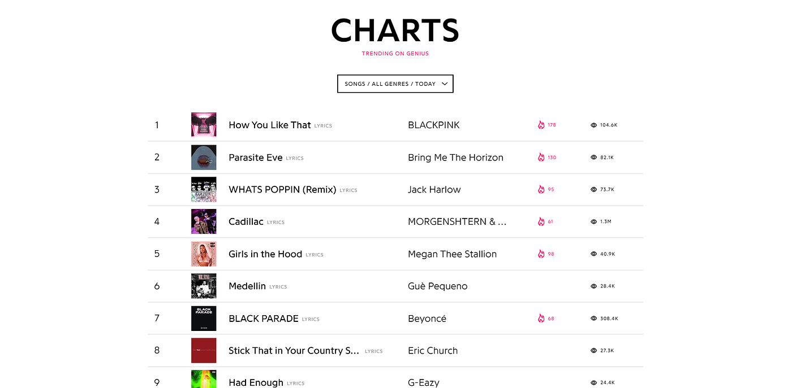
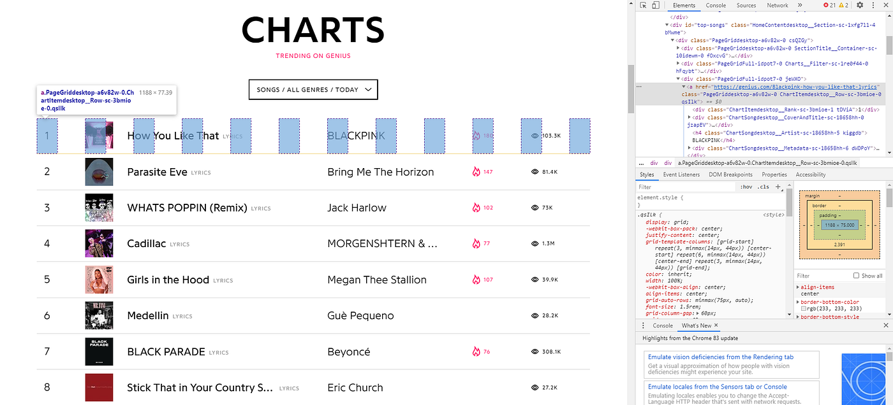
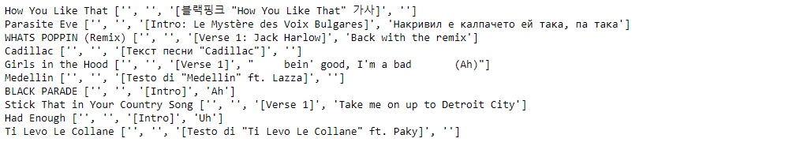

Web scraping opens up so many opportunities to work with the data you are most interested in, and it’s easier than you think. A person’s interest in the data they’re working with can make or break a project and it makes a big difference in their motivation to learn. This simple tool can help you access the data that will really progress your learning.

After reading this, you should be able to put into practice the basic web scraping that will let you obtain about 80 percent of the data out there.

If you don’t know what web scraping is, it’s all in the name. You write a program that *scrapes* data from websites, from which you can extract certain information to form your own dataset.

There are two common standard python packages for web scraping, being Requests and BeautifulSoup. Of course there are many other packages out there, but these are the two I’ll be focusing on, as they’re quite popular and simple to use.

Requests allows you to simply make HTTP requests to get information from any webpage. BeautifulSoup lets you extract the information you want from the request.

I’ll briefly cover the basics and then show you an example of how I’ve learned to use them by scraping the lyrics of the top ten songs trending on Genius.

### Basic Overview

#### Requests

Here are the commands to install requests for pip and conda respectively.

``` graf
pip install requests
```

``` graf
conda install -c anaconda requests
```

Just these two simple lines below are already going to get you started with web scraping.

``` graf
import requests
```

``` graf
page = requests.get(url)
```

The second line returns the result of your HTTP request to your URL which you can then extract information from.

#### BeautifulSoup

To install BeautifulSoup, here are the commands for pip and conda respectively.

``` graf
pip install beautifulsoup4
```

``` graf
conda install -c anaconda beautifulsoup4
```

With these lines you can access the specific information you want to pull from a website.

``` graf
from bs4 import BeautifulSoup
```

``` graf
soup = BeautifulSoup(page.content, 'html.parser')
```

``` graf
soup.find_all(tag)
```

``` graf
tag_element.get(property)
tag_element.text
```

The HTTP request contains all kinds of information, but we use the content — which corresponds to the HTML — to create a BeautifulSoup object. We also pass in a parser, because the BeautifulSoup object represents a parsed HTML document. This BeautifulSoup object has certain methods and properties that let us extract information easily.

The find_all method returns a list of elements of the specified tag. There are other optional arguments, such as class, which allow us to further specify which elements we want it to return. These elements have methods and properties from which we can get our information.

This is just to get a broad familiarity with what the code looks like, so don’t worry if it doesn’t make perfect sense yet. Using them in action later in the article will piece together the puzzle we’ve laid down.

#### Basic Web Scraping Process

1.  Find the data you want to pull.
2.  Make an HTTP request using the site’s URL.
3.  Extract its HTML into a BeautifulSoup object.
4.  Sift through the HTML to find the elements that contain the desired info.
5.  Extract the info from these elements.
6.  Store the data in a dataset.

### Example: Extracting Song Lyrics From Genius

Just a year or two ago when I first started getting exposure to data science projects and articles, I always thought that analyzing the lyrics of songs was so cool. At the same time, however, it felt completely out of reach, and I was perplexed as to how people went about getting the data. Now I realize that it’s actually quite simple. In this example, we’ll be scraping the lyrics from the top ten songs trending on Genius.

Start off by importing our favorite packages.

``` graf
import requests
from bs4 import BeautifulSoup
```

Then let’s actually find the URL for the page that holds these top ten songs.



After about 2 seconds of scrolling, I found that they were actually just on the home page, so the URL is “https://genius.com/”.

Let’s throw that into our function to get the web page’s HTTP request information.

``` graf
home_page = requests.get(‘https://genius.com/')
```

Now we can start to unpack the page and actually get the links to these songs’ lyrics by breaking down the HTML into a BeautifulSoup object.

``` graf
home_html = BeautifulSoup(home_page.content, ‘html.parser’)
```

Now that we have a BeautifulSoup object, we can access it’s elements with our find_all method. Before we can do this, we actually have to look at the HTML of the page to find the right element(s) to pick out.

You can either hit ctrl+shift+i, or click the three dots in the upper right of Google Chrome→ more tools → developer tools, and it should open up the webpage’s source code on the side. You will need to sift through the text a bit, but at least in Chrome, the browser will help guide you by highlighting on the page what each element of HTML corresponds to on the page. After opening several divs, I’ve found where my links are.



Genius has some funky divs going on here but we can still tell that this element corresponds to this first row. Here we can see the link, and more importantly, we can see the type of element — along with its class — that’s holding our information. We can use this information to pick out all these elements.

The link is in the ‘a’ tag, and its class is ‘PageGriddesktop-a6v82w-0 ChartItemdesktop\_\_Row-sc-3bmioe-0 qsIlk’. I made sure to check the next couple of elements to see that we are in fact going to retrieve not just this one link, but all the links of this type, and then I threw it into my function. The class may look a bit complicated, but it doesn’t matter for our purposes, as we just need to use it to differentiate the ‘a’ elements we want from the rest of the ‘a’ elements on the page.

``` graf
links = home_html.find_all(‘a’, class_=’PageGriddesktop-a6v82w-0 ChartItemdesktop__Row-sc-3bmioe-0 qsIlk’)
```

Now that we have the links, we can try getting the lyrics from one of the pages, and eventually, repeat the same process for the rest of them.

We get the link from an ‘a’ element by accessing its ‘href’ property which stores the link.

``` graf
url = links[0].get(‘href’)
```

Side note: By now we have already almost completed a full run-through of web scraping; we’ve retrieved information from a website using our program. However, I like this example because we run through it again, but in a slightly different way, and hopefully get a full understanding from repeating the process.

We can then find the information from that page, and turn it into a BeautifulSoup object.

``` graf
lyrics_page = requests.get(url)
lyrics_html = BeautifulSoup(lyrics_page.content, ‘html.parser’)
```

Then we sift through the HTML of this page and find that the lyrics are in a ‘div’ element, with the more conveniently named class, ‘lyrics’.

``` graf
lyrics_div = lyrics_html.find_all(‘div’, class_=’lyrics’)
```

This is actually the only div with this class, and we can get the lyrics and split them into their respective lines like this.

``` graf
lyrics = lyrics_div[0].text
lines = lyrics.split(‘\n’)
```

Now we can loop through the previous couple lines of code for each link and we get this.

``` graf
song_lyrics = {}
```

``` graf
for i in range(len(links)):
    url = links[i].get(‘href’)
```

``` graf
    lyrics_page = requests.get(url)
    lyrics_html = BeautifulSoup(lyrics_page.content, ‘html.parser’)
```

``` graf
    # get song lyrics
    lyrics_div = lyrics_html.find_all(‘div’, class_=’lyrics’)
    lyrics = lyrics_div[0].text
    lines = lyrics.split(‘\n’)
```

``` graf
    # get song title
    title_elements = lyrics_html.find_all(‘h1’, class_=’header_with_cover_art-primary_info-title’)
    title = title_elements[0].text
```

``` graf
    song_lyrics[title] = lines
```

With this, we’ve stored the list of lines for each song in a dictionary. We can check our results by displaying each song and their first couple of lines.

``` graf
for song in song_lyrics:
    print (song, song_lyrics[song][:4])
```



Although there clearly is some cleaning to be done prior to working with it further, this shows us we did everything we wanted to.

Now I hope you are able to take one more part of the data science workflow into your own hands. You don’t have to just rely on Kaggle and hand-made datasets anymore, and you can work with almost any interesting data you can find on the web. It’s made a big difference in my own journey so far, and I hope it does for yours.
