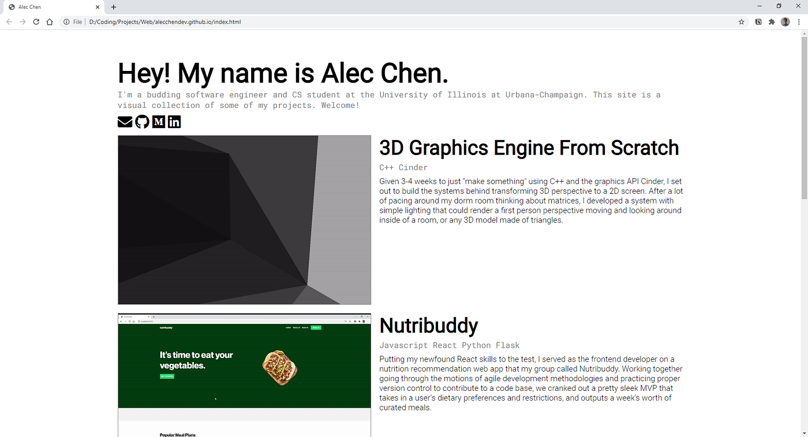

As software engineers, coding is our art. Similar to artists, many of us have a portfolio of projects we’ve worked on that we might like to share. Not only is it helpful for employers, but it’s also cool to show friends and family, and anyone else who might be interested.

But to actually share our work with people, it’s not enough for us to throw our code up on Github and make a nice readme, but nowadays we have to make an actual website to showcase our projects.

Not only is design something that people dedicate their whole careers to doing well, but also HTML and CSS can be very finicky to work with.

This is not going to be an HTML, CSS, or website design tutorial, but I’m just going to share some things I found useful that I learned while putting together my own site, which you can check out here: <a href="http://alecchendev.github.io" class="markup--anchor markup--p-anchor" data-href="http://alecchendev.github.io" rel="noopener" target="_blank">alecchendev.github.io</a>. To see the code behind my site, <a href="https://github.com/alecchendev/alecchendev.github.io" class="markup--anchor markup--p-anchor" data-href="https://github.com/alecchendev/alecchendev.github.io" rel="noopener" target="_blank">here’s a link to the Github repo</a> where it’s hosted.

As a background, I started coding a long time ago, but only started seriously coding on a regular basis this semester and a bit during this past summer. Although I have a little bit of front-end experience, I do not consider myself an expert by any means, and the things I mention in this article should be digestible for anyone who’s familiar with the basics of HTML and CSS.

### Why do I even need a site for my projects?

You don’t *really* need a personal site for your projects. You also don’t *really* need to make your resume look nice, or fill out your LinkedIn profile, but you do those things don’t you?

It’s common for employers to barely glance at a resume, and no way are they going to download your code from Github and run it. If they only spend on average less than 10 seconds on your actual resume, do you think they’re going to click through all your repositories to see your readme’s? Now if you had, say, a page with images or gifs showing off your projects’ functionality, a recruiter could glance at it in the milliseconds that they were going to give it anyway, but this time they’ll be able to see the results of your hard work, and the types of projects you like to work on.

Nowadays a lot of applications have an option for personal websites and other media links because these things help get a better sense of who an applicant is. Having a personal portfolio website is a great opportunity to bring life to the work you’ve done.

### Where do I start?

So before you actually start making it, you need to know what you want it to look like. The average programmer doesn’t just have amazing design ideas to just throw around, so if you’re anything like me, you may need some inspiration. For this, you can go to places like behance, dribble, or really anywhere. I mostly took inspiration from a few websites I’d seen before.

I didn’t have a very detailed idea, but I knew I wanted to be somewhere in between the simplicity of <a href="https://riggraz.dev/" class="markup--anchor markup--p-anchor" data-href="https://riggraz.dev/" rel="nofollow noopener" target="_blank">riggraz.dev</a> and the elegance of <a href="http://brittanychiang.com" class="markup--anchor markup--p-anchor" data-href="http://brittanychiang.com" rel="noopener" target="_blank">brittanychiang.com</a>.

After that, I tried to draw it out on a piece of paper. Something like Figma is arguably better, but my site was going to be very simple, so pen and paper was convenient and good enough. Some people can manage it all in their mind, but I like to have at least a simple outline that I can reference along the way.

### My general approach to the design

Personally, I just wanted a site that showed my work, with little to nothing else.

People like to have very fancy pages that look really cool, but I focused more on just making something that was concise, robust, and easy on the eyes.

Maybe my design itself won’t impress anybody, but the main focus is my work, and I think my design reflects that.

My first attempt at making it was actually kind of the opposite. Although I wanted to make the aesthetic of the design simple, I was going for a more fancy layout. After an hour or two of implementing that, I got sick of it and threw something together that was just meant to showcase my projects. I ended up liking it a lot better, and that’s the one I’ve stuck with.

### Actual design advice

For the design, the more complex and fancy you want your site to be, the more difficult it will be to implement it. Animations aren’t too complex with just raw HTML/CSS, but I personally chose to just have everything be static.

For the actual aesthetics, I think getting just two things right can go a long way:

1.  A nice font, or pair of fonts
2.  A simple color palette

If you have these things, I think the layout of your site can be mediocre and still look pretty good. I personally don’t think the layout of my website is anything special, but I think it looks clean because the fonts and colors go well together.

I kept it as basic as I could, so I went with Roboto as my primary font, and I chose Roboto Mono as a secondary font to give a bit of a typewriter-esque coder feel.

I think a good pair of two different font *types* (<a href="https://www.figma.com/font-types/" class="markup--anchor markup--p-anchor" data-href="https://www.figma.com/font-types/" rel="noopener" target="_blank">https://www.figma.com/font-types/</a>) can go a long way in making something look good.

To get free fonts, and even find font pairings, it’s all on <a href="https://fonts.google.com/" class="markup--anchor markup--p-anchor" data-href="https://fonts.google.com/" rel="noopener" target="_blank">https://fonts.google.com/</a>, and they have options for you to just import it directly into CSS, which is what I used.

For my colors, you can never go wrong with white, black, and gray. If you really want to have color, I would recommend choosing a single accent color and sticking to neutrals when in doubt.

For these visual aspects, experimenting, inspiration, and copying will be your best friends.

### HTML/CSS tips and tricks

At this point, you might be thinking to yourself, “Alec, I don’t care about your experience, I’ve spent my whole career trying to center a div, and I still can’t do it.” Well, I’m finally getting to it.

#### Centering things

For actually centering things, I like to use the classic

``` graf
element {
  margin: auto;
}
```

Or put the element inside of a div and use flex-box.

``` graf
div {
  display: flex;
  justify-content: center;
  align-items: center;
}
```

I’m not promising it’s going to work for every occasion, but it should get you through 80 percent of your centering struggles.

#### Units of measurement

Something I’ve always been confused about is when to use different units of measurement. Below are my personal preferences for these things, which I’ve found through experimentation. They are likely not what a professional front-end dev or UI/UX designer would say, but I hope it can help provide some inspiration.

% — percent relative to the parent of an element. I like to use this very liberally for the width and height of elements, because I think it makes sense for the size of things to scale with their parents.

vw, vh — view width and view height — this changes both between devices, and if you change the size of your window. I use these for big picture spacing, such as the size of a div containing the majority of my content for a page.

em, rem — not 100 percent sure what each stand for but I think of them as **e**le**m**ent font size, and **r**oot **e**le**m**ent font size — these scale primarily between devices. I like to use rem for font sizes and some minor spacing that I want to vary between devices. I don’t really use em, but I can see where it’d be helpful if you wanted to scale the fonts of a single element all at the same time, e.g. if I wanted to scale all the text in my project sections, I could use em for the elements inside, and change the overarching parent div’s font size.

px — pixels — other resources will call this an absolute sizing metric, but it does scale between screens of different dpi. My use case is similar to rem, where I want to have things remain static sizing on a single device, but adapt for others. I use px most often when I know that a viewport is going to be large enough for this pseudo-absolute sizing metric.

#### On sizing of images

``` graf
img {
  width: 100%;
  height: auto;
}
```

Nobody wants a squashed version of their image. Percents will fit an image’s size to its container, and auto for height or width will make it scale to the image’s original aspect ratio.

#### Flex box

Aside from being able to center things, flex box is a godsend for the layout of your website. There are already tons of great tutorials on flex box, so I won’t waste time going over it. However I’ll leave some good resources to learn it:

Mozilla (in-depth guide): <a href="https://developer.mozilla.org/en-US/docs/Web/CSS/CSS_Flexible_Box_Layout/Basic_Concepts_of_Flexbox" class="markup--anchor markup--p-anchor" data-href="https://developer.mozilla.org/en-US/docs/Web/CSS/CSS_Flexible_Box_Layout/Basic_Concepts_of_Flexbox" rel="nofollow noopener" target="_blank">https://developer.mozilla.org/en-US/docs/Web/CSS/CSS_Flexible_Box_Layout/Basic_Concepts_of_Flexbox</a>

freeCodeCamp (exercises): <a href="https://www.freecodecamp.org/learn/responsive-web-design/css-flexbox/" class="markup--anchor markup--p-anchor" data-href="https://www.freecodecamp.org/learn/responsive-web-design/css-flexbox/" rel="nofollow noopener" target="_blank">https://www.freecodecamp.org/learn/responsive-web-design/css-flexbox/</a>

#### Media queries and scaling your layout

I really doubt that employers will be viewing your portfolio on a phone or tablet, but if you are releasing your site for the general public, it may be worth putting in a little extra effort to have the layout of your website accommodate for different devices.

This adaptation comes in the form of <a href="https://www.w3schools.com/css/css_rwd_mediaqueries.asp" class="markup--anchor markup--p-anchor" data-href="https://www.w3schools.com/css/css_rwd_mediaqueries.asp" rel="noopener" target="_blank"><em>media queries</em></a>. For me, I just stuck to changing the layout based on different viewport widths, but there are also features to change upon different viewing devices.

And don’t worry, you don’t have to rewrite all of your styling for each media query, only what you want to change. This is all I have in stylesheet:

``` graf
@media screen and (max-width: 1450px) {
  .project {
    flex-direction: column;
  }
```

``` graf
  .projectImage {
    width: 100%;
    height: auto;
  }
  
  .projectInfoContainer {
    margin-left: 0;
    margin-top: 15px;
    margin-bottom: 15px;
  }
}
```

This just tells the page that when the screen width is below 1450px, apply these styles, i.e. change the flex-direction, adjust image sizing, and tweak some spacing.

And this is the resulting change:




#### Icons

For icons, I used <a href="https://fontawesome.com/" class="markup--anchor markup--p-anchor" data-href="https://fontawesome.com/" rel="noopener" target="_blank">fontAwesome</a>. They have tons of icons that scale with font size that are easy to import into your own page.

And I learned about this through an important technique: inspecting element (or ctrl+shift+I)on other people’s web pages. I looked through <a href="https://kennethjee.com/" class="markup--anchor markup--p-anchor" data-href="https://kennethjee.com/" rel="noopener" target="_blank">Ken Jee’s personal website</a> and noticed a pattern between the icon elements. Just a little bit of googling later I had some awesome icons to use in my own website.

### Conclusion

For a while, I’d put off making my personal website because it felt like such a daunting task, but when it came down to it, making a static website is only a matter of formatting content on a page. It can be a bit of labor, but you’ll be proud of your work by the end of it. I hope this could help.

If anything in this article helped you make your own personal portfolio site, feel free to shoot me a DM showing me your site! I’d love to see it.
