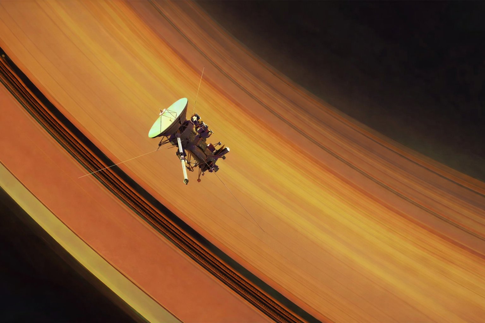

For the past four months I have felt anxiety more consistently and with higher intensity than I have felt in my whole life as far as I can remember. It's not crippling, and I am still able to live my normal life and be reasonably happy. But it definitely sucks.

At first I thought it was because of my job. In my [last blog post](/blog/approach) I mentioned how I'm recently exiting the [trough of disillusionment](https://en.wikipedia.org/wiki/Gartner_hype_cycle). I've felt for a while now a disheartenment from the large distance between doing the things I admire most and my lack of skills. This was from the desire to somehow change the world by building hardware, and the fact that my physics/chemistry neural pathways had been atrophying for many years while I learned about computers. Many things people aspire towards are intimidating. But it seemed like I was asking to be an [NBA player when I'm 5'7''](https://en.wikipedia.org/wiki/List_of_shortest_players_in_NBA_history). This was exasperated by the fact that I had not become meaningfully productive at work yet, and didn't feel like I was learning fast enough, nor learning the things I wanted to in software or hardware.

This has been the motivation for doing all sorts of random side projects lately. I had to take action to get closer to where I wanted to be. And at times, it felt like I was making progress towards that goal, and it seemed like this was maybe a viable path out of this lull. It would of course be fun too, to make something, or do an experiment, or learn something.

But my side projects would jump between fields so much, because I was constantly becoming interested in new problems and domains. I had this impatience towards finding my life's work. I would get excited about a problem, get ready to embark on a long epic journey towards that thing, realize maybe it was too much, or that I'm just not in the position to force things through sheer determination, or that it wasn't really what I wanted, or that there were organizations already making substantial progress on that thing or bla bla bla. It always just felt like I was behind, and I never had the conviction to just commit to something despite these feelings.

I felt this anxiety because the things I wanted literally take possibly a lifetime to achieve, or at least, a long time very well spent, with lots of luck. In the back of my mind I would think to myself on the time horizon of my life, things like: I only have so many good years, at my peak intellectual capability, when I have lots of time, before this and that happens.

Gradually this built up into a sort of decision paralysis. I felt like however I spent my free time alone needed to be culminating towards some greater goal, and so if I wasn't sure if something would be doing that, I wouldn't do it. Why learn little bits here and there if I'll barely retain any of it? So ultimately I started stalling on personal projects and learning side quests because I couldn't figure out what the greater goal was going to be. This inaction compounded into greater anxiety.

At some point I decided to take a step back. I figured I'm probably not going to find my life's work in my current state. I need to address this deeper down the stack. Instead of trying to find some concrete external thing to address how I feel, I began to seek wisdom on why I felt this way to begin with.

Why do I want to do something great? Why do I believe it's important enough to cause me to feel anxious?

I'm still working through these things, but so far there are two ideas that stuck with me.

- Anxiety as the dizziness of freedom
- Ambition/heroism as a way of denying death

I have grown to believe in individual freedoms as one of the proxies for prosperity. While I still believe that is true, over time I've also come to see ways that freedom has a double edge. Ultimately I'd much rather have anxiety over what I will do with my life than anxiety over being able to continue living life. But that doesn't mean that freedom doesn't come with its own kind of burden.

It is anxiety-inducing to believe you can do anything you set your mind to. It's an amazing privilege to have, and so it feels like I must make something of it. And what to set my mind to but the most important thing! But what's most important? Again I get to decide. I get to decide on a grand-scale what I might do with my life, and I get to decide the things I do day-to-day, hour-to-hour, minute-to-minute. I get to, and I must. Because not making a choice is its own choice. With great power comes great responsibility.

It's no wonder [Kierkegaard](https://en.wikipedia.org/wiki/S%C3%B8ren_Kierkegaard) described anxiety as "the dizziness of freedom." I'm pretty dizzy, to say the least.

But why do I need to do the most important thing to me? I don't know. A mix of things. One is because I feel like I've been fortunate enough to have the chance, so I should do something with it. Another is a status symbol, of trying to compete with peers, or these days, random strangers on the internet in roughly similar phases of life as me. My side of the internet (mostly twitter/x and youtube) is often full of amazing and aspirational things, but after so much inspiration the returns not only diminish but start to have a negative impact on my self-perception. Another reason is that I genuinely like various things in math and science and engineering, and doing things in those domains is just fun and fulfilling because learning and creating is fun and fulfilling. And the last is, why does anyone seek something great in their life? Ernest Becker has a book that touches on this called "[The Denial of Death](https://en.wikipedia.org/wiki/The_Denial_of_Death)" where he talks about the deep driving force of human behaviors being the fear of death. Great ambitions are a way of contributing to the symbol of your character, the part of us humans that can be infinite. A symbol that can be everlasting, beyond our absurd and ephemeral fleshy forms. And through that we think we can somehow treat or overcome our fear.

I'm still working my way through this wisdom, and probably will be for many years. I haven't even really made it yet to the conclusions and recommendations that these people make from their insights. However I've still gained a bit of clarity that's nudging me into a different trajectory.

Some themes going forward:

**Gradually increasing commitment**. Last year I did a bunch of things and didn't follow through on any of them. Maybe this year I'll do several things, and follow through a little more. I can relieve some pressure off myself from finding some golden single thing--I'm not sure that's really how my mind works, though I'm still so deeply indoctrinated at the subconscious level it will take me a while to get out of it--but still move in a healthy direction. This is more realistic and achieveable. Concrete and practical. Less romantic, which is good in this case.

We can choose the stories we tell ourselves. I've believed for a while now that sometimes it is okay to choose to believe things that may not necessarily be true, but because doing so is important to your life. An example is believing that you have control over your destiny, because even if many things are impacted by chance, you'll live your life more engaged, motivated, and fulfilled. In my case, I can choose to believe my constructed narrative that my inability to follow through on anything was actually just an exploratory beginning of eventually narrowing down my pursuits. This helps me feel like it all makes sense somehow.

**Reducing my twitter/youtube usage**. There has already been a lot said on social media usage. For me, I've just noticed my threshold for what is too much has continued to shrink steadily. I really just don't need to know most things.

**Planting seeds, and leaning towards my curiosities more than my ambitions**. I'm not sure if I'm still so set on directly working towards doing something great right now. At the least, my thinking on how to live is leaning more towards planting seeds and following my curiosities rather than trying to go barreling towards some particular ambition. I think what really excites me the most right now is not "how can I be the most useful to people" and more "how does that work? Dang, that's frickin neat." I've found recently, when it comes to new interests, thinking far ahead practically about the state of the art of things, career paths, and being useful is demotivating for me. But when I just think about the basic questions I'm curious about, I feel a sense of wonder. Life is incredibly absurd, and somehow understanding it makes the absurd beautiful. This is my personal application of the ways [Camus](https://en.wikipedia.org/wiki/Albert_Camus)' stories have influenced me. Understanding reality doesn't make it less absurd or more meaningful, but in a way it's a form of embracing it.

I'll end this on something I've found solace in lately. The [voyager program](https://en.wikipedia.org/wiki/Voyager_program) is still operational as of the time of writing this, in January 2026. These probes were launches in the 1970s, and are traveling over 15 kilometers per second over 15 billion miles away from earth. They send about 20 bytes per second, which take almost 24 hours at the speed of light to reach us here on earth, where we receive these messages with parabolic antennas that are 70 meters wide, or as wide as two-thirds of a football field. They use plutonium--the material used for nuclear weapons--as their power source, which continues to power them through all these decades to this day.

> "The two Voyagers are the only human-made objects to date that have passed into interstellar space — a record they will hold until at least the 2040s — and _Voyager 1_ is the farthest human-made object from Earth."

These hunks of metal are just floating out there. They're going so fast--20 times faster than a bullet--but to them, everything looks like it's moving so slowly. It's all so incredible and ridiculous, isn't it.

Until next time, [you be good. I love you. See you tomorrow.](https://en.wikipedia.org/wiki/Alex_(parrot))
