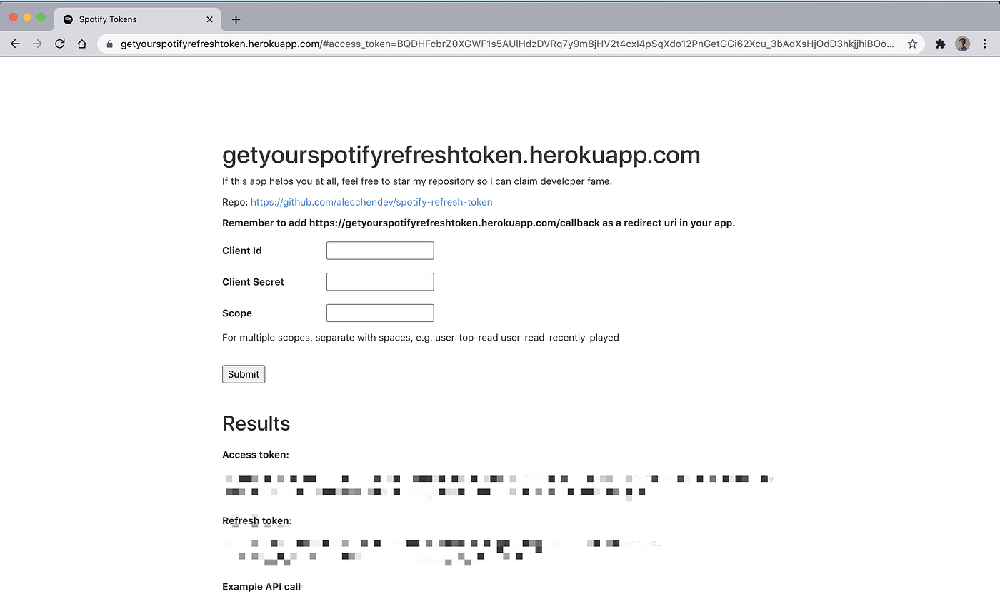
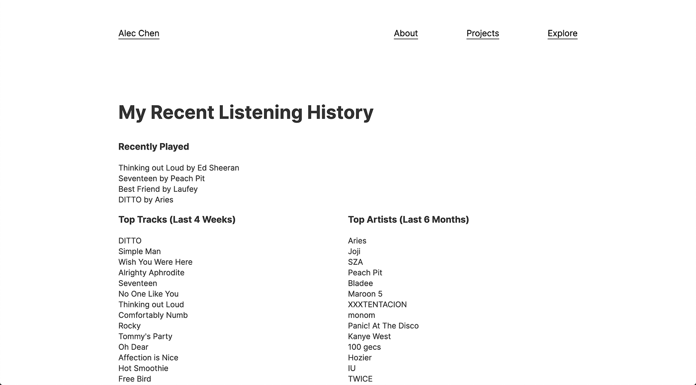

I made a simple site for developers to easily get their own refresh and access tokens for Spotify’s API. Check it out <a href="https://alecchendev.github.io/spotify-refresh-token/" class="markup--anchor markup--p-anchor" data-href="https://alecchendev.github.io/spotify-refresh-token/" rel="noopener" target="_blank">here</a> (updated October 2022).

### Motive Behind This Spotify API Authorization Wrapper

I was adding this page to my personal website that calls the Spotify API to show a brief listening history for my account.

However, to retrieve this information from the Spotify API, it requires you to log in. I didn’t want any sort of overhead for others to just see my recent songs, so I ended up setting up the authorization in this <a href="https://github.com/spotify/web-api-auth-examples" class="markup--anchor markup--p-anchor" data-href="https://github.com/spotify/web-api-auth-examples" rel="noopener" target="_blank">example authorization repo</a> and going through all this trouble to just get a refresh token, which allows you to get access tokens without logging in every time. I wished there could’ve been a simple website that I could’ve easily just put in my credentials and scopes and gotten back my refresh token. So that’s what I built.

Feel free to stop reading here to go give <a href="https://github.com/alecchendev/spotify-refresh-token" class="markup--anchor markup--p-anchor" data-href="https://github.com/alecchendev/spotify-refresh-token" rel="noopener" target="_blank">my repo</a> a star. This article is just to get this out there so developers looking for it might find it on Google. I figured Medium has pretty high domain authority, so this might help with that. **The rest of this article is just keywords for SEO**.

### Spotify API Authorization Flows

-   Refreshable user authorization: <a href="https://developer.spotify.com/documentation/general/guides/authorization-guide/#authorization-code-flow" class="markup--anchor markup--li-anchor" data-href="https://developer.spotify.com/documentation/general/guides/authorization-guide/#authorization-code-flow" rel="noopener" target="_blank">Authorization Code Flow</a>
-   Refreshable user authorization: <a href="https://developer.spotify.com/documentation/general/guides/authorization-guide/#authorization-code-flow-with-proof-key-for-code-exchange-pkce" class="markup--anchor markup--li-anchor" data-href="https://developer.spotify.com/documentation/general/guides/authorization-guide/#authorization-code-flow-with-proof-key-for-code-exchange-pkce" rel="noopener" target="_blank">Authorization Code Flow With Proof Key for Code Exchange (PKCE)</a>
-   Temporary user authorization: <a href="https://developer.spotify.com/documentation/general/guides/authorization-guide/#implicit-grant-flow" class="markup--anchor markup--li-anchor" data-href="https://developer.spotify.com/documentation/general/guides/authorization-guide/#implicit-grant-flow" rel="noopener" target="_blank">Implicit Grant</a>
-   Refreshable app authorization: <a href="https://developer.spotify.com/documentation/general/guides/authorization-guide/#client-credentials-flow" class="markup--anchor markup--li-anchor" data-href="https://developer.spotify.com/documentation/general/guides/authorization-guide/#client-credentials-flow" rel="noopener" target="_blank">Client Credentials Flow</a>

Authorization code flow authorization code flow authorization code flow. Refresh token access token no login already known credentials single request. Authorization code flow authorization code flow authorization code flow. Refresh token access token no login already known credentials single request. Authorization code flow authorization code flow authorization code flow. Refresh token access token no login already known credentials single request.

### Spotify API Client Credentials Scopes

Spotify API client credentials, client id, client secret, scopes. Spotify API client credentials, client id, client secret, scopes. Spotify API client credentials, client id, client secret, scopes. Ugc-image-upload user-read-recently-played user-top-read user-read-playback-position user-read-playback-state user-modify-playback-state user-read-currently-playing app-remote-control streaming playlist-modify-public playlist-modify-private playlist-read-private playlist-read-collaborative user-follow-modify user-follow-read user-library-modify user-library-read user-read-email user-read-private.

Spotify API client credentials, client id, client secret, scopes. Spotify API client credentials, client id, client secret, scopes. Spotify API client credentials, client id, client secret, scopes. Ugc-image-upload user-read-recently-played user-top-read user-read-playback-position user-read-playback-state user-modify-playback-state user-read-currently-playing app-remote-control streaming playlist-modify-public playlist-modify-private playlist-read-private playlist-read-collaborative user-follow-modify user-follow-read user-library-modify user-library-read user-read-email user-read-private.

### Conclusion

Hope you enjoyed this article. And if this web app or the code in my repo helped you out in any way, please star <a href="https://github.com/alecchendev/spotify-refresh-token" class="markup--anchor markup--p-anchor" data-href="https://github.com/alecchendev/spotify-refresh-token" rel="noopener" target="_blank">my repo</a> so I can get developer status points. Thank you and have a beautiful day.
