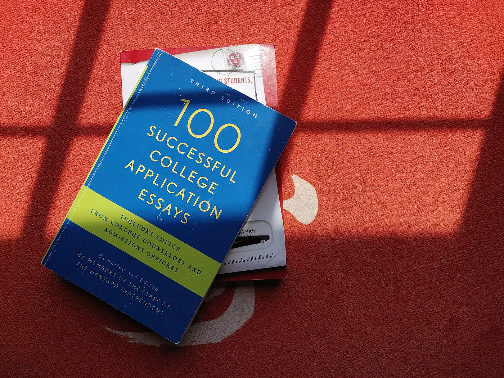

December 13, 2019.

4:10pm. In my last class of the day, I see a girl at another table open her computer to an acceptance message. I figure it won’t make a difference if I wait until after class, I’ll open it now too. I slip my phone out of my pocket and read that I’m an Illini.

March 26, 2020.

10:05am. The moment I gain consciousness I immediately think about the evening’s imminent results. I get on with my day.

6:03pm. I take my laptop up to my room and before opening anything I head to the bathroom. I bring my phone.

6:06pm. I come out of the bathroom having learned I didn’t get into Yale, or Harvard. Okay, I wasn’t really expecting to get into either anyway, it just would’ve been nice. Kneeling against my bedside I log in to my UC portal; not being immediately greeted with congratulations, I move on to my last school. My hopes were high for this one.

6:34pm. My parents, both Columbia graduates, finish talking to me about how it’s okay, and how I’ll have fun at UIUC, and how maybe now I’ll think about going to grad school.

It didn’t hit me immediately. I mean, it definitely hit me in the beginning, but then I was okay for a bit, and then it came back and hit me some more.

I had already taken a hard look at what I’d done with my time in high school during the application process, but getting all my decisions back made me look again, this time tainted by misfortune. These rejections implied that whatever I had done wasn’t good enough, or that I chose the wrong things, or I wasn’t good enough at the things I chose. It said to me that in some way or another, I wasn’t enough.

Our lives are shaped by the many minute and grand choices that we make, and I started to rethink all of them. The extracurriculars I chose to do, the classes I chose to take, the fun things I chose to spend time on instead of working towards something bigger. One of these decisions had a particularly significant impact on my high school career. It was my choice to apply and even go to my high school. Not only that, but by doing so I also skipped freshman year. That was a whole year I threw out the window, a whole year I could’ve used to get better at something, or do something that would really matter…to the admissions officers.

The part that was most striking to me is that these choices are inherently in my control, and it feels bad to look back and feel like I’ve made the wrong ones. But what if they weren’t really in my control?

I look at some other people that got into the colleges they wanted to and I think, *they did everything right.* I never saw it until now, but the path seems so clear. Just do these things, work hard at them, and you’ll find success. But when I was in the midst of it all, I thought what I was doing *was* this path, and it turned out it wasn’t. How was I supposed to know? How did these other people know?

Well, either they just did, or maybe they were a bit lucky. That may be unfair, but that’s how it is. What am I supposed to do about it? I mean, at least it wasn’t entirely my fault. Even if I could replicate what other people did, I didn’t because I just didn’t know, and that’s okay.

On top of regret, I fell victim to the fatal consequences of my own toxic mindset towards higher education. I had heard from all over that it doesn’t matter what college you go to, it matters what you do with it, or that where you go isn’t who you are. And they’re true for the most part, or at least a good way to think about it. But at the same time, most people — including the people that are discouraging this mindset — hear that someone’s going to Stanford and gawk at the prestige associated with this name, or at the very least, they think much more highly of that someone.

I never completely rejected these small interactions because I thought they wouldn’t apply to me. I thought I’d get in anyway, and I wouldn’t have to face the shock that came with learning that I wasn’t the person I thought I was. Because with this whole mindset, I connected my applications with the things I liked about myself, and I let my admissions results confirm or deny that these things were true. So when things didn’t turn out how I thought they would, it was like something I believed my whole life turned out to be false. I thought I was one of *those* people, but I wasn’t. And it sucked.

But for good reason. I shouldn’t have been glorifying the prestige associated with these colleges like other people, and I shouldn’t have let my admissions results dictate my faith in myself. My mindset was what caused my demise.

Thankfully, the rejection letters were so nice that they cheered me up and I went on with my life.

This is not true, but there was one section of my rejection letter from Yale that helped me:

> “Our decisions say far more about the small number of spaces available and the difficult choices we make than they do about a candidate’s personal and academic promise.”

It’s true. It might not make up for rejecting me from their school, but it is certainly true. I didn’t internalize it immediately, but it was just one step towards moving on from my old mindset.

### Life goes on.

A long time ago I read something about getting over a breakup, but it applies to most misfortune in life:

> “They will always have an impact on you. That impact doesn’t ever go away, it just hurts a little less over time.”

Knowing this, all we can really do is just move forward. I can tell you to be positive, and occupy yourself with your passions and all that, but you already know that. There is only one thing that I’ve found truly helpful for diminishing whatever negative feelings that remain.

More than anything, **you need to have absolute blinding faith in the path that you’re on.** You need to be able to look back on everything and remember it fondly. Be okay with the choices you made, they were probably not that bad, and you probably had some fun.

I’m glad to be going to UIUC. I know I’ll be happy there, the quality of education isn’t half bad, and it won’t cost me a fortune. Isn’t that enough?

For myself, and for those of you that have yet to go through the whole college process, I’d like to end this piece with some parting words to my past self:

You did everything right.
