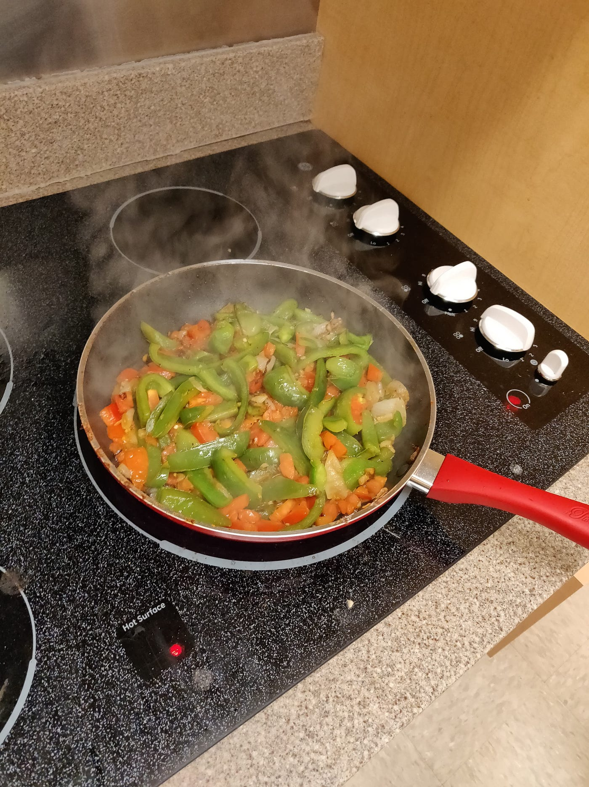

Just about two months ago, I began my first day as a vegan. I had been interested in nutrition for a while, and I’d heard a lot about the benefits of a plant-based diet. I wanted to push myself and take on some sort of challenge, so I went vegan.

The basic requirements for me to complete this challenge were:

1.  Don’t eat things with meat in them.
2.  Don’t eat things with dairy in them.
3.  Don’t break 1 and 2 for 30 days in a row.

And I mostly succeeded. There were two instances where I kind of broke, the first being a bite of a cookie, and the second being some peanut M&Ms, but I wasn’t going to just quit after such minor infractions, and I’d say I lived up to my requirements.

### The differences in my diet on paper

Before going vegan, I ate a pretty well-rounded, omnivore diet. I’d usually have oatmeal for breakfast, with some granola, nuts, seeds, fruit etc. And most lunches and dinners comprised of some serving of meat, and plenty of greens and other veggies, often with some rice. I ate out occasionally, and Fridays at my house we would have some sort of dessert, but that that was it.

When I came to college, it was somewhat the same, but I ate a bit less food, mostly because it was lower quality food, but that was whatever.

As for my vegan phase, here’s what changed from my normal diet:

No more meat — no chicken, no fish, no shrimp, beef, pork, no nothin. No more dairy —this for me mainly meant no more ice cream or cheese.

Then more legumes, tofu, soymilk, more rice, bread, and pasta, more potatoes, and other vegetables.

### My reaction

So I already knew going into it that I was going to have to cook a lot of my own food, because most days at my dining hall, the vegan options were usually rather lacking. I could make my own breakfast quite easily and consistently, but lunch/dinner was going to be a bit of uncharted territory. Not only had I just begun cooking meals a week before coming to college, but I was also in a new place with a barren kitchen lacking basic cooking supplies, and I now had to remove like half of the components of the only meals I knew how to cook!

I started out cooking somewhat ambitious — and looking back, quite extravagant — meals that would take up to 2 hours to cook disregarding clean up and shopping. As I continued, I took less time shopping, and I got a better sense of what I could get and for how much money, with my cooking time diminishing as well. I’m not sure if I got much better at cooking, but I definitely got some experience, and there were a fair amount of meals that I was proud of and enjoyed eating. In this way, pushing myself to take on this challenge was really rewarding.

In the end, however, regardless of my improvement and learning, cooking for yourself might be somewhat manageable, but cooking vegan meals with such sparse resources is something I’m glad I no longer have to do. I’m happy that it was just a temporary thing, at least for where I’m at in life right now.

Ok, so cooking is cool and all, but wasn’t it *hard* to resist eating meat?

So many people are like, “man I could never go without meat,” or, “I just couldn’t stop myself from eating it,” but really, you eating meat has nothing to do with your willpower or enjoyment of meat. At least in my experience, I would say it’s much more about your environment. For my 30 days, I really didn’t mind not eating meat. Towards the end, I was definitely looking forward to it, but up until then, I didn’t have some ravenous desire for meat or anything like that. At most, it was a mild inconvenience that so much stuff has cheese in it and that most desserts have egg in them, but that was it. Because meat options weren’t directly accessible to me, it didn’t really cross my mind that often. The majority of my will power didn’t go towards resisting my urges, but towards getting myself to buy and cook meals rather than just sitting there.

In case I didn’t illustrate the idea clearly enough, here’s another example. Right now I eat way more sugar than I did at home, not *only* because it’s addictive, but because when I was home, if I wanted to eat a cookie with every meal, I would have to go to the store or McDonald’s or something and spend my own money. Here, they just give it to me, sometimes without me even asking.

### What changed

So some things definitely did change. First, I lost around 5 pounds. Although this might seem to make sense at first, it is actually a bit nuanced.

You might speculate that oh, of course, I’m not getting enough protein because I’m eating plant-based ooh wooh it’s so hard to get protein blah blah…

I tracked my daily protein consumption and it was just fine. I was well over 1.2 grams per kilogram of weight, which came out to be around 75–80 grams of protein. That was not even that hard to hit. I realized that it’s not that it’s so difficult to get enough plant-based protein, it’s more that as meat-eaters we just take for granted the surplus of protein we consume in each serving of meat.

So then, I was getting enough protein, I was exercising and even gaining strength. I don’t think I was losing muscle.

Then maybe it was fat I was losing? Possibly. But I was consuming enough fat for a person my age, height, and weight, *and* I was getting enough calories most days, that being \~2500 a day, so it couldn’t have been a substantial amount of fat.

So what then?

During quarantine, although I did exercise, I was mostly sedentary for the majority of the day. I wasn’t even really that bored or anything, I just didn’t do *that* much in a day. Compare that to college, it feels like there is just not enough time in a day, and I’m facing constant stimulus almost all the time. I basically can’t catch a break.

Towards the end of my vegan challenge, I realized that the amount of stimulus, the amount of mental energy I was consuming, could be having this significant effect on my metabolism, and it’s ultimately what I’ve concluded to be the main catalyst of this calorie deficit that led to my weight loss.

For part of the time, I speculated that my body might just have a disproportionate disposition towards metabolizing carbohydrates more rapidly, but I found that to be somewhat less likely.

Another thing to keep in mind in this whole thing is just that your metabolism isn’t constant. Although a calorie difference is the ultimate decider of weight change, you don’t always burn the same amount in a day. And it’s not only through physical or even mental exertion that you create a larger calorie deficit, but it’s also your body composition and hormone balances that can significantly impact your metabolic rate. These things are decided by many things, one of which is *what* you eat.

Other than the weight loss, I really didn’t feel any significant differences. I ate a lot more fiber, and that was relatively unpleasant, but I felt just as energized as usual. I lacked B12 but got some from soymilk that included a vitamin blend.

I did run a bit farther than usual, but if anything I think this may have been more of placebo because it only happened a couple of times out of many times running.

### Main takeaways

-   Going vegan will most likely require you to cook for yourself quite a bit
-   Because of this, I pushed myself and got some great experience
-   What you eat is often more about what you are surrounded by/what is accessible to you rather than what you want to eat at any given moment
-   You can get enough protein and fat on a vegan diet; as meat-eaters we really take for granted how easy it is to get more than enough protein
-   Weight loss is complicated — it is ultimately caused by a calorie deficit, but mental stimulus can burn significantly more calories, and what you eat and other factors can impact your metabolic rate

Have I been continuing since the end of my challenge? Nope. But I do enjoy a bowl of muesli on most days of the week.

If you’re thinking of trying it out for yourself, I would highly encourage you to! It was generally a very rewarding experience even though it was rather inconvenient. And if you’re wondering what I ate, or just would like ideas in general, first, you should check out this YouTube channel, <a href="https://www.youtube.com/channel/UCBy9QPDqagPyrdV_01-c9Xw" class="markup--anchor markup--p-anchor" data-href="https://www.youtube.com/channel/UCBy9QPDqagPyrdV_01-c9Xw" rel="noopener" target="_blank">Mina Rome</a>, whom I started watching far too late into my endeavor, but also I’ll leave a list of what I ate below.

And I’ve left a fair bit out of this article because it’s getting pretty long, so feel free to reach out to me if you want to talk more.

Anyway, here are the meals:

-   Oatmeal, muesli — so much muesli — with almond milk or soy milk, usually with some assortment of nuts, seeds, granola, and fruit
-   Bagel, peanut butter, tater tots, mixed fruit, apples, bananas
-   Matcha/green tea
-   Italian stew — pasta, onion, garlic, white beans, potato, eggplant, some sort of broth, tomato, mushroom
-   Burrito bowl — rice, black and/or pinto beans, onion, fajita veggies, salsa, avocado, tortilla chips, greens
-   Mediterranean bowl — (usually but not in my case) falafel, red cabbage, chickpea, cilantro, tomato, cucumber, rice with turmeric
-   Miso soup — daikon or Chinese radish, gobo, mushrooms, carrots, tofu, potato, udon, shiro miso paste
-   Kimchi, tofu, udon or rice, seaweed
-   Every once in a while my dining hall’s food — usually something with pasta, bread, potato, rice, spinach, lettuce, green beans, broccoli
-   Sweet potato bowl — sweet potato, chickpea, hummus, bell peppers, asparagus
-   Pasta salad — pasta, spinach, cherry tomatoes, basil, white beans
-   Pita wrap — pita, hummus, avocado, chickpea, spinach, chopped apples
