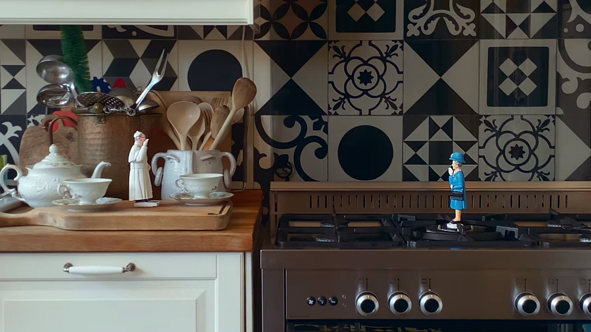

Originally when I noticed this series pop up, I was intrigued by its abstract cover art, but deterred by its subject.

The premise of this collection is that people from all over the world submitted films made under the restrictions of quarantine, social distancing, and a general lack of resources caused by the COVID-19 pandemic. I already hear about the pandemic so much besides actually living in it myself, I didn’t want to watch a show about it too.

But the truth is, these short films are beautifully told stories. It’s not just some show about quarantine, but a collection of films that make you think and give you perspective, entertain and provoke emotion, all the while being made with little to no resources.

From the outside, filmmaking seems to have quite a high barrier for entry; you need actors, amazing writing, a quality camera, other camera equipment, audio equipment, and so on. But in this series, one of my favorite episodes was filmed by taking a screen recording of a zoom call. Other episodes feature barely a few lines of dialogue. But *all* of them are brilliant short films. And they opened my eyes to what film could be.

Let me walk you through three of my favorites from the collection and I’ll show you what I mean. (Spoilers ahead. Most of the films are under 10 minutes so if you see something that interests you, go watch it!)

#### Episode 2, a romance between the Pope and the Queen, played by two dolls.

This short is a love story about the Pope and the Queen being quarantined together. For obvious reasons, the filmmaker, Paolo Sorrentino, could not get the actual Pope and Queen, so they’re played by two dolls, accompanied by fitting voice actors. You’d think these limitations would dampen the storytelling, but in my opinion, it makes it better. This unlikely romance works because more of the scenes are left to our imaginations, and so the restriction is played to the benefit of the film.

> “Can you imagine? The world is learning what it is like to be deprived of one’s liberty, to be closed up in one’s home, a condition you and I experience everyday.”

The way the story unfolds, the Pope and the Queen relate to each other through being locked up their entire lives, a new insight on these national figures that we not only seldom think to consider. Besides this, the dialogue between the characters is what we’d imagine it to be like, and it’s just really neat to see this story come to life.

It only took a phone, dolls, and people to voice act. And of course a filmmaker with a story to tell.

#### Episode 4, a man professes his love over zoom.

Episode 4 is simply beautiful writing, showcased in the screen capture of a zoom call between an old man and woman. To summarize it briefly, the man gives this incredibly romantic and slightly erotic monologue explaining how he’s loved this woman his whole life and regrets ever leaving her. The woman barely says a thing the whole time, but once he finishes, she finally says, “Did you already call the other ones, you turd?” And what follows is a sequence of cuts from other zoom calls of him giving the same speech to many different women, and all of them seeing through it and giving him their two sense.

This short is a perfect example of where the writing shines through regardless of the resources available. It was filmed through a screen recorder, and although it could have been set in other places, and the characters barely move. The people of course have to say their lines convincingly, but I think the writing is what really makes it, and that is something accessible to all filmmakers.

#### Episode 11, a young child plays pretend.

Episode 11 is one long take of a young girl improvising a scene within the confines of a single room. Her father films it all on his phone, and adds in some sound effects and filtering to bring it all to life. It’s such a simple concept, but it’s surprisingly effective. The stories and ideas that kids come up with are pure and untainted by expectations of what a story should be like, and the father takes advantage of that by letting us hear and see what she does. There were a lot of times where I didn’t even understand exactly what was happening, but it was just as impactful as a well-written narrative. It made me realize that film is not just bringing someone’s writing to life, but any story.

#### Honorable Mention: Episode 1, the whole world from your bedroom.

Although episode 1 uses a drone, something not many beginners would have or be able to easily acquire, I couldn’t go without mentioning this episode because it was the first to really make me challenge my belief surrounding what films could be. It found something impactful in something simple and unstructured. The first couple of minutes show the day to day life of a teenage boy quarantined in France, and it transitions into the view of his drone exploring the local area and other people’s lives. With some well-chosen music, even without a single word being said, this concept of being able to see the world from your room was so powerful and apparent to the viewer.

With no story, it told a story.

As someone who’s previously been discouraged from filmmaking because of the seemingly high barrier for entry, the shorts from ‘Homemade’ gave me hope again. These films showcase that if you have a knack for writing but lack the resources, you can still make something great. And even without writing, you can make a great film from anything — it’s just up to you on how you want to tell its story.

Under the greatest restrictions the world has seen, many people with little film experience made some really impactful work. And it tells us something: if they can do it, we can too.
