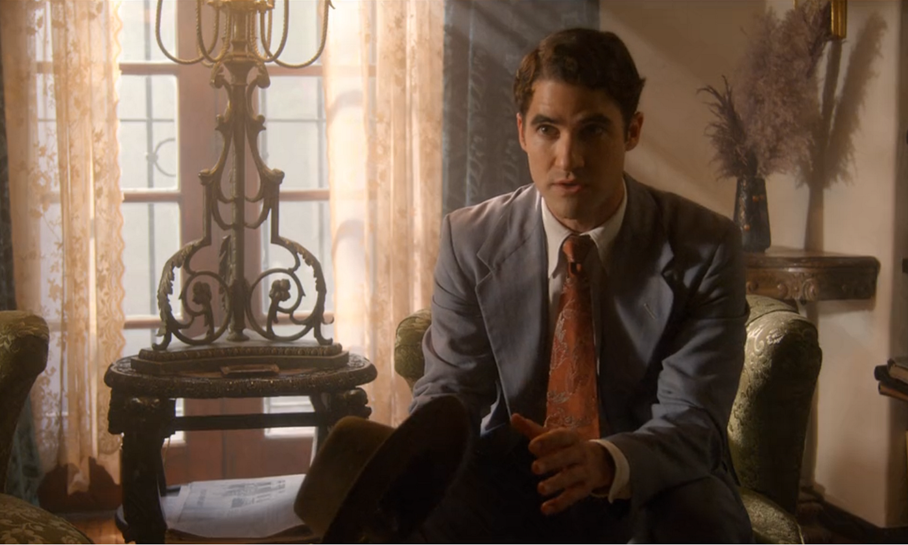
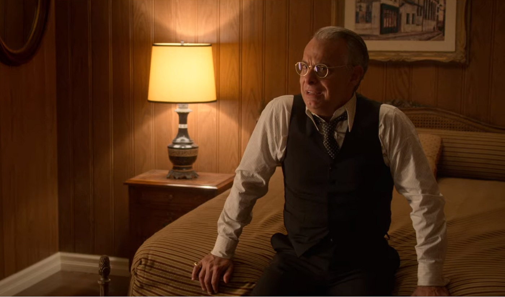
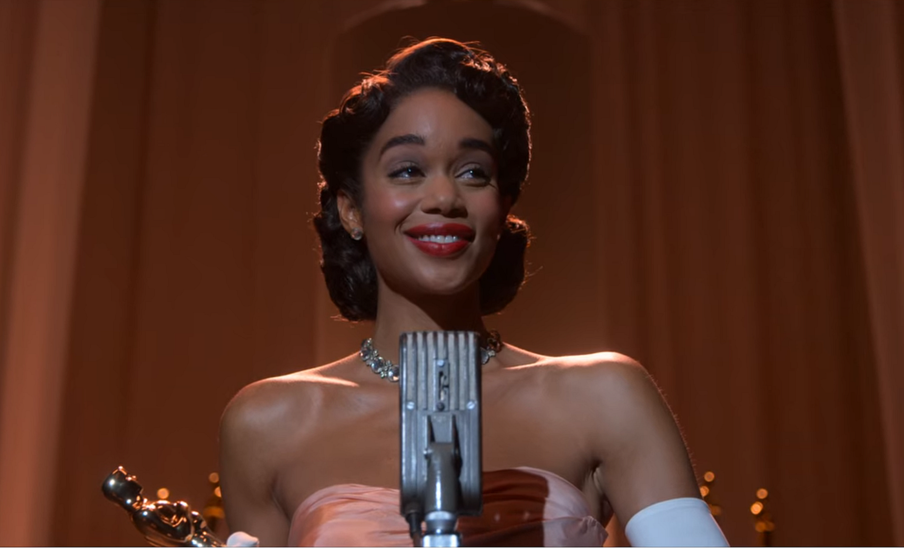

I recently finished watching all 7 episodes of the show, *Hollywood*. While I was reading up on the historical context, I read a brief synopsis of the show that described it as “an alternative history to 1950’s Hollywood, which imagines how life might’ve been different for queer, black, and brown entertainers if racism and homophobia were not barriers to their success.” On a surface level, it gets the point across, but as I continued to think about it, I realized it couldn’t be farther from the truth. *Hollywood* doesn’t show the fantasy of what could’ve been. It shows a harsh reality that’s molded into a better one.

(Spoilers ahead.)

There’s this quote in the first episode, when one of the main characters, Jack, is talking to this woman, and she challenges the importance of movies. In response, he tells her about when he would go to the movies as a kid.

> “When I looked up at that enormous screen, I suddenly knew what life was **supposed** to feel like, what being alive was **supposed** to mean.”

The show isn’t just saying movies are brighter or unrealistically happy, but it specifies with the word “supposed” this idea that movies show how the world is “supposed” to be, or in other words, how the world *is*.

This mindset carries over to the rest of Hollywood.

When a director, Raymond, talks to the town’s premiere production company, Ace Studios, about producing his movie with an Asian lead, the producer, Dick, rejects him. Dick tells Raymond this story about how this brilliant Asian actress deserved a certain part and the oscar that came with it, but that it was better that she didn’t get it, because the movie wouldn’t have been a hit if she did. At the time, Asian women were not thought of as stars or even normal human characters, and so movies couldn’t show them as such, because they could only show how the world *is*.

Raymond had a vision to change how things are, but a couple of key things had to happen for it to come together. The most important of which was Dick Samuels’ transformation.

In the 1950s, being single as a middle-aged man meant one of two things for Dick: either his wife had recently passed, or he was gay. Being the latter of the two, Dick had been hiding his sexuality for many years for the sake of his career. He had a lot of turmoil and disheartenment accumulating over the years.

After a young actor throws himself at Dick to boost his own chances in the town, Dick refuses and breaks down. He comes to terms with everything he’s been holding back, and it marks the start of his change. He was no longer going to hide who he really wanted to be, and this sentiment transfers over to the movies he produces too.

Conveniently, this is when Raymond becomes more persistent, and is set on casting his black girlfriend as the lead role of his movie. Raymond says to Dick and another producer that they either cast his girlfriend or he won’t direct the movie. Now that Dick has changed, it means that Raymond’s directing the picture.

Although the producers were on board with the idea, the final decision was left in the hands of the head of the studio. She mentions it casually at a luncheon with Eleanor Roosevelt and it provokes Ms. Roosevelt to meet with her and the producers, where she says to all of them:

> “Think about it, what it might mean to a dirt-poor, little black girl living in a shanty in some cotton town, where she’s told she’s free, but really her life is no better than that of her grandparents, who were the owned property of another human being. Think about her. What it would mean to see herself up there on that screen. Vaunted, dignified, valued.”

This is where *Hollywood* hammers home the idea of what makes movies so powerful. They have the power to influence us. They show us not only how the world is, but also how the world can be.

They show us experiences that we wouldn’t know without them. And our experiences shape who we are by shaping our views and understanding of the world, and so movies do too.

The more we see something in a certain context, the more we come to understand it as a part of the world. In *Hollywood*’s example, seeing a black woman on screen as someone complex and successful can shape our image of black women. And it means so much to a young black girl in the 1950s because she’s surrounded by experiences that convince her of the opposite.

This example brilliantly illustrates how movies can make a difference. And it’s not just about having someone to relate to. It’s about how seeing people in a certain context can change the way people think.

The show goes on to become an example of its own message. It provides us with a series where we can *see* change happen. It starts with a Hollywood that only ever produces the same movies featuring the same actors, but by the end, we see a black woman win an academy award for leading actress. More importantly, we see a group of people persist and fight for what they believe in and succeed in changing something crucial to society. Even if it’s just by a little, it helps us believe that this can happen in the real world too.

There’s so much more I could say about this show, but there’s this one quote I’d rather end on from the second episode, where Raymond brilliantly encapsulates everything I’ve talked about:

> “Movies don’t just show us how the world is, they show us how the world can be, and if we change the way movies are made, you take a chance, and you make a different kind of story, I think you can change the world.”
