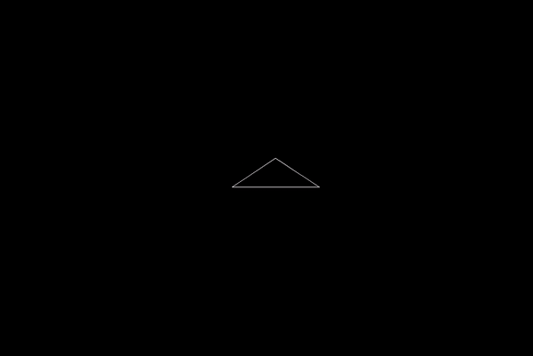
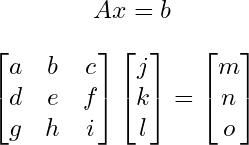
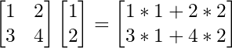
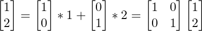
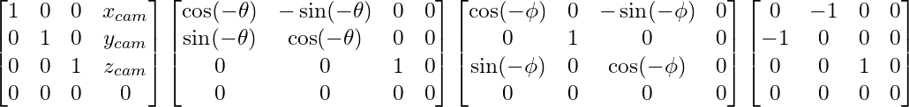
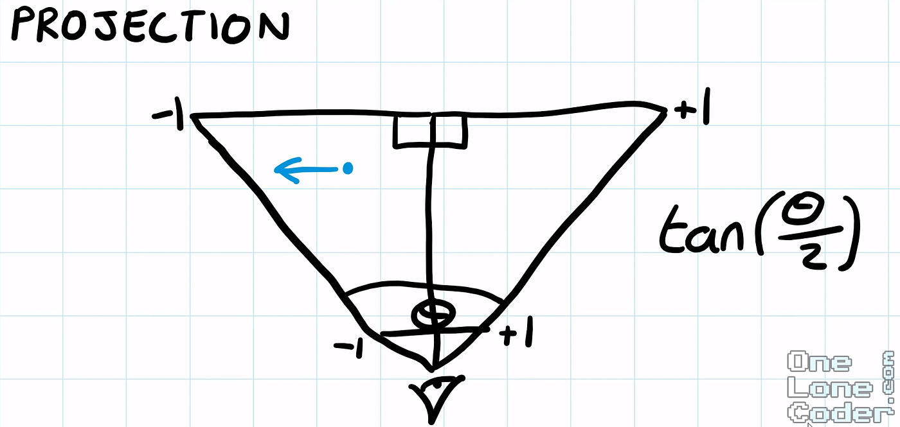

This semester I’m taking a class on software design and for our final project, the course staff has given us 3-4 weeks and told us to make something using C++ and a graphics library called Cinder.

I thought it’d be cool to build the systems visualizing 3D space on the 2D screen.

My goal for the end of the project was to just render a camera inside of a room, where the room was represented by some white lines drawing the frame against a black background.

I really had no idea how difficult this was going to be, so this seemed like a reasonable north star for the project.

My original approach, with pretty much no prior knowledge or research, was that I’d figure out how to render vertical and horizontal lines and then build everything from those.

Beyond the general concept, I really had no idea how I was even going to do that, I thought I might do ray tracing, like projecting a ray for each pixel on the screen and whatever object that hits, I’d draw that.

Not only was this going to run into problems with my whole line idea, but also it would be very computationally taxing to run loops incrementing rays until they hit something. And then to make up for that, it would limit the depth of view of the player.

I’m still very only scratching the surface of graphics systems, and I know ray tracing is becoming more prevalent as computers and graphics get more powerful and better optimized, but at my level, it’d be a lot of work.

After researching for a couple of minutes I realized a much better system would be to represent everything via triangles, and then transform the points of the triangles, and then draw everything.

This is how it’s turned out so far.

With some minimal movement controls, you can move forward, backward, and side to side, as well as look in all cardinal directions.

Of course, it didn’t go completely smoothly the first time, but after working on it for a while, it worked how I expected it to.

For the rest of the article, I want to show how this actually works. I’m not going to teach you how to program in C++, or even how to implement this in C++ because that’s not really what this article is about. Instead, I’m going to explain the intuition in a hopefully helpful way so that you have an understanding of how the system works behind the scenes. And then if you wanted to build it, you could do it yourself and actually learn something, and if you don’t want to build it, then you would at least understand how this stuff works without that clutter of following my code.

### Table of contents

-   Overview of going from 3D to 2D
-   Linear algebra
-   Transforming from absolute to relative position
-   Projecting and scaling to an image
-   Rasterizing to a display window

#### Overview of going from 3D to 2D

There are 3 steps for going from 3D to 2D space that we’ll be diving deeper into in the next sections, but briefly:

1.  You need to get the locations of your points in absolute space **relative** to your camera, or your perspective.
2.  Then you need to scale those points according to depth and project them to a 2D plane.
3.  And finally, you need to scale those points to the width and height of your screen and place the origin at the top left corner, and draw everything.

All of this is done with…

#### Linear Algebra

Linear transformations!

For each one of the transformations, all we do is take our point and multiply it by a matrix.

If you don’t know or remember how to multiply matrices, you should go learn it. But basically, you sum the products of the components of the rows of your first matrix and the columns of your second matrix, and that’s your new component corresponding to the location of the row and column you used.

So this is an example of a calculation:

You’ll notice, that it’s actually a sum of all the columns.

And we realize that our transformed point is actually just our point written in the basis, or column space, of the transformation matrix.

As proof, it may help to see how points in our normal, identity matrix can be written in the same form.

So to transform a point to a new basis, like when we are rotating and doing all that stuff, we really just multiply by a matrix that holds this information.

I’ve very briefly covered just enough of the intuition behind linear transformations for you to understand how this would work, but to really learn and understand it, and see how actually kind of beautiful it is, I would recommend checking out <a href="https://www.youtube.com/playlist?list=PLZHQObOWTQDPD3MizzM2xVFitgF8hE_ab" class="markup--anchor markup--p-anchor" data-href="https://www.youtube.com/playlist?list=PLZHQObOWTQDPD3MizzM2xVFitgF8hE_ab" rel="noopener" target="_blank">3Blue1Brown’s series, the Essence of Linear Algebra</a>.

Also just to note, this is a 4x4 matrix, and our point is 3x1. Basically, when applying the transformation, I pretend there is an extra 1 at the end of the point, and I chop off the last row of the matrix, and this becomes a normal 3-dimensional transformation, with an additional translation.

I keep it in a 4x4 matrix because it’s nice to just have all of the information in a single entity.

#### Transforming from absolute to relative position

So we don’t want to just visualize things, but we want to move and look around in the 3d space.

To do this, we need to know where things are not only in absolute space, but where they are relative to us, and what direction we’re looking.

So what information do we have that will impact something’s relative position.

First, definitely our own position right.

Then what direction we’re looking. There are different ways of doing this, but I found it most intuitive to use spherical coordinates.

This means we have something phi, representing our vertical angle, going from looking up at 0 degrees, to looking down at 180.

And then we have something like theta, representing our horizontal angle, going a whole 360 going counterclockwise from the x axis.

And there is one more thing.

If we look at a normal representation of 3-dimensional axes, we see that z points up, and x and y lay “flat”

But at 0, 0 for our horizontal and vertical angles, if there is a point on the y axis, it’s actually to the left of us. So the point 0, 1, 0 relative to the camera would be -1, 0, 0.

This conversion is another transformation.

This is my final transformation to take a point in absolute space to its location relative to me. In the end, we want to perform the following transformations. Offset by our position, rotate horizontally (around the z-axis), rotate vertically (around the x-axis), and convert our axes. I’m not going to go into depth explaining how I got these, but I’ve left the matrices for if you want to think about it on your own. Also, try to think about why order matters not only because of how matrix multiplication works, but how the transformation actually changes if you were to say rotate vertically before rotating horizontally.

#### Projecting and scaling to an image

Ok lets move on. The next two are much simpler, or at least, have only 1 matrix instead of 4.

So what actually are we doing when we “Project to the image plane”? For my purposes, this is scaling triangles their depth, so things that are farther away are smaller, and then scaling it to the space between -1 and 1, often referred to as the “clip space,” so I can easily scale it to my display size later.

Neither of these things is really projecting because projection implies that we are getting rid of a dimension, but we don’t actually have to do that. When we draw to the screen, no matter if our vector has a third dimension, we are only taking the x and y coordinates to draw, so it’s projected then.

So first, let’s scale by depth. This is actually very easy. Divide the x and y values by its z value. We’ve converted our axes so that the farther something is away from us, the greater the z value, and so the smaller the value will be when we divide by it. This will have the effect of giving things depth.

Then, we will later want to scale the x and y values to the width and height of our display window, so it will be convenient for us now to scale everything to be between 0 and 1 away from our origin.

To do this, we want to divide by the maximum value of what our x and y values could be. Because we are dividing by z, it’s the maximum of the ratio.

For this, we have to set a field of view angle for both our vertical and horizontal axis. Then, conveniently, the ratio is just our x over our z value, which will at most be tan(θ/ 2).

For the field of view that we set, whatever the x and z values are, the maximum value the ratio could be, while being within our field of view, is this ratio, opposite of adjacent. And the same goes for our vertical axis as well.

#### Rasterizing to a display window

So once again I’m kind of lying. Rasterizing is the actual drawing of images onto a pixelated display, and this is more of, well, orienting to a display window.

Here, for the vast majority of graphics libraries, programs, etc, the origin is in the top left corner, and the y axis points down. So a point 1, 2 on the normal axis would be here on the display.

To do this, because we conveniently scaled everything to be between -1 and 1, we can simply multiply by the width, and negative of the height to invert it. Now that our image is scaled, we can translate the origin by offsetting it by half the screen height and width, as that’s where the origin currently is, the center.

This will draw things to the unintuitive display axes how we imagine them intuitively.

Then bam! Once you implement this system, draw all the triangles, and add some camera movement, you’ve got yourself a basic 3D graphics system.

I still have around 2 ish weeks to continue this project, and although there are definitely some clipping issues that I’m hiding in my demos, I’ll probably be moving on to something new. I’ve been pretty satisfied with my progress, and it’s gotten me excited for some more systems programming and/or graphics in my near future. I feel like I’ve learned quite a bit from this project, and I hope through this article, maybe you have as well.
