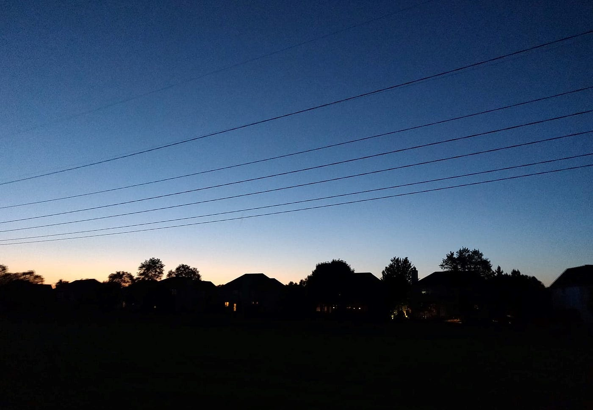

At the beginning of quarantine, I started exercising regularly. Out of all the habits I’ve tried starting over the past couple of months, it’s actually been the one that’s been the easiest to continue. Not that it’s easy, just easi*er*. I do a mix of strength training and cardio, working different parts of my upper body for two days, and running on the third. Having done this for almost three months now, I’ve grown to really like running, but for reasons I wouldn’t have expected.

Up until recently, I have never really seen the appeal of running. I understood that it’s a nice way to get some energy out, or to just get some fresh air, but doesn’t the novelty of nature wear off at some point? And if you’re just doing it for exercise, aren’t there tons of other ways that don’t impair my lungs? I get that it’s cardio but damn.

My first step towards liking it was learning the simple change to pace myself. I used to be baffled by cross country runners saying they ran 3–5 miles; I could barely run 1 without feeling like throwing up! Once I learned to take it easy, it was smooth(er) riding.

Pacing yourself is harder than it sounds. It’s a physically easier task, but it takes more patience, and it’s more boring. The other thing is that you go maybe 1.5–2 times faster than if you were walking, but you’re 10 times more uncomfortable. Once I got past all of this however, I could run for longer. And the farther I went, the more rewarding it would feel.

I had always heard that people experience a “runner’s high” from running, and to this day I don’t experience what I always imagined it to be. Supposedly from all the stress you’re putting your body through, it releases endorphins that make you feel good. I *do* feel good once I stop running, but it’s not some “high,” it’s that I’m tired and I can finally take a break and drink some water.

But it’s not just that. And it’s not just the physical and mental benefits that come from exercise. I am rewarded from running partly because it gives a sense of achievement, but more because running is one of many possible habits that will leak into my life and help improve it.

I find that in my life, my everything follows or aligns in some way with inertia. Things don’t want to change: they either want to remain still, or continue moving. The more I do something, the more likely I’m going to continue doing it. Sometimes it forms a habit with a cue, craving, response, and reward, but regardless of each of these steps, it builds momentum. When it comes to running, the more I run, the more I *will* run. More importantly, running is a form of delayed gratification, and it’s a commitment to do something that makes me uncomfortable, but grants me more reward in the long term. And the more I do things of this nature, the more I *will* do.

In the short term, I know this, and I feel it. After I run, I get to think to myself, that’s one more time that I’m doing something good for my life. And it compounds. I feel better, I’m more motivated to do things, these things improve my life in other ways, and so on. This progress is almost never linear, and it’s not clear that it’s even working a lot of the time, but overall I know it builds momentum for an upward trend.

There are already a billion other articles on building habits and all the steps you can take to do so, so all I’ll say to those of you that want to start something like this is to simply start today, and continue tomorrow. Whether it’s one day or one week, you can continue on whatever frequency you want. Just as long as you continue, you will be on the right track.
