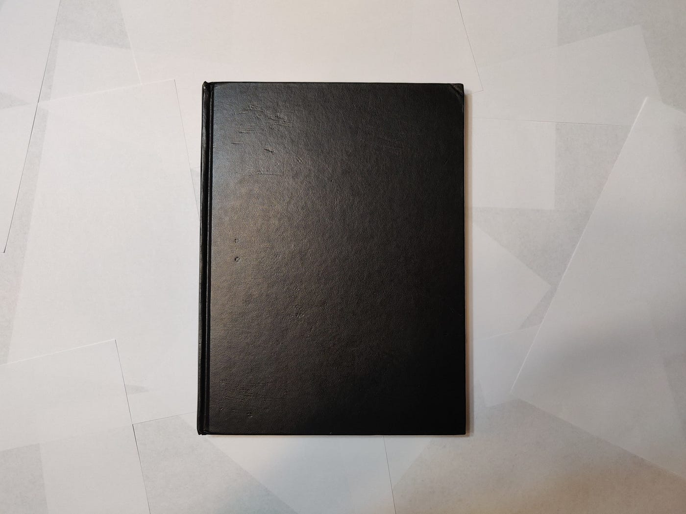
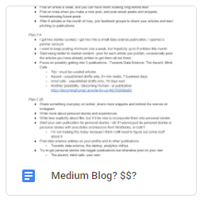

If I’m being absolutely honest, I only started writing because I learned you could make money from posting articles on Medium. To this day, the document I use to plan out and take note of different things related to my writing journey is named “Medium Blog? $$?”

But even though the start of my writing journey was not incredibly noble or romantic, I would still call myself a writer. I write every day now, and I enjoy it a lot.

I wouldn’t consider myself particularly talented in the craft, and I had little to no experience going into the past three months. I’d written a bit in elementary school if you count that, I loathed writing essays in high school, and I struggled to write essays for college applications. Other than that, I am really just someone who one day said they wanted to write, and then somehow mustered the will and perseverance to start, and then continue for a couple of months. Anyone can do it, but it’s harder said than done, so it just might help to know what you’re up against.

### **In the beginning, you must have one goal**

When I first realized I wanted to write, it was extremely exciting. I remember downing dozens of articles about starting out writing, and I’d constantly fantasize about this new version of myself who writes.

But there was a point where I’d let a whole week go by without writing a single thing. I may have opened a document on Google Drive, and titled it “First Article,” but beyond those two words, the document was blank. I recognized my procrastination, and one day I just decided to go forth, and write something. This is a lot harder than it sounds, but I think a key factor in my ability to start was my *willingness* to create garbage. It was important for me not just to be aware that I would dislike most of the stuff I created in the beginning, but to be willing to go and make that garbage in pursuit of getting better.

Nevertheless, it was still exciting to publish my first piece. Cherish this, because it won’t be long before the novelty fades.

It was after the first couple of articles that I hit a slump in my work. During the second month of writing, my journey had entered a barren and desolate land, where most other enthusiasts starting to write were far gone. I had little support and a less than pathetic following. On my stats page, I could see days go by without a single person even viewing my work, let alone reading any of it. And I went a week or two without writing because “I just didn’t have anything to write about.”

I think the only reason I’m still writing after three months is that I was aware during my first articles that I couldn’t let myself lose sight of one goal:

To keep going.

Regardless of if others thought my work was bad, or even if I thought my work was bad, I kept going, because if I didn’t, it would never get past being the dump that it was at the time. I sat down and wrote a three-minute article and hit publish. I had to ignore so much of the writing advice telling me how to get my articles to perform well for the algorithm because I knew that if I let myself get too caught up in many details, I might not publish that article for another week, or even at all.

And even two articles after that, I knew that if I wanted to reach the goal I’d set for myself, I had to write something. So I put something together, and I hit publish. And I kept doing it again and again.

These articles ended up doing fairly well relative to my other ones, but even though I was fortunate enough to face a bit of success that could motivate me for the future, it was important for me to be prepared to trudge through another month of resistance.

I knew that even though I wasn’t all that proud of my writing, I was proud to have kept going.

### **Focus on the process**

After the second month, I got better at writing more consistently. It wasn’t mandatory or anything, but I also got into the habit of writing a little bit every day. Still, however, the struggle was not over. And it probably won’t be over until I stop writing altogether.

Even with more motivation to write, and an easier time writing regularly, I still felt a lack of direction in my writing and a sense of discouragement from my lack of success as a writer.

A lot of writers have a sort of niche that they become an authority in, but I didn’t, and I still don’t really. The whole month of July I questioned what my whole pursuit of writing was even for. What value was I really contributing with my articles? What was *I* even getting out of writing them?

I became very concerned with writing articles the way I’d seen them written, or what I thought a publication wanted, or what I thought the Medium curators wanted. I’d finish an article and I wouldn’t feel a sense of accomplishment, but relief that I didn’t have to force myself to keep working on it.

All the while, my stats page became my plague. There were days I checked it as often as I checked my phone, and each time I’d get fewer views and reads than I expected. Articles I enjoyed writing the most performed the worst, and visa versa. Everything around me went against what I felt within me.

There were moments of small wins that motivated me, but many more that discouraged me.

But I managed because I focused on the process.

In *The War of Art*, there is an excerpt where Steven Pressfield shares his writing routine that sheds light on this idea.

> “It’s about ten-thirty now. I sit down and plunge in. When I start making typos, I know I’m getting tired. That’s four hours or so. I’ve hit the point of diminishing returns. I wrap for the day…”

> “…It’s three, three-thirty. The office is closed. How many pages have I produced? I don’t care. Are they any good? I don’t even think about it. All that matters is I’ve put in my time and hit it with all I’ve got. All that counts is that, for this day, for this session, I have overcome Resistance.”

I would highly recommend reading Pressfield’s book because there is so much more to this concept than I’m able to describe here. But briefly, Resistance is the force within us that goes at all possible lengths to prevent us from accomplishing what we want.

To become a writer, to consistently write, to become better at writing, and to embody the writer we want to be, we must overcome Resistance. To do this, it helps to focus on the process.

And so regardless of the external success, or lack thereof, that I faced, regardless of the confusion and expectations I carried with what I was writing, I knew the most important thing was this process, and so I kept on writing.

### **On finding your passion**

At a certain point in my writing journey, I definitely questioned if writing was *right* for me. So far in this article, I’ve probably made it seem like writing wasn’t for me. But just because I’ve struggled, it doesn’t mean it isn’t worth it, or that I should stop what I’m doing. It’s only natural to have doubts about the things you care about.

Recently there’s been so much emphasis on finding your passion and doing what you enjoy, and as a result, a lot of us have this great pressure to find our calling, our passion that we want to spend our whole lives on. And so often when we try out certain activities, we dismiss them too quickly because they don’t fit our far too idealistic image of what a passion is supposed to be.

Just because something does not come naturally, or just because you don’t enjoy something at every step of the way, doesn’t mean you shouldn’t do it. I believe it’s impossible to know if you have a calling for something without doing it for a solid while. You might feel like it wasn’t meant for you, but only if you stick it out for a while can you really come to a reasonable conclusion. And in the end, if you don’t like it, don’t worry about having wasted time, as you can move on with your life knowing that not an inch of your body will ever bug you wondering if you made a mistake quitting because you’ll have explored it thoroughly.

Even regardless, who cares if it’s *your passion*? If something generally brings you long-term fulfillment, there’s no point in burdening your mind worrying about whether something is your passion. Feel free to explore other activities, but if you’ve committed to something you know you enjoy, I don’t think it really matters if that thing is what you were “meant to do.”

In writing, there will be many times that you may doubt whether it’s your passion or if it’s what you’re meant to do, but just stick with it for a while, because chances are that if you started, you’ll be thankful you continued.

### **Final thoughts**

To be willing to produce garbage as the means to reaching greater mastery, to focus on the process and merely overcoming Resistance, and to disregard temporary dissatisfaction while furthering the exploration of the craft — these things are simple to understand but difficult to put into practice, so I wish you luck.

It’s been a long three months, but I’m happy with them. I’ve mainly focused on the more difficult parts of my writing journey because I believe that those are the most valuable for other beginning writers and creatives to hear, but really, the past three months have also been filled with just as much fun and fulfillment. Even though it’s been tough, I’m truly glad to have gotten this far. I’ve learned a lot along the way, and I hope through this article, you have too.
