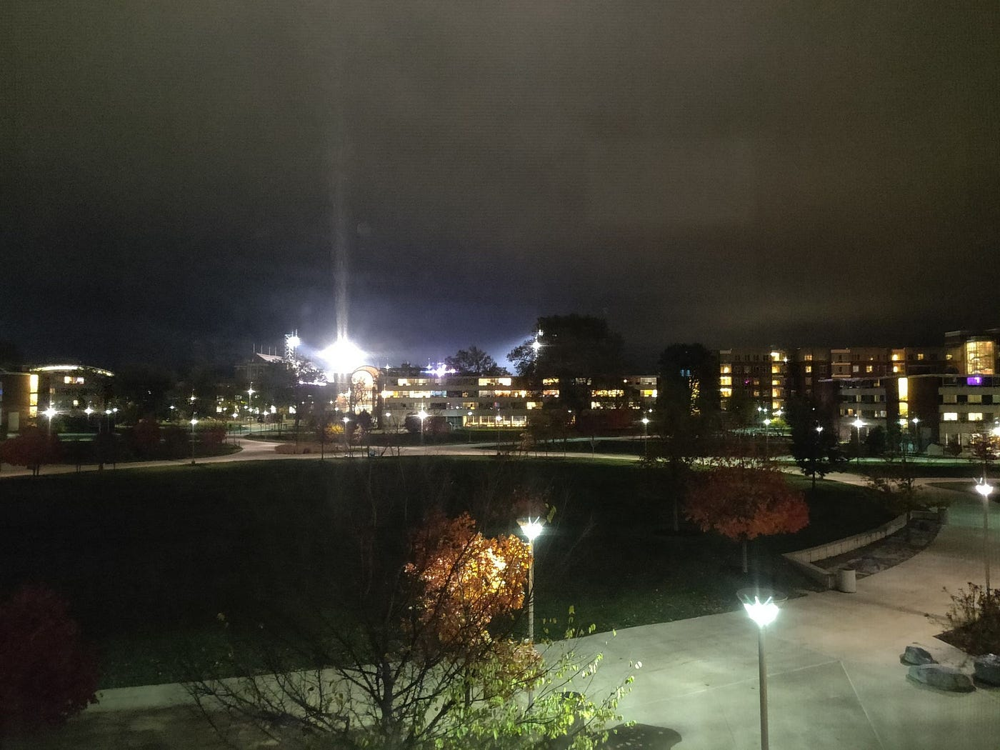
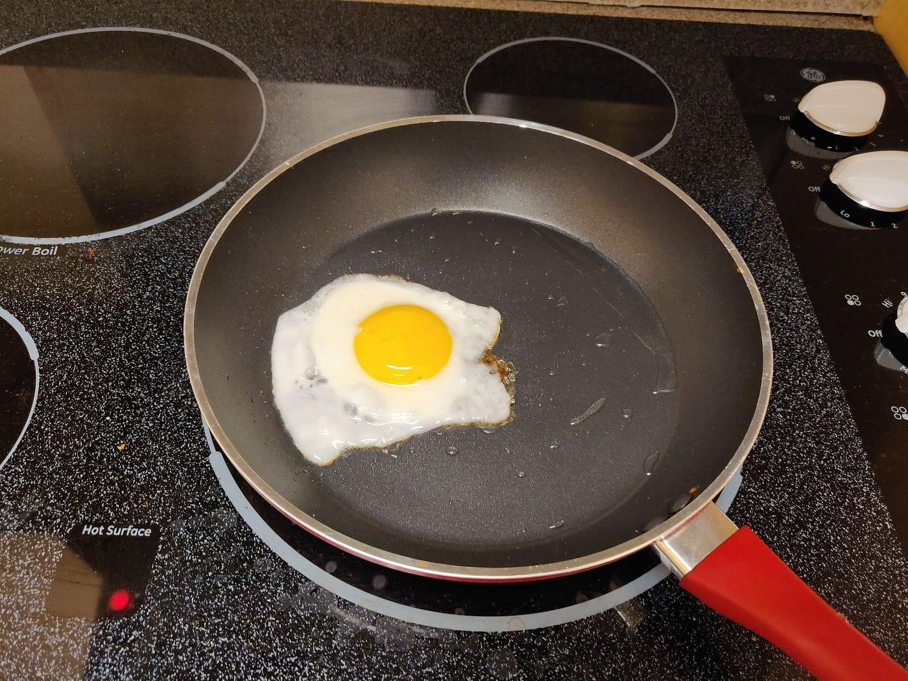

We’ve all been there. We meet someone, and we’re instantly charmed by, just *something* about them, and our romantic curiosity takes over. We follow up with them, and we have so much in common, or at least we have enough for our romanticism to carry the conversation. Maybe we’re in high school and labels are admitting too much so we have to do this roundabout getting to know them before we tell them how we feel, or maybe we just jumped right in. One way or another we’re in some sort of relationship, and we can’t stop talking to them. We want to know everything about them, and the moment we think of something we tell them whatever menial thought passes by our minds. They’re interested in everything we have to say, and it feels so good to tell them absolutely everything.

And in return, we expect them to do the same. We expect them to tell **us** everything, and also to keep telling us new things. And they do. And we do too. And it feels like we have this strong flame of romance and passion burning.

But then that fire starts to teeter and grow feeble and it becomes impossible to maintain such a vibrant flame any longer. We start to worry just a little bit if our flame is worth maintaining, or if the person we’ve chosen to maintain it with wants to keep maintaining it because it seems as though they haven’t been throwing in kindle wood as frequently, and they don’t poke the fire very enthusiastically when we throw in some logs.

This uncertainty brings worry. With worry comes stress.

The stress deters us, and sooner or later we will either find ourselves stuck and unhappy or no longer in a relationship.

I’ve noticed that it’s become very common for couples around my age to have this constant, ongoing conversation simmering over text 24/7. And although it may arise from an innocent romantic curiosity, in the midst of “falling in love,” it often leads us to impose the same expectations on our significant others that we do on content creators.

Content creators output lots of content, either through weekly videos, podcast episodes, blog posts, etc. Imagine how much content you consume on a weekly basis. If you have ever been in this situation where you’ve had this continuous background conversation, I would bet that the number of texts that you sent back and forth would amount to probably double that — of course, this will vary from person to person. Regardless of how much content you consume, you might notice just how much content is being generated, and more importantly, is being **expected** to be generated just from being in a relationship.

Not everyone can or wants to be a content creator. Why has it become so common for us to expect it from a relationship?

As a society, and as humans, we put so much of an emphasis on romantic relationships, partly because we’re biological creatures and it’s the act of fulfilling our reproductive duties, partly because sex is intimate and weird and feels good, and partly because we’ve put so much emphasis on it for so long, and likely more reasons that are beyond me.

The more we believe in the importance of romance, the more we think and talk and make songs and movies about it. The more we do this, the more we start to put expectations on what it’s *supposed* to be like.

These expectations are what allow us to evaluate our relationships. They give us a reference, something to compare it to. But more often than not, when we evaluate our relationships and our partners based on these expectations, we’re disappointed. It makes us unhappy to think that what we’re experiencing is not what we thought we were going to get.

This makes sense. But is it really the question we should be asking? Instead of “is this what I thought it was going to be?” And “Is this what it’s supposed to be?” What if we asked, “do I enjoy this?” And “will I continue to enjoy this?”

We get so caught up in our expectations that we forget about how we actually feel about things. Oftentimes we might actually be happy and content with a situation, only to find ourselves unhappy after subjecting it to our expectations or comparing it to others.

It’s hard to escape the temptations of comparison. Sometimes the line is blurred between what we actually feel and what we think we’re supposed to feel.

But every so often, maybe when you’re feeling down out of luck, just ask yourself this:

Regardless of what’s out there, of what you know about similar situations, **do you like where you are?**
