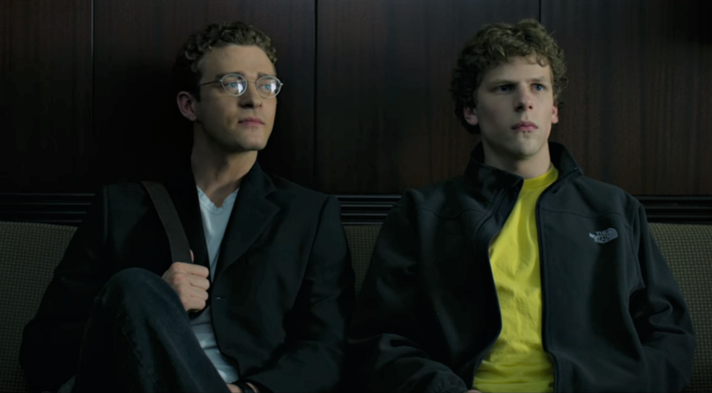

The actors and their performances were all excellent. The writing was brilliant, and the way they jumped back and forth in the story was engaging and easy to follow. It felt fast-paced but had attention to detail. Overall a great movie.

But even though I can appreciate this movie for its quality storytelling, ‘The Social Network’ didn’t hit home like other great movies do. There was a culture to Mark Zuckerberg and Sean Parker present during the movie that my personal values conflicted with. I later recognized that dissonance as the same feeling I experience with a lot of the culture I’m surrounded by in the real world.

Every day I feel like I read an article or watch a video that makes me feel like I’m not doing enough. All these people are trying to tell us what we should do. And that’s because they want to help us, right?

Well, regardless of whether these intentions are genuine, I find that more often than not, I don’t actually use most of the knowledge I’m learning, and so it only contributes to a state of discontentedness with my life.

It’s not that this specific movie, or the actual Mark Zuckerberg or Sean Parker created this phenomenon — they certainly didn’t on their own — but I wanted to highlight that the way their mindsets are portrayed in this movie really embody the root of this self-improvement, hustle culture. When Mark and Wardo meet with Sean for the first time, Sean is talking about the potential of Facebook, and he says,

> “A million dollars isn’t cool, you know what’s cool? A billion dollars. And that’s where you’re headed.”

And with the music and the rest of the scene, this is a super cool moment. But it begins to show us this obsession with being ultra-successful that sets in over the course of the movie.

Later in the movie, Sean tells Mark this story:

> “A Stanford MBA named Roy Raymond wants to buy his wife some lingerie but he’s too embarrassed to shop for it in a department store. He comes up with an idea for a high-end place that doesn’t make you feel like a pervert. He gets a $40,000 bank loan, borrows another 40,000 from his in-laws, opens a store and calls it Victoria’s Secret. Makes a half million dollars his first year. Starts a catalog, opens three more stores, and after five years, he sells the company to Leslie Wexner and The Limited for $4 million. Happy ending right? Except two years later, the company’s worth $500 million and Roy Raymond jumps off the Golden Gate Bridge…”

> “…This is a once in a generation ‘holy shit’ idea. And the water under the Golden Gate is freezing cold.”

These last two statements, side by side, are the most powerful, and they precede a beat of silence between the two for us to really take it in.

This conversation between Sean and Mark implies that Mark would feel the same regret that this guy did if he made the same mistake with Facebook. It’s normalizing these ideas, saying that any person in our society reflects these values and that it makes sense for someone to jump off of a bridge were they to miss a similar opportunity. And when we see this mindset as one of the main factors in propelling Mark to such great success, and alongside such a flashy and lucrative lifestyle expressed in movie format, it instills in our mind that this is what we too want and believe.

Mark has an attractive dominance to him that comes from his incredible drive and ambition. But for many people, it can be disheartening, because never in our whole lives might we have the same thing that Mark does, even though that might be innate, something that was drilled into him through his environment over the course of his life.

Oftentimes we think we should have this infeasible determination, or that we should try to have the same motivation, but I find that this often takes away from our lives that are in reality quite good. These goals and measures of success that we’re led to believe our society values are centered around excessive success, so of course it’s hard for people to be happy with their humble lives when it feels like this is what everybody else wants. It’s hard for people to be happy when the way of living that will bring them the most solace is one that is so different than the way they feel like they’re supposed to live.

It’s difficult to go against the grain, but I need to remember that it’s just a movie. And even if it weren’t, be it people in real life, it doesn’t have to be my life. It can be interesting to experience and understand the lives of other people, but it doesn’t mean that my life needs to be like theirs. It’s important to tell the difference so that we can escape the unnecessary pressure that comes from what we think is *expected* of us, because in reality, the way we live our lives is only subject to what we *want* for us.
