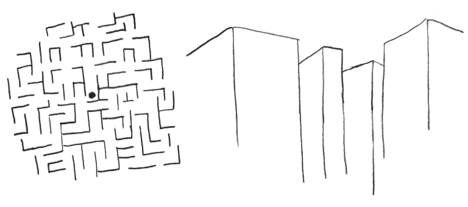

I constantly feel the need to question what I’m doing, whether my time could be better spent doing something else. This is not an anxiety disorder or special condition only I am victim to. This is a symptom of a culture that I’ve subscribed to.

Self-improvement.

With such good intentions and actionable advice, it feels as though it could not possibly do any harm. But of course, for anything involving work, there ensues burnout. I’ve gotten burned out before from trying to enact too many habits, or just feeling pressured to. But right now is a little different.

I’ve been consuming a lot of information recently. And while learning is a great thing, I’m starting to realize that learning and consuming are very different.

I’m trying my best to actively engage with the content I’m reading and watching, but at a certain point, the value diminishes. I can only learn so much in a day, and after a certain point, I’m just cluttering my mind with more sequences of words that may or may not be important.

Reading has become super trendy now because self-help has become more popular, because why not learn more and derive more meaning from your life through the words of other people? It’s all fun and good, but there comes a limit. A great story is a great story, and it doesn’t exhaust you to read it. If anything, you are energized by your engagement to keep reading. A lot of the content out there now is not like this. A lot of content is just spewing intuitive information and simple but less valuable concepts. I read so much of this because it has an intriguing-enough title, and I feel like I *should* read it. I feel like I should know how many miles I should run every day to get the maximum benefit, or why this person stopped waking up at 5 am. But it takes effort to engage with things, and if they’re going to be low quality, I’m exhausting my effort and getting nothing back.

Our lives have changed so that at the end of the day, we think of the value of our day in terms of how productive we were, or how many things we did, or if we kept up with our habits, or accomplished certain things on our to-do lists. Nobody just lives their lives anymore, we constantly evaluate ourselves. It may have started out with good intentions, but it has only become a source of discontentedness for me. We want to improve ourselves so we can accomplish things so we can find happiness and fulfillment, but once again I’ve found myself losing sight of happiness while chasing it.

It’s time to return to a less complicated life.
