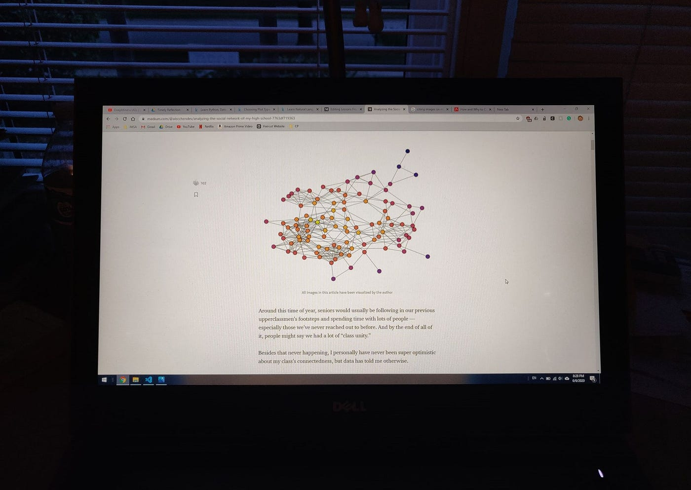
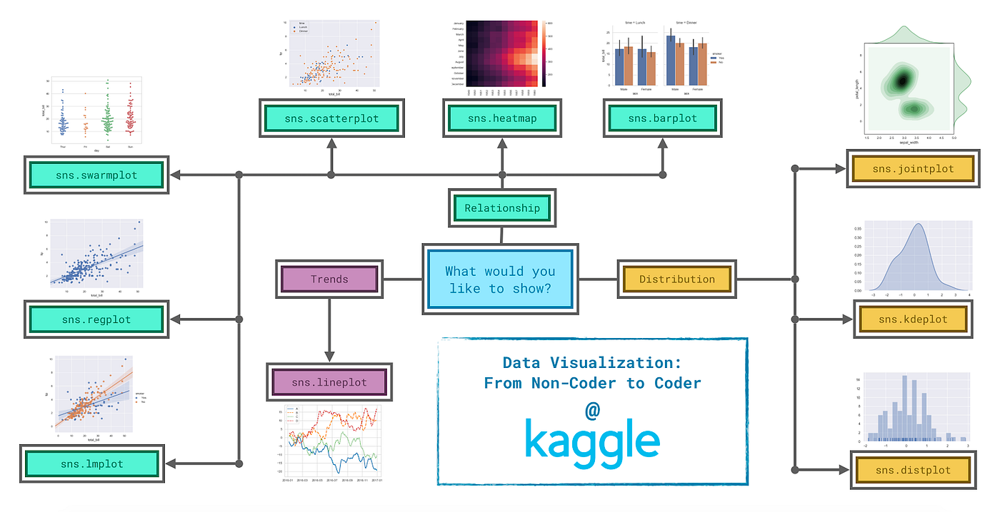
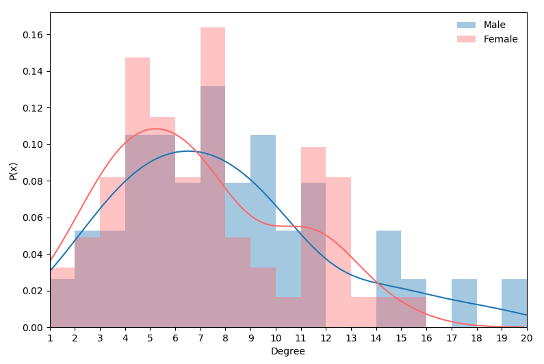

I recently published an article about the social network of my high school, and it required me to go through the process of a normal data science project. For other beginners, I want to share some of the important things I learned and what the process really looks like besides its flashy outcomes.

You don’t have to read my previous article to read this one, but I’ll leave it here in case you’re curious.

<a href="/blog/analyzing-the-social-network-of-my-high-school/" class="markup--anchor markup--mixtapeEmbed-anchor" data-href="/blog/analyzing-the-social-network-of-my-high-school/" title="/blog/analyzing-the-social-network-of-my-high-school/"><strong>Analyzing the Social Network of My High School</strong>  <em>What I learned from the data behind my high school’s senior class.</em>medium.com</a>

### Cleaning and Reformatting

This aspect will vary depending on what your data is like, but I received raw data, and I think I spent just as much time if not more cleaning and reformatting data than I did visualizing it. When I learned basic data skills, the data had usually been handpicked for the sake of the exercises, but this is often not the case for real personal projects.

In my project, I had to write code to correct spellings of names, remove certain values, anonymize, and reformat the data into multiple files to accommodate for certain libraries.

I didn’t just have to clean up the data, but I had to come back to it many times, and only then could I visualize exactly what I wanted.

If you have really enticing data, this part can be pretty interesting, but even when it is, it can be discouraging. Cleaning and reformatting take a lot of work, and it doesn’t clearly translate to any reward. It makes for this threshold of work that has to be met before you even get to start tackling any of the flashier data science stuff. All the advice I can offer here is just to get used to it, and that as you continue, that threshold will become smaller as you become more familiar with it.

### Visualization

About a month ago I visualized my contest performance to see my progression in competitive programming. It was my first time experimenting with visualization libraries like matplotlib, and looking back, those plots feel almost primitive. If you compare those charts to my most recent ones, you’ll see how this project really helped me expand on my visualization ability. Along the way I learned what I think are some key concepts to visualization.

**Cleaning and reformatting part 2  
**This was partly because I wasn’t super familiar with all the functions I was using, but I had to go back to the data tons of times to pull exactly what I needed for my visualization. The data is never going to fit all of your visualization methods, or algorithms for that matter, so this is another time to realize that data science is as much about manipulating data as it is analyzing it.

**On what you’re going to visualize**  
I think it’s always a good idea to go in with a plan, but when you’re learning something new, it’s more important to be flexible. As I learned more about what I was doing, I started adding and removing things from my original plan, and by the end, the majority of my final visuals were ones I hadn’t planned on making.

**How to make a good visual  
**Making a good visual is simpler than it may seem. 80 percent of it bottles down to a couple key components, being function, proportions, and color.

Function just means that your data is visualized in a way that clearly shows what you want it to show. Think of what you want people looking at your visual to learn from it. Ask yourself, will they learn it? The actual plotting of the data is mostly automated by whatever tool you’re using, so your main job here is just choosing the right graph to show it. Although this flow chart is curated towards seaborn functions, it gives a good overview.

Having the right proportions for your graph will make it look cleaner and more intentional. Even if it’s readable with default or sloppy proportions, it’ll just enhance the overall visual a thousand percent to have things spaced nicely.

Finally, colors will turn your numbers into art. Choosing a nice color palette will make the graph not only look cool but also it can help illustrate what certain components represent or what the visual is comparing. This is a brilliant article that goes over interesting concepts and resources for using color in data visualization.

<a href="https://blog.graphiq.com/finding-the-right-color-palettes-for-data-visualizations-fcd4e707a283" class="markup--anchor markup--mixtapeEmbed-anchor" data-href="https://blog.graphiq.com/finding-the-right-color-palettes-for-data-visualizations-fcd4e707a283" title="https://blog.graphiq.com/finding-the-right-color-palettes-for-data-visualizations-fcd4e707a283"><strong>Finding the Right Color Palettes for Data Visualizations</strong>  <em>While good color palettes are easy to come by these days, finding the right color palette for data visualizations is…</em>blog.graphiq.com</a>

I personally like using the default color picker on Google, and I like Coolors for giving me palette ideas. Most of the time I mess around with some colors for a bit and it usually turns out okay.

I tried to keep each section short because these ideas are kind of intuitive, but doing these few things well will give you the greatest returns on the quality of your visual. The rest of the more minute and advanced styling will help, but not nearly as much.

### Writing

When it comes to actually writing about your data, I think the most important concept to keep in mind is that people are reading for themselves. It will make for a better article if you stick to the most valuable ideas that you want to share.

> “I realized I had written more explaining the statistics behind my graphs than interpreting them in context.”

I know there’s all this work that’s gone into your project, but so much of the extra knowledge that you’ve gained from it most likely doesn’t belong in the article. In my original draft, I included a lot of the information in this article, and by the end, I ended up changing it completely and excluding two graphs I thought were cool but didn’t offer nearly as much value as the others.

You’re telling a story, and organizing everything into something cohesive, insightful, and concise is a skill that is hard to do well.

When I was making my visualizations, I was getting weary that I might not have that much to talk about. But when I started writing, having to explain everything opened my eyes to the context of the numbers that gave the visuals meaning. Even if it doesn’t seem like there’s much there, if you work with it and put it into context, it’ll surprise you.

My last point about writing is possibly the most important. The whole point of having all this data is to show people empirically the truth behind what you’re saying, so make sure that what you’re saying *is* what you’re saying. Include all the important caveats and be transparent with the reader. The worst thing would be to have brilliant analysis be discredited because you forgot to acknowledge holes in the data.

### Final Thoughts

Now that we’re nearing the end of this article, go out and actually do something. Whether it’s your first project or your fiftieth, don’t fall victim to just reading about data science and actually start doing it.

And if you would like to refer back to the key points, I’ve left a summary below.

#### Summary

Cleaning and Reformatting — There’s going to be a lot of work you have to do before you can get to the most interesting part of the project. It gets easier every time, but you have to do it every time.

Visualization — When visualizing, go in with a plan but expect it to change, and it will probably change for the better. For the visual itself, remember that function, proportions, and colors will serve the most value in making your visual insightful and aesthetic.

Writing — Writing is probably the most challenging part, but it’s also really important. Remember you’re a storyteller first, and the math, statistics, and computer science are just what enables you to tell stories nowadays. Help your reader understand enough so they can intuitively understand what you’re saying, **without** needing to know all the work behind it.
