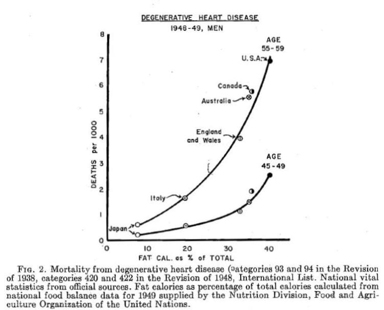
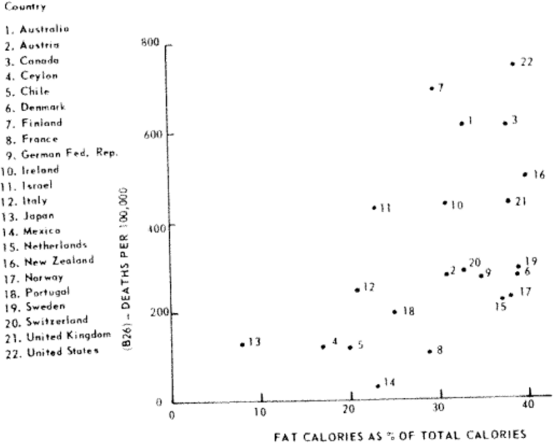
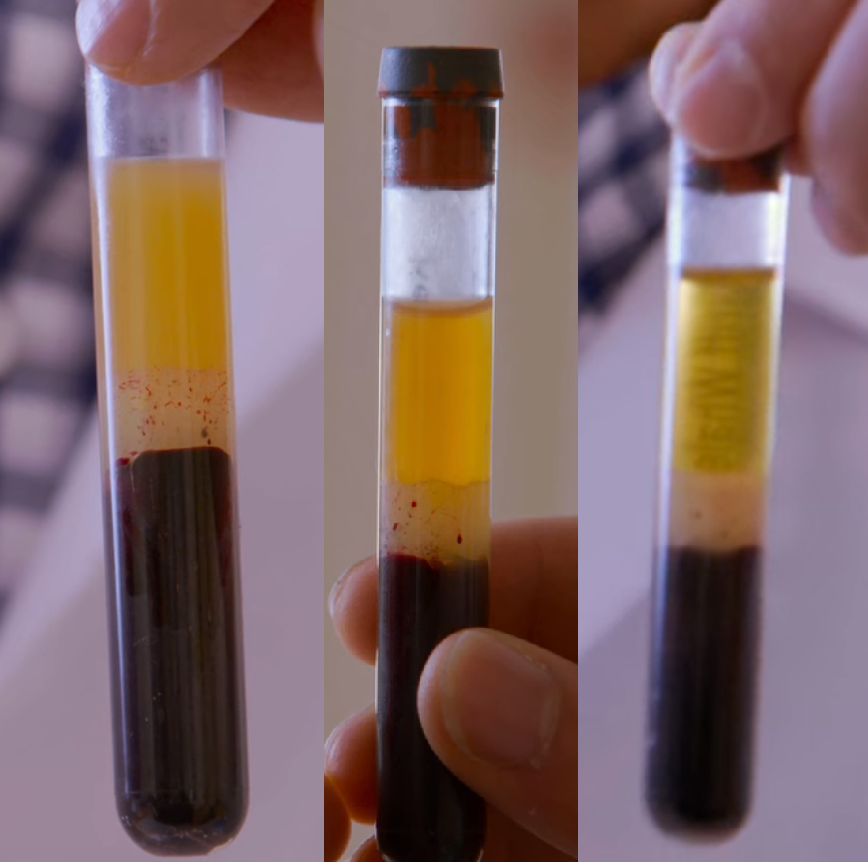

Recently I’ve found it very difficult to come to an educated conclusion on simple nutritional decisions like where to get my protein from. So many ups and downs with the public perception of meat have led to widespread beliefs based on faulty evidence and skewed interpretations. While watching the recent pro-plant-based diet film, *The Game Changers*, I took a closer look at some of the claims they made against eating meat in hopes of finding some sort of clarity amongst so many sources of information.

I want to make it clear that this is from my **personal** research. Although I’ve tried my best to cite studies and use credible sources, I do not have a medical license or any formal education in nutrition. I just want to share the things I’ve learned and found especially intriguing and important for nutrition in my experience. With that being said, let’s start off with one of the topics subject to the most confusion: meat and the heart.

**1. Meat, specifically with its large amounts of saturated fat, causes heart disease.**

In my own life, the claim that meat and saturated fat causing heart disease has been one of the most influential in shaping my diet. I’ve generally tried to eat less red meat and more lean meats like poultry and fish because I took this as fact. Only recently have I started to really consider the research and evidence behind this guideline I’ve been fed my whole life. And what I’ve learned is that this idea that meat causes heart disease is taken out of context.

It all started with Ancel Keys, a researcher at the University of Minnesota Laboratory of Physiological Hygiene & Exercise Science. He conducted a <a href="http://www.epi.umn.edu/cvdepi/wp-content/uploads/2014/03/Keys-Atherosclerosis-A-Problem-in-Newer-Public-Health.pdf" class="markup--anchor markup--p-anchor" data-href="http://www.epi.umn.edu/cvdepi/wp-content/uploads/2014/03/Keys-Atherosclerosis-A-Problem-in-Newer-Public-Health.pdf" rel="noopener" target="_blank">study now known as “the Seven Countries Study”</a> that cherrypicked seven out of twenty-two countries to support the claim that consumption of saturated fat was directly linked to heart disease-related deaths.

**The overall data showed no statistical correlation**, and although this was made public knowledge in a <a href="http://library.crossfit.com/free/pdf/1957_Yerushalmy_Hilleboe_Fat_Diet_Mortality_Heart_Disease.pdf" class="markup--anchor markup--p-anchor" data-href="http://library.crossfit.com/free/pdf/1957_Yerushalmy_Hilleboe_Fat_Diet_Mortality_Heart_Disease.pdf" rel="noopener" target="_blank">study performed four years later</a>, <a href="https://pubmed.ncbi.nlm.nih.gov/20888548/" class="markup--anchor markup--p-anchor" data-href="https://pubmed.ncbi.nlm.nih.gov/20888548/" rel="noopener" target="_blank">many health guidelines for the following years, including the 2010 Dietary Guidelines Committee Report, were based on weak scientific practices like this.</a> This is why, like the producers behind *The Game Changers* documentary, many people take for granted the credibility of these guidelines.

The truth is that there are many other factors that increase the risk of heart disease that are much more important, such as obesity, stress, smoking, diabetes, etc. And **a plethora of** <a href="https://www.healthline.com/nutrition/5-studies-on-saturated-fat" class="markup--anchor markup--p-anchor" data-href="https://www.healthline.com/nutrition/5-studies-on-saturated-fat" rel="noopener" target="_blank"><strong>recent studies</strong></a> **have deliberately debunked this idea that saturated fat causes heart disease.**

**2. Meat impairs endothelial function and blocks blood flow.**

In the movie, I remember a very powerful visual demonstration of the cloudiness of blood caused by eating certain foods. Three football players from the Miami Dolphins ate three different burritos: one with beans, one with chicken, and one with beef. Afterward, they ran each of their blood samples through a centrifuge to separate the blood and the plasma, and showed the amount of fat in the plasma to reflect the health of their endothelial function, our bodies’ way of regulating our circulatory system.

There is definitely some truth to what they’re saying here, but this idea that meat is the sole cause of this is taken out of context.

<a href="https://pubmed.ncbi.nlm.nih.gov/3826340/" class="markup--anchor markup--p-anchor" data-href="https://pubmed.ncbi.nlm.nih.gov/3826340/" rel="noopener" target="_blank">In a study conducted in 1996</a>, they found that carbohydrate intake was inversely correlated with fat utilization and that when fat is consumed in isolation, or even just alongside fewer carbohydrates, it is used rather quickly as energy, leaving little to no fat circulating in the blood and no harmful effects on endothelial function.

When you eat any form of either fat or carbohydrates, there is either some form of unused energy circulating in the blood that impairs endothelial function in excess. It is important to note that either can be eaten and used as energy without impairing blood flow and that it’s **only when both are consumed together or in excess will our endothelial function be significantly impaired.**

To understand more thoroughly how this works, it is helpful to know about the ways our bodies metabolize different forms of energy, one of which being ketosis, the process that turns fat into energy.

Your body has two main ways to make energy for itself. The first method, and also the most common, is through consuming carbohydrates. When you eat any form of carbohydrates, your blood sugar rises, and insulin kicks in to allow your cells to obtain energy from glucose. When your body runs out of carbohydrates, and large amounts of insulin are no longer circulating in your blood, your body enters ketosis, where it will use fat as energy in the form of ketones.

Ketones are a perfectly good source of energy for your cells, and although many cells do prefer carbohydrates, there is also evidence for other cells, such as those in the heart, preferring ketones, such as in the Biochemistry textbook published by W.H. Freeman. Ketones have also been found to have other benefits, such as <a href="https://pubmed.ncbi.nlm.nih.gov/11581442/" class="markup--anchor markup--p-anchor" data-href="https://pubmed.ncbi.nlm.nih.gov/11581442/" rel="noopener" target="_blank">aiding in epilepsy</a> and <a href="https://www.ncbi.nlm.nih.gov/pmc/articles/PMC2367001/" class="markup--anchor markup--p-anchor" data-href="https://www.ncbi.nlm.nih.gov/pmc/articles/PMC2367001/" rel="noopener" target="_blank">slowing the progression of Alzheimer’s</a>. In <a href="https://www.ncbi.nlm.nih.gov/pmc/articles/PMC5102124/#:~:text=The%20novel%20ketone%20diet,%20therefore,human%20conditions%20with%20metabolic%20abnormalities." class="markup--anchor markup--p-anchor" data-href="https://www.ncbi.nlm.nih.gov/pmc/articles/PMC5102124/#:~:text=The%20novel%20ketone%20diet,%20therefore,human%20conditions%20with%20metabolic%20abnormalities." rel="noopener" target="_blank">a study at the University of Cambridge</a>, they found that a ketogenic diet improved mental and cognitive performance in rats.

So for *The Game Changers* experiment, the fat is left circulating in the blood unused because, alongside the consumption of meats, they also consumed a lot of carbohydrates through the tortilla, beans, and other ingredients. <a href="https://pubmed.ncbi.nlm.nih.gov/3826340/" class="markup--anchor markup--p-anchor" data-href="https://pubmed.ncbi.nlm.nih.gov/3826340/" rel="noopener" target="_blank">Were they to consume a more ketogenic meal, with fewer carbohydrates, but the same amounts of fat, their bodies would have used the fat as energy, leaving their blood to be clearer like the plant-based burrito blood.</a>

To back their claim, *The Game Changers* movie cites a study that shows a high fat **non-ketogenic** diet impairs endothelial function, but it neglects that high fat ketogenic diets are actually perfectly fine in terms of endothelial function. In <a href="https://www.ncbi.nlm.nih.gov/pmc/articles/PMC5852826/" class="markup--anchor markup--p-anchor" data-href="https://www.ncbi.nlm.nih.gov/pmc/articles/PMC5852826/" rel="noopener" target="_blank">this study,</a> the researchers even found that exposure to ketone bodies *aided* in antioxidant defense in endothelial cells.

**3. Our bodies aren’t designed to eat meat.**

I think a particularly interesting aspect of the movie was the ancestral and evolutionary perspective on what our bodies have been *designed* to eat. And although they failed to consider certain aspects of human history, I must place merit for how intuitive and somewhat sound this reasoning is for dietary recommendations.

The way they frame this anthropological perspective is through the discovery of new evidence supporting more plants in prehistoric diets. We previously thought humans ate mostly meat because in the fossils researchers had found, we had only discovered tools for eating meat. This was because these tools were made of things like stone and other materials that wouldn’t erode or deteriorate quickly. Now with better technology and research, we’ve found microscopic evidence in prehistoric human bones that have helped us learn that humans also ate lots of plants.

The truth is, although many ancestors have eaten many plants, <a href="https://pubmed.ncbi.nlm.nih.gov/29574845/" class="markup--anchor markup--p-anchor" data-href="https://pubmed.ncbi.nlm.nih.gov/29574845/" rel="noopener" target="_blank">we have still hunted and eaten animal meat for a very long time</a>. The movie provides other anatomical evidence such as how our intestines are much longer than carnivores, however, our intestines are still much shorter than herbivores and have we have a smaller secums, the pouch in the intestines for fermenting fiber. They mention that our teeth aren’t sharp and scissor-like like carnivores, but we also have a very functional metabolic state of ketosis, that burns fat, something much less common in herbivore diets.

We have such complicated physiology that’s developed to ingest many kinds of foods, so **to say our body is specifically designed only for any single type of food is an overstatement.**

**4. A plant-based diet, or any single diet for that matter, is strictly superior to other diets.**

This may not come as a surprise to many people, but it’s worth thinking about how we compare and consider diets. *The Game Changers* took an all or nothing approach to convincing the viewer of the rigid superiority of a plant-based diet, but **I would argue that there is no strictly optimal way of eating, at least definitely not one that would fit everybody.**

On a less extreme note, I would say there are only good, evidence-based nutritional decisions we can make, and even then we have to do our own research to make sure our decisions have real merit. We can experiment with things ourselves, and advocate for others to do the same, but in the end, nutrition is highly variable from person to person.

Sound evidence of drastically varied yet healthy diets shows us this. The <a href="https://pubmed.ncbi.nlm.nih.gov/24462788/" class="markup--anchor markup--p-anchor" data-href="https://pubmed.ncbi.nlm.nih.gov/24462788/" rel="noopener" target="_blank">Okinawan people have a primarily plant-based, high carbohydrate diet</a>, and the <a href="https://pubmed.ncbi.nlm.nih.gov/18523037/" class="markup--anchor markup--p-anchor" data-href="https://pubmed.ncbi.nlm.nih.gov/18523037/" rel="noopener" target="_blank">Masai people have an almost exclusively animal-based diet</a>, and both groups have incredibly low levels of chronic illness and heart disease.

It’s not about getting everyone to eat a certain way, because there isn’t only one way to healthy eating; it’s about opening people’s minds to the evidence behind diets worth considering, and learning more about nutrition so we can make better decisions towards our personal dietary needs.

*I want to reiterate my ethos as the author of this article. I am just another person trying to make educated decisions about nutrition, and so I’ve tried to conduct my own personal research to find credible evidence worth sharing. But like anything I read while researching for this article, what I say should be looked at with not just an open mind, but a skeptical one. Feel free to question or challenge any claim I make that doesn’t link directly to a research paper. Challenge the studies I do link to, and question my interpretation of them. I am only trying to learn, just like anyone else, so I would appreciate any feedback or discussion that arises from this article.*
