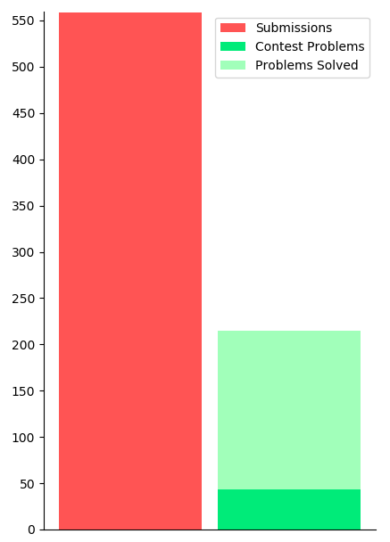
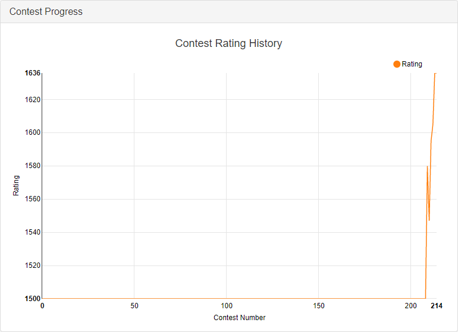
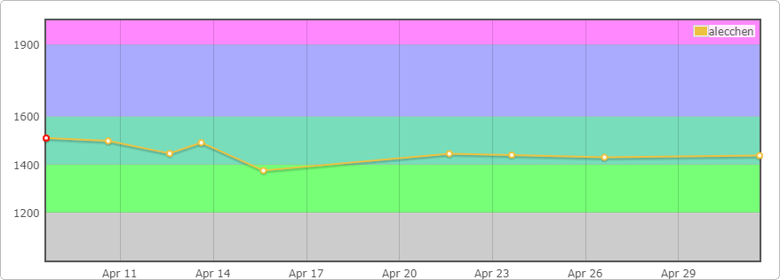
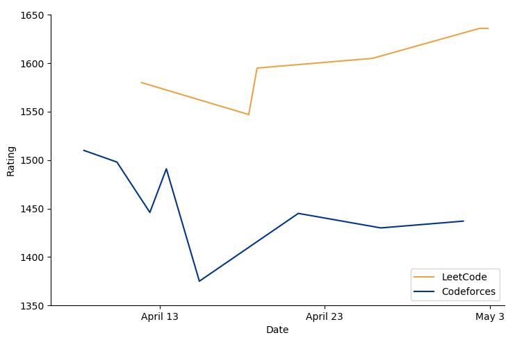
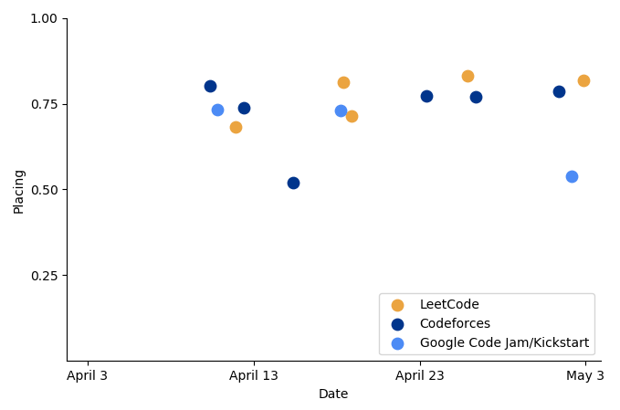

Just a little over a month ago I stumbled upon a video called “Winning Google Kickstart Round A 2020 + Facecam” made by a high school student named William Lin. It was exactly what it said, it was him — with a face cam — finishing first in this online coding competition hosted by Google. He typed at faster speeds than I felt I could read, completing four problems in an astonishing 17 minutes.

The idea of competitive programming wasn’t foreign to me, but I had never really looked into it before, so I started watching some more of William Lin’s videos and got a grasp of what this whole scene was about. Most importantly I read on Google’s competition website:

> “…top participants may be invited to interview at Google.”

Okay so maybe I’d try it out. I mean, if I got good enough, I could be one of these “top participants” getting picked up for an interview.

Even if I didn’t get good enough to get interviewed right off the top of the leader boards, I’m about to be a freshman majoring in computer science, I might as well brush up on my skills.

So I began. I watched some videos and compiled a list of resources for problems, contests, tutorials etc. Within 24 hours I had tried out some practice problems, and entered in my first contest: the qualification round for Google Code Jam. I just barely qualified.

30 days later and I’ve competed in 20 contests, made 559 submissions, and solved 215 problems, 43 of which were during contests. This would mean that only 38% of my submissions were accepted, and that I only solved about 2 problems per contest while each one usually includes 4–6 problems total. Were these my only stats, my competitive programming career was off to a pretty bumpy start, but really, these numbers don’t mean anything to me.

What means something to me is that I solved 7–8 problems a day, and participated in a contest every 1–2 days, occasionally finishing multiple in one day.

So I spent all this time and energy getting better at competitive programming. I wanted to see if it had paid off.

Naturally, my first instinct was to look at my rating on the different sites that offered them.

These are my ratings on LeetCode and Codeforces respectively. You can probably see for yourself why these alone were not incredibly insightful. I decided to plot both of them on the same axis. Maybe then I could learn something.

Nope. Not yet at least.

If I were to stop here, I might’ve concluded that I’m doing enough LeetCode problems, and they’re making me worse at Codeforces problems. I quickly realized that this was probably not the case, and the given trends were more representative of the flaws in my analysis than my contest performance.

Besides, it didn’t include 5 of the 20 contests I competed in.

I took it upon myself to get a more substantial idea of my improvement, and plot a standardized metric that I could extract from any of my contests.

I ended up graphing how well I did compared to the rest of the people in each contest, which equates to the percentile associated with my placing. This was fairly easy to calculate ((total participants - placing) / total participants) and it was simple to understand what it represented. If I improved, then my placing should go up…

So did I improve? Well, it doesn’t really seem like it. And when you perform linear regression on the points, my performance seems to increase by less than 0.1% each day, and only about 2% for the whole month.

Alright, well maybe I have some outliers. The data does not have any real statistical outliers (3 standard deviations from the mean) as the variation in the data is far too large for how small the sample size is, but let’s just say that my top and bottom 3 placings are outliers and remove them from the graph, just to see.

So the graph, visually, seems to indicate a very gradual improvement, however the numbers themselves would suggest I am improving at only a marginally faster rate, still nothing significant.

Whether or not you have graphed your results, you might be in a similar situation: you’re putting in a lot of work into something, and it’s supposed to show in your results, but it’s not. I personally was a bit discouraged to see what seemed like a random assortment of dots without any semblance of growth over time.

On the bright side, it gave me better content for this article.

> “Life isn’t just unfair, it’s also really complicated.”

There’s a lot more that goes into results than just the work that we put in. I’m here to offer some speculation as to why this is happening to me, and possibly to you too.

### 1. I’m doing something wrong.

Personally, I’m very optimistic when it comes to improvement, and I tend to use the growth mindset as an excuse not to confront failure for what it really is. Consequently, I can become too comfortable with bad results, and end up missing the things that I need to improve.

Taking a step back, I will admit, my training was not incredibly focused or efficient, and I often changed the way I would practice, which may have caused a lack of consistency that might’ve been necessary for better showings.

### 2. My results are discrete, but my growth is continuous.

Take this illustration for example. Say the line represents my programming ability over time, and each point is the ability that my contest performance reflects. Most people would say that the line on the left definitely shows some growth, however the points alone on the right look more like my own contest results, which suggest that I have barely improved at all. Even if it reflected my ability accurately at the given time, without the function to show my continuously changing ability, it might not show what is really happening.

### 3. There is a threshold I have to meet for my improvement to show.

For top programmers, their performance is not a question of how many problems they can solve, but the speed at which they solve them. At my level, it’s the opposite: my placing matters much more on how many problems I solve than the speed that I solve them. I could be solving my lowly 2 problems much faster, signaling improvement, however it wouldn’t show in my results because I’m still only solving two problems. This explanation especially fits with what I experienced, as I felt like I could recognize and implement solutions faster and more easily, however because I hadn’t met that threshold, my improvement wasn’t reflected in my results.

### 4. One month is just not enough.

This is not to say that there’s no way to tell if I’ve improved after a month, but that a month, containing 20 contests, is not enough to draw a statistically significant conclusion. I am almost certain that this is true, so I will be coming back to revisit this topic in some time.

### Closing Remarks

Unfortunately, my results did not indicate anything really substantial. It did however help me realize a few things.

1.  I have practiced a lot. 215 problems — even if many of them may have been easier ones — is a lot of problems. That’s something to be proud of.
2.  My contest placings are unreliable feedback on my progress. And that’s okay, it’s one less thing to worry about.
3.  Although I may have improved, I haven’t improved *that* much, or it would have showed, even with all the other factors involved. This tells me that there is progress to be made, and that’s exciting.

In the meantime, all I can do is keep practicing, and I’ll know I improved when it’s enough to really make a difference.
