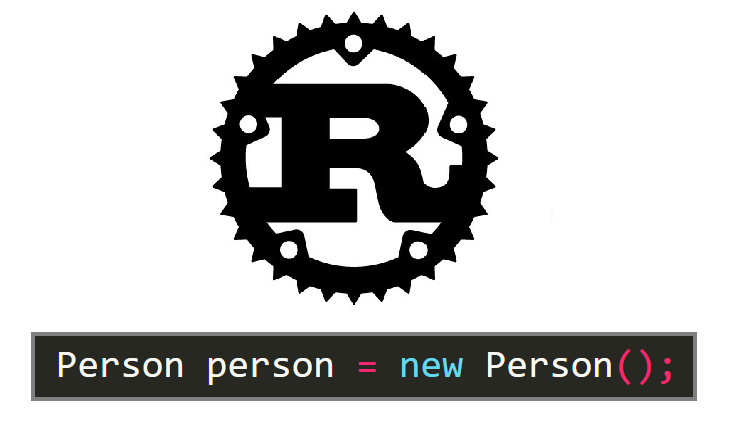

If you’ve heard about Rust, then you probably know why people are so excited about it. Memory safety through the ownership and borrowing system, blazing-fast speed, first-class support for WebAssembly, and so on.

Although these things make Rust a great programming language for the future, there are a lot of nuances to the language that make it really nice to work with too.

A lot of programmers aren’t doing things that really benefit from Rust’s most lucrative advancements, however, the choices that went into designing this programming language make it worth exploring. I think for intermediate programmers, working with and understanding the design of Rust can strengthen your programming intuition.

And what better way to jump right in than one of the most fundamental programming paradigms: object-oriented programming.

In Rust, the very basic components of an object are isolated and simplified. The creation of an object alone is actually just a `struct`. To implement methods for the struct, you use `impl`.

Because objects are just structs, by default, objects are the most primitive form of grouping information together. It’s a great way that the programming language itself follows DRY principles, and I think having the struct feature double in this way makes a lot of sense.

A basic object is simple enough, but when it comes to other object-oriented concepts, such as inheritance, interfacing, and abstract classes, Rust does things very differently, and in my eyes, more elegantly.

For all these features, it really bottles down to wanting to do two things.

1.  You want to define a sort of general object type, and have sub-objects that fit into that, or
2.  You want to force an object to have some sort of implementation of a method or variable.

### Enums

Parent objects, interfaces, and abstract classes all serve to allow for a sort of general object type with sub-object types that are meant to be interacted with in a similar way.

So do `enums`. Or at least the people behind Rust seem to think so.

Rust actually figured people might be using this a bit more often and implemented a better version of the switch case, `match`, to make for better control flow.

You may notice things aren’t exactly perfect in the declaration of my enum. You can’t just assign object types as variants of an enum, you can only define, pure variants, values, <a href="https://doc.rust-lang.org/book/ch05-00-structs.html" class="markup--anchor markup--p-anchor" data-href="https://doc.rust-lang.org/book/ch05-00-structs.html" rel="noopener" target="_blank">structs, or tuple structs</a>.

The last two, Cow and Goat, are both tuple structs, but Goat is an example of how you could define an enum variant similar to a pure object type in other languages.

Although the enum somewhat supports the sort of general, parent object type, it’s primary purpose is to embody variants.

Going off of the first example, you can implement methods for enums, but when we want a model for more general interfacing, we have to turn to something else.

### Traits

Enter `traits`.

The way I see it, traits are a more elegant implementation of interfaces in most languages.

You define a trait, with default or empty implementations for methods, and then define the implementation for that trait for a given object.

Here’s an example of an axis-aligned bounding-box trait that I’m using for collision detection in a 3D platformer game I’ve been working on.

When implementing the AABB trait for my Player struct, because the min and max methods don’t have default implementations, my code won’t compile until I’ve implemented both of them.

And if you notice in the trait’s collision method, it uses `other`, which has the type `&impl AABB`. This is an example of where you can pass in a type that implements the trait as a parameter, similar to how you would with an interface in other languages.

### Conclusion

Drawing connections between programming languages, and seeing where the purposes of features overlap can help give us as programmers a better understanding of the tools we use so often. Even if we’re not the ones behind any languages, it’s important to recognize how they came to be the way they are.

Rust is special because of the different design choices its developers made. Instead of having features like parent objects, interfaces, and abstract classes, which are all in a way variants of an object, Rust supports isolated features that serve multiple purposes where it makes sense, without cluttering the programmer’s toolbox.

Its system doesn’t perfectly emulate the same object-oriented design as other languages, but I don’t think it’s supposed to. Although it doesn’t cover all of the nuances, it supports an elegant system that makes sense, and fulfills all the necessary purposes, albeit in a different way.
