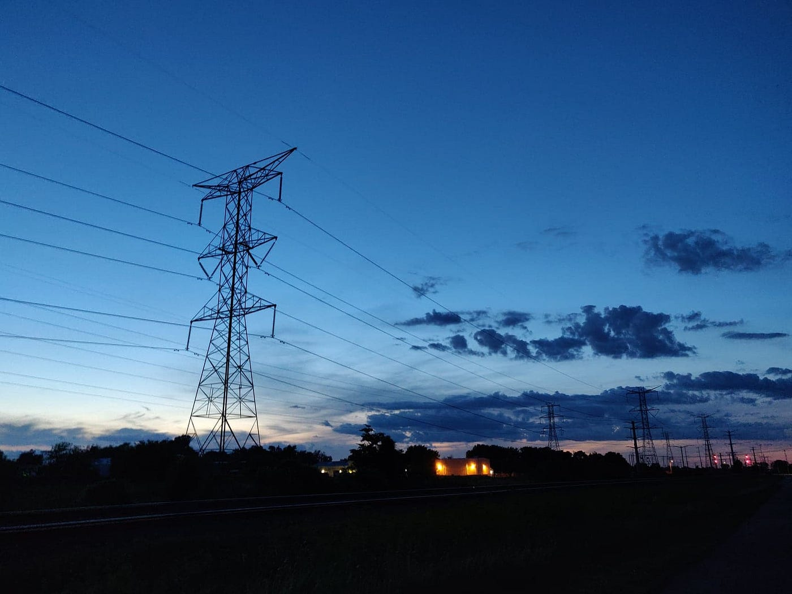

I just finished my senior year of high school about two months ago. From applying to colleges, getting into and getting rejected by colleges, and just the general closing of this chapter of my life, I’ve thought a lot about what I’ve done these past 3 years.

A lot of this thinking was regret, and shame, and loss, and wishing I could do it again, and that if I could just do it again I could do things better and have a better experience and not waste the great opportunity of knowing people and doing things in high school.

Although for most of my time thinking like this, I knew the answer, that there’s nothing I can do about it, and I need to move on, and that I can learn from it, I couldn’t get there without many of these thoughts and feelings. I’m writing this not to tell those that have experienced this what to do, but to share my story with all of it, and hope to provide some sort of solace that will be more helpful than the advice we may already know.

#### I didn’t get the experience I thought I would.

When I look back and think about the “high school experience” I thought I was supposed to get, I feel like I totally missed out. I didn’t go to parties or date a lot of girls, I didn’t drink or do a lot of drugs, and I didn’t hang out at a diner and drink milkshakes all the time because my life is not a movie. I realized that I didn’t get the high school experience I expected because what I expected was straight out of fiction, it was unrealistic.

But was it? I’d seen and heard about plenty of other teenagers living out lives similar to the notion of the “high school experience” I’d perceived. Part of this was that I was never actually with any of these people, so the image that I might get could be very different from what’s actually happening. A lot of these people could be projecting this same idea of “the high school experience” because that’s what *they* think they’re supposed to be experiencing too. But even if a lot people do this, there are a lot of them that really do live out this experience. So if it wasn’t all that unrealistic, why didn’t I do any of it?

Well, there are tons of reasons that made it less and less likely for me to do a lot of these things, but the biggest one is just that for most of the time, I didn’t really care. I didn’t care all that much to live out “the high school experience” … until now. Now that I’m looking back I’m thinking, *fuck, I should’ve done all these things.*

But I didn’t. Maybe I *should’ve*, but I didn’t. But I did other things.

If I had just sat at home, or in my room, and did nothing all day, I don’t think there would be much of a silver lining to this situation. But looking back, I’ve come to realize that I honestly did a lot in high school. Sure I “wasted” a lot of time too, I spent a lot of time in situations I wouldn’t choose to be in now, but I still had a lot of fun. I made friends, I had good conversations, I made a fool of myself, I did some other random shit. But if I keep believing that i was *supposed* to have this other experience, I’m going to feel awful about it. If I impose this idea of what I thought it was going to be like onto what it actually was, I’m never going to feel satisfied because things almost never go exactly how I think they will. When I think back to my experiences, and remember them for how they were, and not for how they’re *supposed* to be, they’re pretty damn good. I don’t need to see it any other way.

#### On regrets and the other paths my life could’ve taken.

“The high school experience” was this idea that I imposed onto myself *after* I’d already had my experience. But going into high school, I wanted something entirely different from both what I expected and what I got.

Don’t get me wrong, I’m pretty happy to be where I am right now. I think that’s the only way to live really, but I didn’t feel this way for a while.

I recently looked back on some personal projects I worked on in 8th grade. It was the first year after I’d quit gymnastics, and I had a lot of time at home to myself. I’d been introduced to game development the summer before and I thought coding was super cool so I watched a bunch of tutorials and worked on some projects. And now, looking back on them as a stats and cs major ready to start my career in this field, I’m realizing that these projects were pretty fuckin good, and that, *Fuck*, I was on a track to do some great things if I hadn’t switched schools.

After 8th grade I’d gone to attend a STEM boarding school. And because of all of the stuff there was to do and all the people to meet and hangout with, I stopped working on these personal projects, these personal projects that showed promise for a vibrant future for the rest of high school.

Going to this new school, I was so excited, but it was nothing like what I expected. It was good in many ways I didn’t expect, but I honestly can’t tell if they outweighed the bad. I know that especially at such a young age, when I hadn’t really learned a lot about life and what I wanted, my environment had a huge impact on the path of my life I would take. And now I keep thinking, I wish I could know the person I would be if I hadn’t chosen to go.

But there’s more to what I’m feeling than just wallowing in regret. I’m looking back at my 14 year old self with the same expectations I would hold myself to now, someone with 3 more years of experience and wisdom. It doesn’t make sense. Of course I’m going to think I did some stupid things if I expect myself to have known everything I do now.

I kept thinking, if I had just looked into this more, or if I had just thought about this before doing this… but I didn’t. And it’s okay that I didn’t because even if those things were seemingly in my control, in a way they also weren’t. It would’ve required plain dumb luck for me to have stumbled onto the “right” path at the time. I was young and naive, and I didn’t have a strong sense of what was important to me to guide me in any way.

The only time I feel like I can really say I have any regret is if I did something that I knew was wrong, if I had the choice to do what I thought was right, and I chose otherwise. But while I was living out these years, for many of these decisions large and small that would end up shaping my life, I tried my best to do what I thought was good for me, and this is just how it all turned out.

#### Time is the one resource we can never get back.

In the coda of Jordan Peterson’s “12 Rules For Life” he gives his personal responses on a few frequently asked questions that are often tough to answer. Here’s one of them that helped me in this situation:

“What should I do with the fact of aging?

Replace the potential of my youth with the accomplishments of my maturity. A life lived thoroughly justifies its own limitations.”

I interpret this as not saying that you must have significant accomplishments to be satisfied or fulfilled or have spent your time well, but that anything you have learned, or any of the ways that you have matured from your time are accomplishments that are as valuable as the potential you once held. This message was especially cathartic for me because I had always been told I had so much potential as a child, and when that idea that I had internalized for so long had “gone to waste,” I faced the greatest conflict. So coming to understand that my experience can be just as valuable, and could replace my previous potential, it hit home.

And for “a life lived thoroughly justifies its own limitations,” I believe it goes to say that whatever we do, however our lives turn out, it is okay. Although there will of course be obstacles and setbacks and external forces that hold us back, as long as we *try* to live our lives, we will have lived up to everything our lives could be.

From the very beginning, I knew what I eventually needed to come to. I knew at some point I’d need to accept what has happened, try to learn from it, and move on with the present. But dealing with experiences and emotions is not as simple as knowing the solution. It took me a while to come to some sort of acceptance of my own regret, and still every once in a while a thought catches my mind and I feel it again. I find that it helps me most to talk to other people and hear about others’ experiences and how they navigated them. I wrote this so that hopefully for others that are experiencing or have experienced something similar, they can find some sort of comfort in another person sharing their story.
