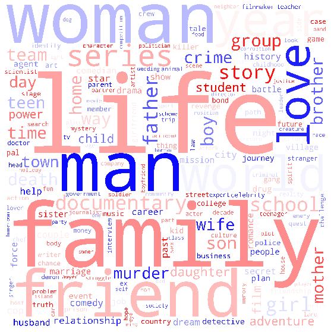
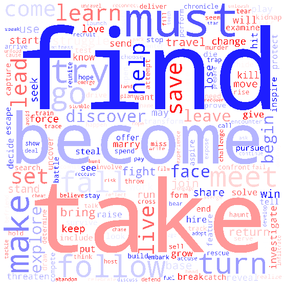
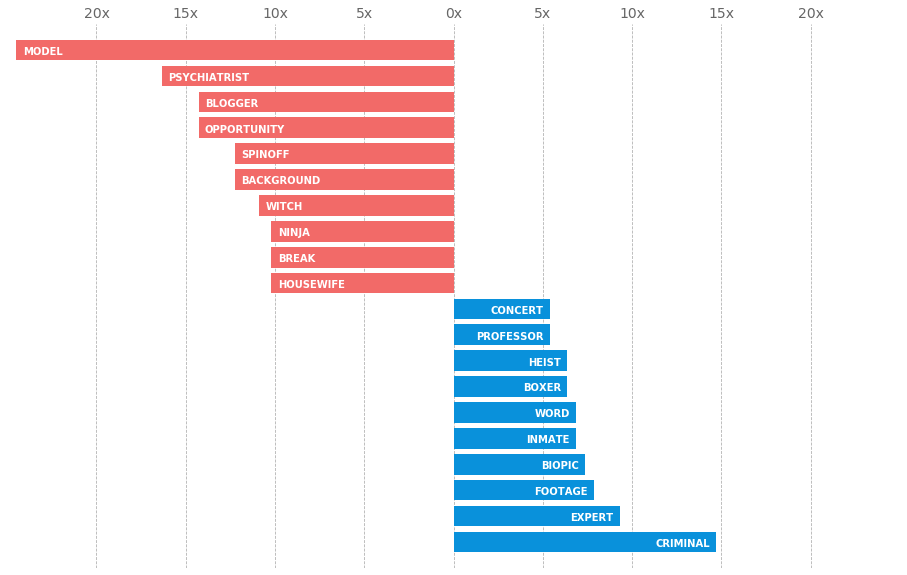
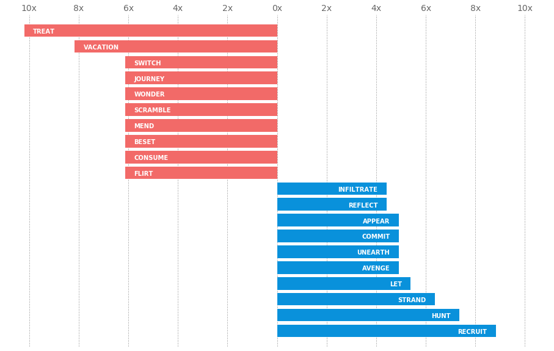
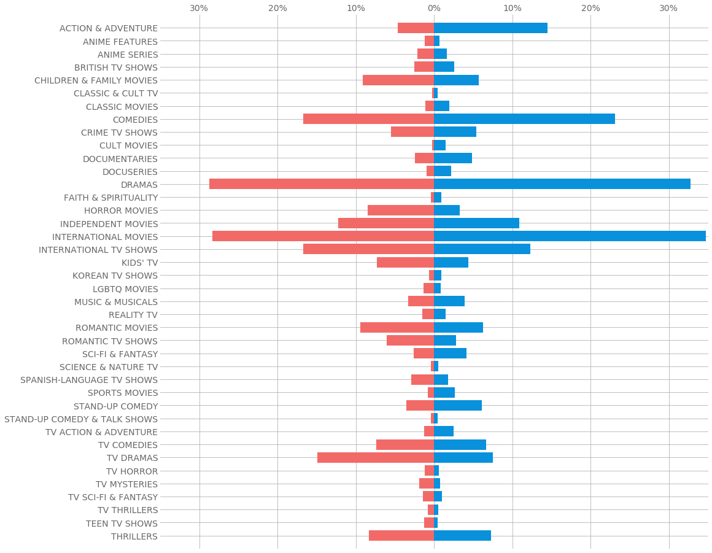

A couple of years ago when I was first exposed to data science, I was amazed by a data article called “<a href="https://pudding.cool/2017/08/screen-direction/" class="markup--anchor markup--p-anchor" data-href="https://pudding.cool/2017/08/screen-direction/" rel="noopener" target="_blank">She Giggles, He Gallops</a>” which analyzed gender in screen direction in thousands of screenplays. It specifically identified all the verbs following “he” and “she” to investigate gender tropes. Now that I’ve learned more about data science, I thought I’d try to apply a similar analysis to a different dataset.

Nowadays, streaming services have completely taken over the movie and TV industry. They’re the primary medium for viewers, and these platforms shape our culture through the movies they choose to feature. Netflix, being one of the larger streaming services, has some of the most influence in this domain, so I wanted to take a look at gender representation in its selection.

In this article, I’m going to explain the necessary intuition behind how I went about my analysis and showcase the skeleton of the code that corresponds to it. If you want to access the full code or the datasets used, you can find them on my <a href="https://github.com/alecchendev/netflix-gender-exploration" class="markup--anchor markup--p-anchor" data-href="https://github.com/alecchendev/netflix-gender-exploration" rel="noopener" target="_blank">Github repository</a> for this project.

#### The Data

The third-party Netflix search engine, Flixable, released a <a href="https://www.kaggle.com/shivamb/netflix-shows" class="markup--anchor markup--p-anchor" data-href="https://www.kaggle.com/shivamb/netflix-shows" rel="noopener" target="_blank">dataset</a> that lists all the movies and TV shows on Netflix as of 2019. It provides a couple of different attributes with the title, which include its cast and description. With these two attributes, we can look at trends in the gender(s) of the cast, and the content of the movie or TV show. For my analysis, I chose to look at the leading actor/actress’s gender.

The Flixable dataset however does not include the genders for the cast. I’m not going to label all 6000+ entries by hand, so I got some help from IMDb, which has several public datasets that are updated daily. One of these <a href="https://datasets.imdbws.com/" class="markup--anchor markup--p-anchor" data-href="https://datasets.imdbws.com/" rel="noopener" target="_blank">datasets</a> details the names of actors, actresses, writers, etc. and their professions. Given the cast of a title, I found that I can match up the cast member names to the names in the IMDb dataset, see if they are labeled as an ‘actor’ or ‘actress’ and automate labeling gender that way.

> Before I came across this genius plan, I tried web scraping the genders by google searching each cast member’s name, finding their IMDb page, then extracting their jobs. It took several days to run, and I was only about halfway through when I realized IMDb had a dataset that could help me. I had been very enthusiastic to use web scraping, as I had learned it fairly recently, but this made me remember that certain tools are made for certain purposes. Web scraping makes it possible to gather the data myself, but I don’t need to use it if the data is already out there somewhere.

In the following code snippet, I make a new list with strings corresponding to the genders of *all* cast members. This gives me the freedom to decide later whether I want to label movies by the leading role, the majority gender of the cast, or something else.

``` graf
genders = [''] * len(data)
# loop through each row
for i, row in data.iterrows():
    cast = row['cast']
    cast_genders = []
```

``` graf
    # for each cast member, get their gender
    for name in cast.split(','):
        gender = ''
        # professions_key stores a given name's professions
        if (name in professions_key.keys()):
            professions = professions_key[name]
            if ('actor' in professions):
                gender = 'male'
            elif ('actress' in professions):
                gender = 'female'
        cast_genders.append(gender)
```

``` graf
    genders[i] = ','.join(cast_genders)
```

``` graf
# store as new column in dataframe
data['genders'] = genders
```

#### SpaCy’s Language Model

The most important feature that lets me run this analysis is that with each title comes a description. These descriptions detail the basic content of the movie or TV show. The words used in these descriptions can give us insight into what movies labeled with a certain gender are most frequently about.

The tool that lets us pick out these certain words is a natural language processing package called spaCy. We are using some very basic functions of spaCy’s language model. A language model at its core is a function that assigns a probability to given words, or sentences, but spaCy’s model has added functionalities that process common NLP features. In our case, we can create a document object from spaCy’s model, which will let us pick out each token (word, in our case) from a sentence, and access its part of speech and lemma.

Getting its part of speech is helpful because we can find what words are important nouns and verbs for each gender, and separate them from features like prepositions that are less important to us.

The lemma of a word is the root form of a word. For example, the lemma for both ‘played’ and ‘playing’ is ‘play.’ This is helpful because it isn’t all that important to us whether different forms of the word are used, but rather just that the word is used in general.

This is an example of how the language model is used straight from <a href="https://spacy.io/usage/linguistic-features" class="markup--anchor markup--p-anchor" data-href="https://spacy.io/usage/linguistic-features" rel="noopener" target="_blank">spaCy’s documentation</a>:

``` graf
import spacy
```

``` graf
nlp = spacy.load(“en_core_web_sm”)
doc = nlp(“Apple is looking at buying U.K. startup for $1 billion”)
```

``` graf
for token in doc:
    print(token.text, token.lemma_, token.pos_, token.tag_, token.dep_, token.shape_, token.is_alpha, token.is_stop)
```

There are 3 main visualizations that I looked at in this analysis. The first was just a word cloud. This gives me a broad sense of the most common words in descriptions. The second is a plot showing the likelihood of words to appear in the descriptions of movies and TV shows of a certain gender. This will highlight the most polarized words and any significant disparity in the content of films. The last is a plot of gender representation in genres. This will give us a better idea of what broader subjects are important to each gender.

#### Word Clouds

I visualized two different clouds, one for nouns, and one for verbs. To retrieve the data to do this, I looped through every description, applied the language model, and stored the lemma in a dictionary with lists for each part of speech.

``` graf
pos_words = {}
for description in data[‘description’]:
    doc = nlp(description)
    for token in doc:
        pos = token.pos_
        pos_words[pos].append(token.lemma_)
```





There aren’t many surprises here, but it gives us a general sense of the words in the descriptions.

#### Gendered Words

For gendered words, I specifically wanted to create something like in the <a href="https://pudding.cool/2017/08/screen-direction/" class="markup--anchor markup--p-anchor" data-href="https://pudding.cool/2017/08/screen-direction/" rel="noopener" target="_blank">article</a> I read. They had calculated the values for how much more likely a word would show up in a female versus male context, so I wanted to do the same. For this, I first gathered the counts of each word (by part of speech) for each gender. Then I calculated the probability that it would appear in the description of a given gender’s movie. Then I took the ratio of the greater of the two probabilities over the smaller of the two and gave it a sign to indicate which gender was more likely, i.e. negative meant more likely female, positive meant more likely male.

I excluded words that only showed up in one gender because I wanted to look at words that I could compare how much more likely one gender was over the other, and words that showed up in only one gender were more often just words that were used very sparsely, rather than words that were especially indicative of a given gender.

``` graf
# retrieving counts
pos_counts = {}
for i, row in data.iterrows():
    leading_gender = str(row['genders']).split(',')[0]
    
    doc = nlp(str(row['description']))
    for token in doc:
        pos_counts[leading_gender][token.pos_][token.lemma_] += 1
```

``` graf
# calculating probabilities
pos_probs = {}
for pos in all_pos.keys():
    for word in all_pos[pos]:
        male_count = pos_counts['male'][p][word] / male_total
        female_count = pos_counts['female'][p][word] / female_total
```

``` graf
        male_prob = male_count / (male_count + female_count)
        female_prob = female_count / (male_count + female_count)
```

``` graf
        prob = (max(male_prob, female_prob) / (min(male_prob, female_prob)))
        prob *= 1 if (male_prob > female_prob) else -1
```

``` graf
        pos_probs[pos][word] = prob
```



Some really stark gender differences I noticed were that among the female words, there was “psychiatrist,” and “blogger,” and male words included “expert,” and “professor.” I would consider these mostly gender-neutral terms, but they show up amongst the most gender-polarizing nouns in the descriptions of these movies and TV shows.



Here, out of the strongly female-associated words, besides “flirt,” they are all quite neutral. However looking on the male side of things, “hunt,” “avenge,” and “infiltrate” are much more gendered and reflect more traditionally male roles in action or adventure movies.

#### Genre Representation

For genre representation, I simply counted the number of films of certain genres for each gender, and normalized the count by the total counts of titles between the two genders, to get a percentage of the movies that are tagged with a certain genre. This allows for a more fair comparison.

``` graf
leading = defaultdict(lambda: defaultdict(lambda: 0))
for i, row in data.iterrows():
    leading_gender = row['genders'].split(',')[0]
    
    genres = row['listed_in'].split(',')
    for genre in genres:
        leading[leading_gender][genre] += 1
```



A few things that caught my eye here were that action movies and comedies made up more of male leading titles than females, while romantic movies and TV shows made up more of female leading titles than males. This is not all that shocking, but it does provide some empirical evidence for how entertainment contributes to how people view gender.

One other thing was that a larger proportion of male leading titles were dramas as compared to females, but a larger proportion of female leading titles were *TV* dramas as compared to males. This could provide an argument for different genders being better suited for different mediums by network executives or viewers.

#### Conclusion

By trying to recreate an analysis that inspired me, I found new insights and learned new skills. Using this top-down approach of learning skills as they’re needed made me utilize two datasets to get the results I was seeking and gave me a chance to learn and use NLP basics. This practice proved to be very useful to me, and I think other budding data scientists can learn a lot from doing the same.
