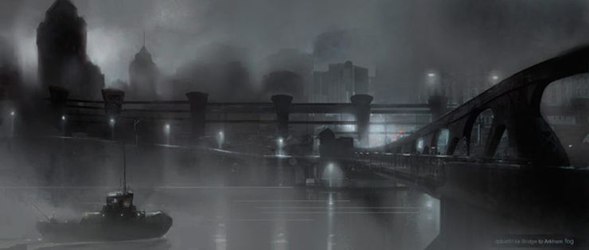
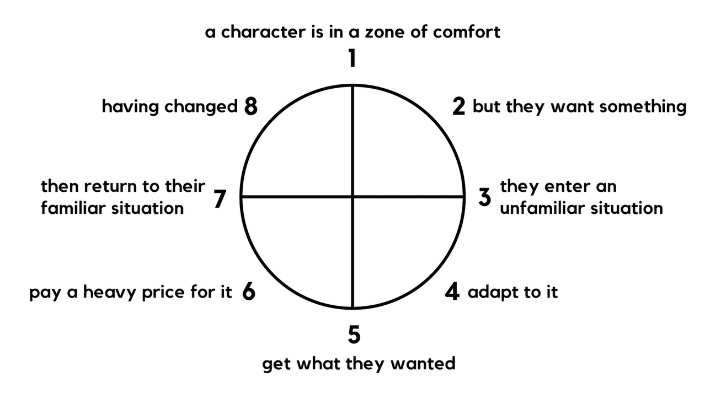

I’m not a huge superhero movie fan. Maybe I will be, but as of the time of writing this, I’ve consumed very few superhero movies. This is just to say that I’m not incredibly well-versed on the genre, but I thought I’d share my thoughts on what makes Christopher Nolan’s Dark Knight Trilogy so brilliant.

Although I’ve never really taken much time to think about superhero movies, this trilogy has opened me up to what makes this genre so compelling. In the basic form, I think the *purpose* of superhero movies, or the sort of selling point that makes superhero *stories* worth telling is that they highlight human qualities using exaggerated, fantasy-like situations and dire circumstances. The reason they’re so popular isn’t just because it’s cool to think about having superpowers, but because superpowers enable the superheroes, the main characters, to solve unique problems and face extreme situations.

For the most part, stories follow some semblance of a structure that aligns with Dan Harmon’s story circle, and superhero movies are no exception.

They might go through this circle many times, but generally, some variation of this structure appears in any kind of story. This structure is universal to stories because the purpose of stories themselves, among other things, is to take us on an adventure with the characters, through desire, struggle, adaptation, loss, and ultimately catharsis among other things. They take us through this adventure because in a way it simulates the cycle of the human experience.

However they don’t just simulate the overall, general journey of the audience, but most often each one will have an emphasis on some aspect of what makes us human, something that story listeners can connect with. Maybe it’s some virtue, like humility or trust or loyalty, or moral right wrong, choosing good over evil. It can be literally anything, but there’s usually at least one sort of central underlying theme in a story. And when you listen or watch or read a story, you experience this theme subconsciously, and if the theme resonates with you at all, then when the story resolves you’ll feel good, you’ll feel catharsis.

But anyway, where do superheroes come into this?

Superhero movies do exactly this, but instead of Billy giving Sally a piece of his candy bar, it’s Spiderman saving Mary Jane from falling off a ledge. They take the stakes and challenges of the circumstances and amplify them by a thousand. But at the very basic level, they do this to put a spotlight on something related to the human experience.

Side note: Bad or boring superhero stories have superpowers and dire circumstances but not the human element. For example, one of the most commonly criticized superheroes is superman, because, in a lot of circumstances, he can seem utterly overpowered. Even in unreal situations, it doesn’t make sense for him to face the same struggle as other superheroes, and more importantly, the audience.

This is where the dark knight trilogy and the design of Batman’s character shine.

Ask yourself this: What is Batman’s superpower?

If anything, you might say Batman has tech, gear, and money. But those aren’t really superpowers, and that’s not really what I see his superpower as either.

Superpowers are usually a special incident or superhuman ability that shapes the hero’s symbol and story. Tech and gear are if anything mere plot devices for Batman, not exactly what I’d consider his primary superpower to be. If we think about what element of Batman makes him really a superhero, I would say it’s his emotion, determination, desire, and everything else that just makes him human. Spiderman became Spiderman because he was bit by a radioactive super species of spider, but Batman? He chose bats as his symbol because they were his greatest fear, one which indirectly led to the death of his parents, a loss that shaped him for the rest of his life. Other heroes have superhuman abilities, but Batman is merely super *human*. His origin story, his philosophy, his personality, is not designed around a special ability, but amplified versions of innate human qualities.

In this way, Batman is a special subset of the superhero archetype. He is only the human elements that drive him, unadulterated by unrealistic upgrades to his inherent human abilities. It’s how the lack of a typical superpower puts an emphasis on Batman’s humanness that personally made me understand and resonate with this superhero story.

Not only this, but the villains in Batman, or at least the ones featured in the Dark Knight trilogy, fall under a similar design. They all have distinctly human motives and backstories, and the challenges they pose to Batman are not carried but supported by the use of external power. The Scarecrow had the hallucinogenic gas, but more importantly, he was a snobby criminal defense attorney that used his gas to bail his clients out of conviction. The Joker was an agent of chaos. Mistreated by the world around him, he wanted to show people the façade of their established order, and how everyone is no better, no more moral or virtuous than he is, that “When the chips are down, these ‘civilized people?’ They’ll eat each other.” Bane wanted to prove that he was better than Bruce and that Ra’s al Ghul was wrong to have excommunicated him from the league of shadows.

By giving the villains fully-fledged, human personalities and incentives, they serve the main purpose of the superhero story archetype better, as they give character to the people the hero interacts with and is challenged by, similar to those in real life. It’s not only much more interesting and entertaining to watch these kinds of characters cause problems, but it brings meaning to the conflict.

In the form of myths, fables, and fairytales, the *superhero* story type is the oldest form of storytelling. It brings concepts and ideas, limitless under the bounds of their fictional worlds, and connects them to our lives. The dark knight operates under a world’s system most similar to ours, but with drastic circumstances.

Movies and stories are often critiqued for causing unrealistic expectations of the world, but in my opinion, this is a total misinterpretation of what stories are meant to be. They don’t necessarily serve as fictional documentation of reality, but purposefully exaggerated and abridged versions of it. If anything, I think stories in their purest form are just the morals and messages behind them, and realistic circumstances and characters make them digestible. The direness, the urgency, the importance, and the dramatization that we see in movies are not to claim that real life is or is supposed to be like this, but are instead tools to engage, entertain, and put emphasis on the underlying themes and ideas that the movie touches on.

The superhero archetype does this at all costs. Even sometimes sacrificing realism, it makes as many decisions possible to serve the greater form of its story. It goes beyond the extents of reality, stretching situations and denying the impossible so that its characters have the opportunity to pose or solve any kind of conflict.

While watching the Dark Knight, it was these things that I thought about that made me really appreciate the superhero narrative. Although Christopher Nolan and all the people whose work went into making the overall storytelling and production of the movie incredible gave it a great advantage, the story of Batman is a great example to demonstrate the merits of the superhero structure. His symbol, his mindset, his history, the villains, the progression, and supporting characters, everything served to make the trilogy’s many themes potent and meaningful sources of connection.

As much as the underlying subjects of a story are central to the bond between a film and an audience, what makes the archetype of the superhero story so special is in its execution. Like in *Batman Begins*, one of many memorable quotes in the trilogy reads, “It’s not who I am underneath, but what I do that defines me.”
