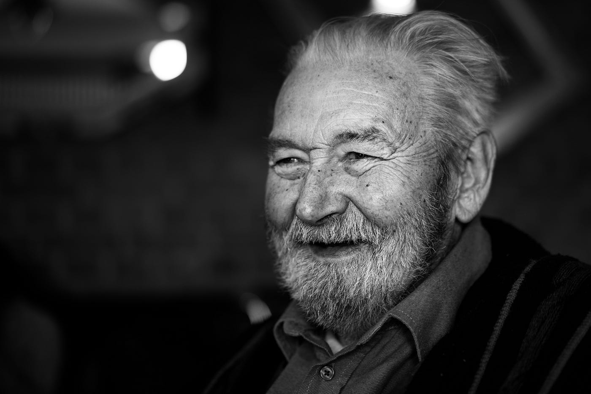

During the height of cardiovascular disease rates in the United States, a town of Italian immigrants stood out as a statistical anomaly. They had no deaths or even signs of heart disease in men under 55, and half the national rate of death by heart disease for those over 65.

Through their story, we can learn that the key to health and happiness may be one and the same. It’s the story of a small village in the foothills of eastern Pennsylvania, a town named Roseto.

### **The Roseto Mystery**

In the late 1800s, a group of paesani from Roseto, Italy immigrated to America. They settled down in the foothills of eastern Pennsylvania, and as more of them came, they built a community isolated from the neighboring villages. They cleared the land, making room to grow beans, potatoes, and onions. They raised pigs and grew fruit in their backyards, including grapes for homemade wine. Small businesses such as restaurants and bakeries opened up. Women worked in factories making garments, men mined in the quarries. They built their own church for them to practice in.

In 1960, a young physician by the name of Stewart Wolf took a special interest in the town. He’d talked to a practicing doctor in the town who’d mentioned a total absence of deaths or signs of heart disease in men under 55 in Roseto. Wolf would come to learn their death rate from heart disease for men over 65 was half the national average.

It didn’t make any sense. Heart attacks were the leading cause of death in the United States and this town of Italians was immune to it.

Their health should’ve been worse than the average American’s. They ate immensely caloric, rich, fatty Italian food, they smoked and filtered cigars, and they worked in factories and quarries. Many of the Rosetans even struggled with obesity yet their death rate from *all* causes was 35 percent lower than the rest of the United States.

Wolf investigated further into their exercise habits, family history, genetics, and location. Nothing indicated that they should be any less victim to the cardiovascular epidemic that was plaguing the rest of the country. However, while looking into the Rosetans’ way of life, he found something different.

They were happier.

The Rosetans couldn’t care less about their health, but they were healthier than most people.

Rosetans spent lots of time together. Three generations would often live in the same household, and on the street, you would see people on each other’s porches stopping by to talk to each other in Italian. They frequented church, and they embraced a culture that valued helping those below them over excessive wealth or success.

With a close-knit community and strong social structures, they escaped the most potent cause of death at the time by being happier, not healthier.

This is the story Malcolm Gladwell tells in <a href="https://www.nytimes.com/2008/11/30/books/chapters/chapter-outliers.html" class="markup--anchor markup--p-anchor" data-href="https://www.nytimes.com/2008/11/30/books/chapters/chapter-outliers.html" rel="noopener" target="_blank">the introduction of his book, <em>Outliers</em></a>. In *Outliers*, Gladwell uses this as an allegory for how his book approaches the idea for success, but here it can act as a primer for what really should be the focus for improving our health:

Our happiness.

Why do we pursue better health? Because we want to feel better. Because we want to live longer. Because we want to be happier.

What does worrying about our health do for us? It makes us feel bad. It adds stress that decreases our lifespan. It makes us less happy.

In my experience, I’ve found that the key to taking care of myself has been to take some inspiration from the Rosetans. We don’t all have access to such a fruitful community, but we have the ability to think similarly to how they do.

To take care of our health, we need to stop worrying about it. As long as we give a little attention to how we care for bodies, we’ll be getting the majority of health benefits that we’re after. And by letting go of the pressure to be healthier, your health will no longer be a burden weighing you down. It’ll be your friend cheering you on.

### **Hit the fundamentals**

So you shouldn’t worry about your health. But that doesn’t mean you can necessarily live just like the Rosetans, smoking cigars and eating rich Italian food all day. Taking care of our health is still important, and happiness isn’t the end all be all for good health.

However, we tend to go about our health in a way that overcomplicates things. In the end, all we have to do is hit the fundamentals:

Sleep, food, and exercise.

As long as we tackle these to some degree, we will be taking care of our health just fine.

#### **Advice on sleep from Dale Carnegie**

In Dale Carnegie’s *How To Stop Worrying and Start Living* he said something about sleep that really resonated with me:

“If you can’t sleep, then get up and do something instead of lying there and worrying. **It’s the worry that gets you, not the loss of sleep**.”

For a while now, I’ve struggled with interruptions in my sleep. In the beginning, it really bothered me, because not only was I trying really hard to be very health-conscious, but experiencing frequent interruptions in your sleep is really bad for you.

However, nowadays I feel much better. And that’s not because anything changed, it’s because I stopped beating myself up about it. I’m still exploring my problem because I know in the long term I’ll be better off addressing it, but until then, there’s nothing wrong with me feeling great the way I am.

As long as you are getting somewhere around the recommended amount of sleep of <a href="https://www.cdc.gov/sleep/about_sleep/how_much_sleep.html" class="markup--anchor markup--p-anchor" data-href="https://www.cdc.gov/sleep/about_sleep/how_much_sleep.html" rel="noopener" target="_blank">at least 7–8 hours</a>, and as long as you feel alright throughout the day, you will be getting plenty of sleep to maintain your health.

#### **Move your body**

<a href="https://elemental.medium.com/the-best-strength-training-workout-is-surprisingly-easy-a7c7eb095a6f" class="markup--anchor markup--p-anchor" data-href="https://elemental.medium.com/the-best-strength-training-workout-is-surprisingly-easy-a7c7eb095a6f" rel="noopener" target="_blank">This article about effective strength training</a> included a quote that illustrates my philosophy with regards to exercise.

“The most important thing is to just do something. The number one principle is to start doing it and continue doing it — that’s probably where 80% of the health benefits come from.” — Greg Nuckols, founder of StrongerByScience.com and a powerlifter who’s held three world records.

In the end, the article made it clear that to improve our health and maintain strength, we simply need to just exercise our whole body in some way. No intense regiment, just move our body. And to build strength, just doing a single set to exhaustion a few times a week will supposedly return great improvement.

And in <a href="https://medium.com/runners-life/this-is-how-far-you-should-run-each-day-1841bb7d772" class="markup--anchor markup--p-anchor" data-href="https://medium.com/runners-life/this-is-how-far-you-should-run-each-day-1841bb7d772" target="_blank">another article</a>, they mention that to reap the many benefits of running on a given day, all you need to do is run a single mile.

Exercise is not something we are absolutely required to do each day like eating and sleeping are, so the most important thing is just to be consistent about it.

#### **Don’t eat the same thing all the time**

Nutrition might be the most complicated of the three. There’s strong evidence for high fat, low carb, meat-heavy, ketogenic diets, *and* there’s strong evidence for lower fat, higher carb, plant-based diet. We’re told to limit sugar, to limit salt, but also to get more salt, to eat less saturated fat, but actually it’s probably fine, high cholesterol is bad, except it’s only a certain kind of cholesterol, and so on.

And at the same time, we can only eat from whatever food is affordable and accessible at the moment. Although many of us are still presented with many options, cooking requires learning and time, something that comes at an inconvenience to people’s very busy lives. To apply so much nutritional knowledge on top of everything can feel almost impossible.

For the majority of people, I think eating healthily in practice can be simplified down to just eating a balanced diet. Most of the negative effects of bad nutrition come from the long-term consumption of certain foods. So if you’re generally eating different foods, and switching it up every so often, you’ll probably end up eating quite well. Of course, if you have special conditions, that’s the first priority, but for the average person who has the freedom to stress out over what they should eat, the answer is to eat many different things. The only exception is that you should probably steer clear of too much <a href="https://www.health.harvard.edu/heart-health/the-sweet-danger-of-sugar" class="markup--anchor markup--p-anchor" data-href="https://www.health.harvard.edu/heart-health/the-sweet-danger-of-sugar" rel="noopener" target="_blank">sugar</a> and <a href="https://www.ncbi.nlm.nih.gov/pmc/articles/PMC5787353/" class="markup--anchor markup--p-anchor" data-href="https://www.ncbi.nlm.nih.gov/pmc/articles/PMC5787353/" rel="noopener" target="_blank">processed foods</a>. Those have pretty one-sided evidence against them.

It feels like life is often too complicated for any of us to get things right. But we can choose to live simply. If we worry less about our health, and do our best to be consistent and hit the fundamentals, we won’t just be happier, but healthier.
