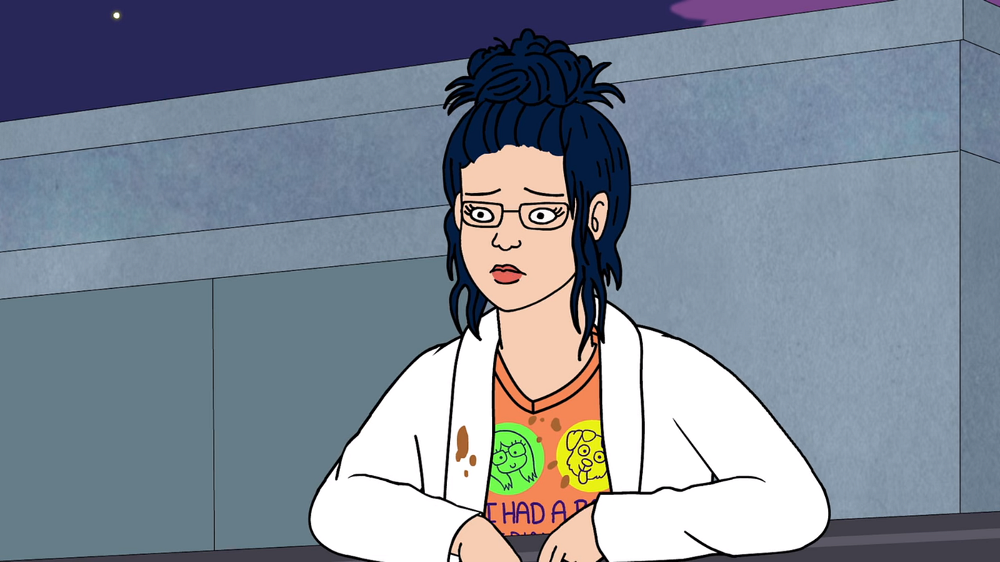

For most of my life up to eighth grade, I was a gymnast. That being, I had a lot less free time than most kids. I’d wake up at around 6 or 7 depending on if I had an extra orchestra rehearsal in the morning, then force myself to shower, eat, brush my teeth, and pack up, all in under thirty minutes so I could make it to school on time. Classes would go until 11, at which point I’d have 20 minutes to eat and talk with my friends before going back to classes again until 3:30. I’d usually have gymnastics at 4, so I’d get picked up right after school ended, then change my clothes and eat something on the way over. Practice was usually three and a half hours, so I’d get back at around 8, then do my homework.

A lot of the time that pretty much marked the end of my day, and I wouldn’t have much spare time before I’d have to get ready for bed and do it all over again.

But there were some days where I could spare just enough time to watch one or two episodes of a TV show. And just briefly, I could feel a bit of silence and calm in my life besides sleeping.

In the beginning, TV was just that. It was just an escape from a life dictated by other people; it was the one time where I could decide something for myself, and just zone out and relax before enduring another day. But over time my relationship with TV developed into something I found solace in.

Even though I would be listening and watching other people talk, I felt like I could actually hear myself think, and the characters on screen and the writers behind them were there with me.

Most of the time I watched sitcoms, and the greatest thing about sitcoms is just that they follow the lives of somewhat realistic people. Watching these personalities talk and interact and go about their lives brought me insight into my own. These shows gave me an occasion to think back and remember my life.

I think everyone thinks about their own life while consuming any kind of story, but there’s more to it than just obtaining insight. I noticed a long time ago while watching an episode of one of my favorite shows, Bojack Horseman, when one of the characters, Diane, is at a low point in her life and she goes on this brief but telling monologue about the unhappiness she feels with herself and her attempt to avoid confronting it. It struck me that I could feel so much for this character on screen — a character that wasn’t even a real person, but a cartoon with a person’s voice — even without them having any feeling towards me.

At first, I just thought that that’s how TV gets you. It provides a cheap means of empathy without requiring me to do anything; it was unhealthy, unnatural, and indicative of a lack of meaning in my relationships with real people.

But I noticed later, that oftentimes my empathy for a character could be stronger than it was for some people in my real life. And it wasn’t because my other relationships were devoid of meaningful connection, but instead that my relationship towards a character was more than just this cheap means of empathy I thought it was.

My relationship with a character in many ways resembled a relationship with a real person. I felt empathy for them and shared some of their feelings, and I spent time listening and getting to know them. In great shows nowadays, characters are so well written that we can get to know them well enough to experience real empathy for them. Of course, it’s not exactly the same, but that actually turned out to be a good thing.

My relationship with a character resembled more than just a relationship with a real person, but a relationship with myself. I realized that when I empathized with a character, it was because in some way they acted as a reflection of myself. Sharing some of the flaws and insecurities of the characters I watched, I could confront things about myself that I wasn’t usually comfortable with, by seeing it in another person, a character. I realized this character on-screen had brought me some of the deepest introspection I could have.

Because they’re fiction, these characters are perfectly attuned to making it easier to see the unflattering sides of ourselves. Because they’re made up, we don’t bother comparing ourselves to them as we would with people in the real world. We can be as attached to them as we want to, without the fear of them disliking us. They can inspire us without us feeling belittled. We can empathize with them without the possibility of judgment. Our relationship with TV show characters is ultimately in our control, and that’s why they’re perfect catalysts for such valuable introspection.

Back in middle school, when my life was so chaotic and so many things were out of my control, TV served as my mediator for internal conflict. And although I didn’t realize it then, I’m thankful now, because TV shows weren’t just an escape from my life, but the means for me to return to it.
