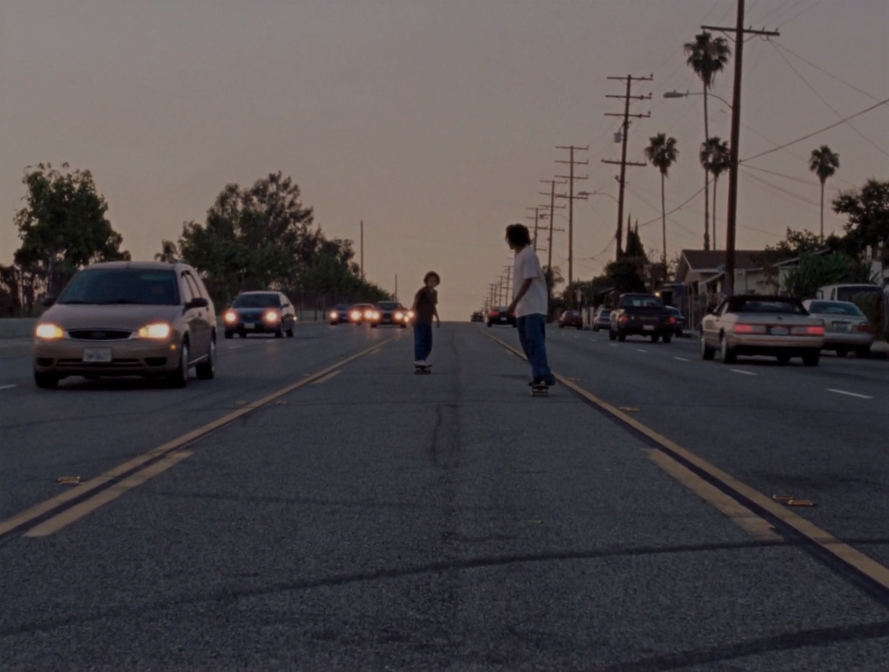

Man, this movie was good. It wasn’t one of those movies that make you rethink your whole life like it blew your mind or something, but it captures a human experience and it does it really well.

It’s a story without a very rigid narrative structure. There wasn’t a very distinct conflict and rising action and all that. It just followed the transformation of this twelve-year-old kid, Stevie, as he’s exposed to the world through a group of skaters that become a family to him.

(I mention several plot points that might be considered spoilers, but I think even knowing some of them wouldn’t take away any significant value from the film.)

As someone born after the ’90s, I can’t say exactly how accurate the depiction of the culture was, but it felt very real, and I know how important this aspect of the film was to its writer and director, Jonah Hill. The smaller aspect ratio and the slightly more grainy film quality contributed to the movie beyond just being set in the ’90s, it felt like the movie itself was made in the ’90s. All of this in combination with the skate culture, the music, and the drastically different political climate help me understand this time and people’s nostalgia for it, at least as much as I can without having experienced it myself. It made me realize that a movie like this can be a brilliant way for people to understand culture, as it supplements raw knowledge of a given time with what’s as close as you can get to really experiencing it.

These skaters are all from poor families, and the movie does a really good job of not painting a one-dimensional picture of these kids that people who are better off often do. People commonly use ghetto kids as an example of bad influences and the lower end of society, that they’ve got no passions or ambitions and their lives won’t go anywhere. But in *mid90s*, all these kids are real people. They speak the lingo, but only one of them plays the persona of the typical teenager that just wants to party and “get fucked up.” Another wants to be a pro skater, and he’s put in the work and he’s really good. He wants to get out of the hood. Another carries around a camcorder the whole time and he wants the make a movie.

And even though we see how in some ways they could very well be considered bad influences on Stevie — they introduce him to drugs, alcohol, and sex at a very young age, and because of them he makes several decisions that end up risking his life — in the end, it’s not so one-dimensional. When Stevie’s in the hospital, his mom comes out and finds all of them sitting there waiting to see him. And although waiting in a hospital is not in it of itself an incredibly altruistic act, it goes to show that they’re his family too and that they actually care about him regardless of the things they might say or do sometimes.

The relationships with his friends were one thing, but relationships between Stevie and his mom and brother made for brief but impactful scenes that provided another lens from which to view Stevie’s change. The way Stevie treats his family members differently from the beginning of the movie is an important aspect of the film that’s executed very well.

Some of the things he says to his family members are really serious and cruel, but it doesn’t feel silly that this kid is saying all these things he’s picked up. Even though sometimes it does — in any context it’d be silly to hear a twelve-year-old say “I can’t take this shit” so melancholically— it feels like he’s really grown up. His small stature does stay relatively the same throughout the movie, and he is quite small compared to the rest of the people he’s around, but it still feels like he’s grown into an entirely different person. He doesn’t even talk *that* much throughout the whole movie compared to most films, but through the few times he does, we can tell so much about him. The way he glorifies Ray and Fuckshit (yes that’s the name of a character) when he’s with Rubin and then with that girl. When he says “fuck Mom” while he and his brother are playing video games. When he blows up at his mom, we see this genuinely monstrous side of this little kid frighten his own mother into submission. By the end of this interaction, she asks him to just *let* her drop him off, and to just know where he goes. When he blows up at his brother, he compares his brother to himself, insulting him and saying he’s got no friends and no girls, and he socks him in the face so hard his brother cries.

These scenes are really jarring, but they don’t feel out of place. Instead, they are some of the most impactful scenes that contribute towards us understanding the change Stevie’s gone through. And I think this is something that really characterizes how good the storytelling is in this movie.

In the very first scene of the movie, we see that even though his brother beats him up, he spends all this time writing down all of the albums his brother has so he can buy one he doesn’t have for his birthday. At the start of his relationship with his friends, he hasn’t even been introduced to the concept of black people. From the beginning to the end we see such a drastic change, and in a lot of ways, we see that it’s for the worse. But experiencing it with him, we know that although he’s changed, he’s also found a home and family amongst his new friends, and he’s figured out a part of who he is.

I would really recommend watching *mid90s* if you haven’t. It’s the type of movie that will sit with you for a while, not necessarily because it exposed you to a different culture or way of life, but because it touches on certain universal human experiences through the transformation of Stevie. Growth, and loss, and a desire for belongingness and sacrifices that come with it. There’s so much more to this movie than I could depict in an article or even in any amount of writing, so really, you’ve got to go see it for yourself.
