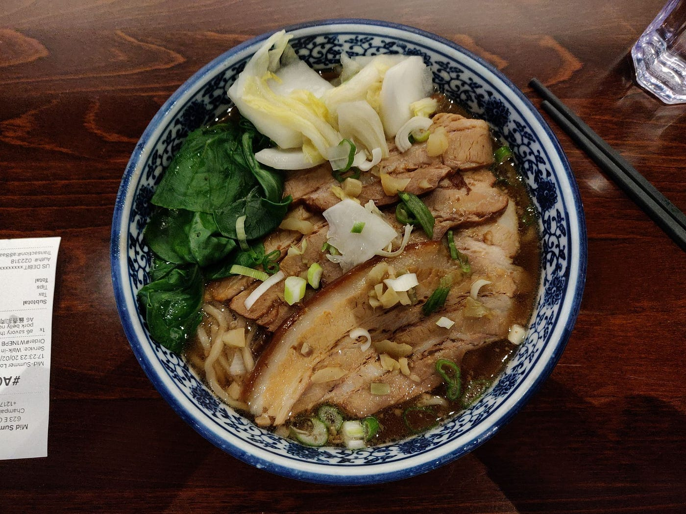

I see a lot of content creators I like making videos about things they wish they knew when they were younger, and I figured I’d flip the structure given that I’m in the opposite position as an 18-year-old right now. So for my older self, these are some things I hope you remember.

Dear 28-year-old Alec,

In just about a month, I will be coming up on a whole year of taking cold showers. I started this first stereotypical improve-yourself practice on somewhat of a whim, and now that a year’s gone by, it’s got me thinking about the path my life, mindset, and personality have taken since that first step into the cold.

Back in march of last year (2020), the world shut down, with the more immediate effect to my life being that my spring break was extended by 2 weeks. It was a bit surreal to have school abruptly halted because of a global virus outbreak, but it wasn’t too beyond what my high school had seen in previous years. I think most people were more in shock than anything else in response to this first announcement. But less than a week later the school said the rest of the semester would be online and that they didn’t know if there’d be graduation or prom or any of those big high school things.

While some others were experiencing remorse for the loss of the SSS that we all thought our years of sacrifice and denial of gratitude in the present entitled us to, I felt liberation. I understood why people were bummed, and I could kind of relate, but I didn’t really care.

More than anything, I felt resolution. For a while, I had felt at the mercy of my environment, that the things I would choose to be doing with my life would be far different were I to be somewhere else. For a while I had felt a dissonance between what I wanted to do and what I was doing, and that my environment was the friction I couldn’t get past in resolving this inner conflict.

Covid resolved this friction for me. Or at the very least, it gave me the chance to confront it.

I think I give this time any significance at all because it was one of the first times where I felt like I wasn’t just reacting to the things in my life, that I was actually living it.

So that’s what I did.

For people who aren’t me reading this, of course, it’s difficult to represent a whole year in some sentences, so this is heavily narrowed down on more of the self-development type of things that I think had some influence over the direction of my life.

I’m not going to get into everything, because most of the details are irrelevant, but I covered the basics and a bit more on top of that.

I gave most of the classic self-help habits and practices a fair shot, and even did other things like pick up some hobbies and try a different diet.

I’ve stuck with a few — cold showers, exercise, writing. Others I’ll revisit from time to time.

But anyway, here’s what’s happened. Here are a few of the themes I’ve come across.

*No. 1: The key to happiness.*

I genuinely believe that the key to happiness is simple.

In my experience, the key to happiness is humility.

Through humility you have respect and gratitude for others. Through humility you have patience, understanding, and acceptance of your own life. You have empathy for others and gratitude for what you have. Through humility, you find fulfillment in the day-to-day processes, rather than the occasional milestones.

Through this ultimate virtue, you can live a life of satisfaction and contentedness, while still allowing yourself to pursue what you want.

You may not be extremely successful in the traditional sense or in the way that’s glorified in the media, but you will live a good life relative to your own terms, one of practical happiness. I’m finding that this is far more valuable than what (at least American) society leads us to believe is worth pursuing.

*No. 2: You are only human.*

You are not and will never be impenetrable. You will not be able to sustain the mindset towards life you would like all the time. No matter how much you subscribe to a framework of life, you will always be at the mercy of your mind, body, and environment.

The reason that the key to happiness can be so simple, yet leave so many unhappy and discontent is because knowledge is not practice. Truly believing and living by certain values is 1000x more difficult than knowing them and finding them appealing.

Loss will always hurt no matter how much you understand that we are entitled to nothing. We will have expectations, attachments, disappointments, heartbreak, regret, all the same way that we will always feel pain when we scrape our knee or hit our head. However, your mindset, your framework for life, will help you with all these things. Just don’t expect them to rid your life of all problems.

*No. 3: How will you approach pain and pleasure? Discomfort and desire?*

Pain elevates. Pleasure distracts.  
Let go of desires and practice discomfort.  
Life is warm compared to your cold shower.  
Life is cold compared to a warm one.  
How much do you define your life by its rare but remarkable moments versus the common and mundane?

Thinking about it now, I truly have no idea how I/you could be that much different than how I am now. I feel like if anything, we’ll be pretty similar, just in different circumstances. Nevertheless, I have no doubt you’ll surprise me on that note.

Looking forward to it.

Sincerely,  
18-year-old Alec
