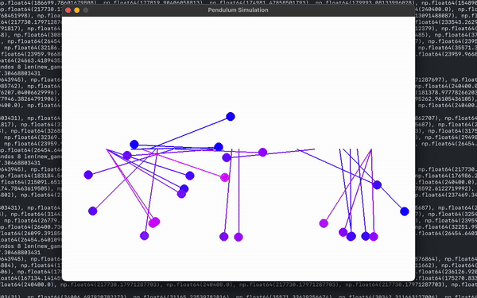

Just wanted to share a bit about what I've been up to lately.

### Go to PID controller

I've been interested in electronics/control systems and a friend of mine recommended trying this out. I got a DC motor with encoder, and was able to make a program where I could specify a position to go to (whereas the inputs to the DC motor are basically go left or go right). This clip is basically like a rotary phone motion where I gave it a phone number and it moved to each number/back to zero, mimicking the motion of a rotary phone.

I think the crazier thing for me doing this project was I had to solder some parts together. I didn't anticipate having to do that, and I'd never done it before, but people do this when they're in middle school, so I got the supplies and melted some metal. I'm still really baffled that it worked. Like you just melt metal over these pieces, and electricity flows through them. That's so awesome!

[Here's the code.](https://github.com/alecchendev/arduino/blob/main/rotary.ino)

### XOR gate

I wanted to do some basic boolean algebra with some buttons, resistors, and an LED. I was able to do NOT, OR, NOR, AND, and NAND, but when it came to XOR I was struggling. It eventually led me to understanding transistors and diodes (and blowing up an LED), and I eventually cracked XOR (with 5 transistors).

### Physics calculator

I already posted about this on twitter, but I'm just really proud of this project. I also recently added the ability to add your own units (still can't define your own conversions...yet), which is pretty cool.

Here's the [website](https://alecchen.dev/calculator/), [code](https://github.com/alecchendev/calculator).

### Pendulums

Another control systems project. I saw people online doing pendulum balancing (a friend of mine did this in an undergrad class as well). I was considering trying to do the same project in real life, but first wanted to try it out in software only since I'm still really inexperienced with hardware.

I got the basic pendulum physics working, made a super naive algorithm to balance it if it was up (basically, if leaning left, go left), then started training a genetic algorithm for swinging it upwards from below (yea...I ditched the actual control systems part and just went another way lol). That had some okay results, though seemed to reach a local maximum. Some naive tweaks in the reward function (i.e. rewarding the max height reached in addition to general time spent close to goal) helped, but not enough. After that I got distracted with a different project.

[Here's the code](https://github.com/alecchendev/pendulum).

### Noobular

Lately, as I've been interested in physics/non-software engineering, I was re-trying out Brilliant. It's pretty cool! Earlier this year, on a whim I also did a bunch of Duolingo with my family, and lately I have been giving Math Academy a try. My experience with Duolingo was sort of mixed, but I really liked Brilliant and Math Academy. They are simple, yet interactive/engaging, and make it pretty easy to learn a little each day. They feel like a natural progression of how people teach/learn on the internet.

For certain topics they probably reach diminishing returns, but it seems like a roughly simple formula (content + interaction + chopped up into small-ish lessons + sprinkle of gamification) can go a really long way.

I really liked the simplicity of Math Academy and have had an itch to do web dev lately. So Noobular is my attempt at making a Math Academy-esque site, but where anyone can upload content.

So far I've gotten a basic MVP down, i.e. a teacher can create courses with modules and multiple choice questions, and a student can take those courses and their progress will be tracked.

<iframe width="560" height="315" src="https://www.youtube.com/embed/ECO_-1E5lZo?si=jr4xbRZotFX8IsPL" title="YouTube video player" frameborder="0" allow="accelerometer; autoplay; clipboard-write; encrypted-media; gyroscope; picture-in-picture; web-share" referrerpolicy="strict-origin-when-cross-origin" allowfullscreen></iframe>

This has also been a fun experiment using htmx and server-side rendering, whereas most of the frontend work I've done has been with client-side javascript frameworks like react/svelte.

[Here's the code](https://github.com/alecchendev/noobular).
