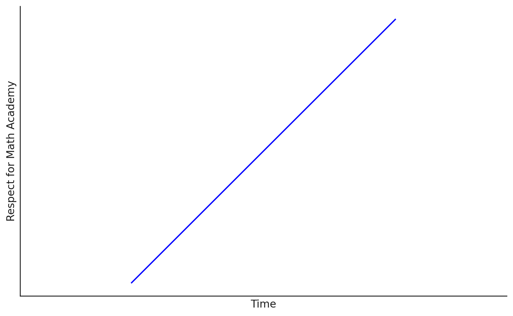

What's new with Noobular?

- Points
- Prerequisites
- Db migrations
- Math
- Bunch of ui touch ups
- Questions and choices are now markdown as well

Demo!

INSERT DEMO
- Show all the content stuff inside of the hex module
- Show exports and how they render in github
- Show being able to edit a text file and update the course (how to not reveal auth?)
    - Do this all locally
- Demo the xor module with points and stuff

Outline again, only the most interesting stuff
- Summary of latest changes
- Respect for math academy and the goal of noobular

---

What's new with Noobular?

It's been almost 4 weeks since the last dev log and a bunch of stuff has changed. I
don't think any of it is all that interesting to an outside observer, so I'll leave
a demo and summarize the major things.

DEMO

## Latest changes

- Points

You get points when you complete a module now! The number of points you get is based
on the number of blocks in a module and how many questions you answer correctly. (You
get bonus points for getting everything right!)

- Prerequisites

Teachers can now express prerequisite relationships between modules, so instead
of just giving the student the full list of modules in the course all at once,
it only shows the next modules the student has the prerequisites for. This is
a very basic start to automatic task selection/recommendation.

- Db migrations

I've committed to not just deleting the whole DB every time I make a change, since
I'm actually using this app to store content now, and don't want to recreate everything
all the time. I really want to avoid depenencies on extra tools, so for this I've rolled
my own migrations. I just store a separate table for the DB version number,
then on startup I check if my current version is the latest (the latest is based on
how many migrations there are, hardcoded in the codebase), and if there's a new version,
I run the associated migrations from the current to the latest. So far it's worked
pretty well. I did one initial migration to add this system and a new column,
and then one more complicated migration where I had to recreate some tables
and migrate the data over. Not totally perfect, but all in all I've been happy with
how this has turned out.

- Latex

I added support for latex in the content blocks. This has helped express a bunch of
things for my cryptography course.

I initially went with mathjax, but had some issues with formatting content
upon loading more when taking a module, so eventually realized I could switch
to server side rendering the latex with katex, and that's worked swimmingly.

Also, I've added the ability to have any markdown/latex content in questions
and choices, which is a feature needed to do a bunch of kinds of content,
which math academy makes use of quite a bit.

- Bunch of ui touch ups

Big one is with modules, when you click the next button, it no longer snaps
to the next thing, which was kinda annoying. Also the progress bar is sticky,
and it looks really smooth now. Also lots of fixes and edge cases when adding
math, including over flow and weird z-index stuff that I've actually noticed
similar issues with when using math academy.

- Importing/exporting modules

A very basic version of the content protocol is in place. For any module
you can now click an export link and get something backwards compatible with markdown
which you can save as a file and use however you'd like. For example, my
[hex module](https://github.com/alecchendev/teaching/blob/main/cryptography_for_beginners/hex.md) renders nicely on github, even though it includes all the information needed to be used in noobular.

On the flip side, I've also added a cli option on noobular to be able to take one
of these files and upload/import it as a module. So nowadays, it's a lot easier
for me to create and edit modules by just editing text files on my computer
and pushing the edits from a cli command. Also,
it's nice for me to be able to store them separately if I ever want to keep
the content and noobular gets sunsetted.

The tl;dr for this protocol is that it's basically just markdown, but with
some markdown comments (basically link references with no link) to denote
whether content is a part of a question, a choice, explanation, or content block.

## Creating this cryptography course

So I've been making a beginner cryptography course to test out noobular. I've been
testing out the modules on my girlfriend and been getting a bunch of feedback
and fixing bugs and things. It's really cool, a while ago I tried to explain binary
to her and she mentioned how before she only kinda got it, but after doing the latest
module she really got it. There's still a bunch of stuff to make learning really
effective on noobular, but just this basic feedback is really promising. I've
experienced this magic as a student on math academy, and so it's cool that I can
now be a teacher and see the same thing happen for someone else (of course, on a much
smaller scale).

Making the content is sort of tedious. I really don't want to have AI do it,
and I still think that's the right choice, but it definitely is a bit of a slog.
I've been writing some small scripts to help auto generate some questions for some
things, and I'm still up in the air about whether auto generating these will
be worth the time. There are a bunch of really effective features from math academy
that I want to implement, but I have hesitated because they require a bunch more
effort from the teacher to create a bunch of extra questions for each bit of knowledge,
e.g. for review, a diagnostic exam, second chances when completing or retrying a module.
I estimated it'd be about 15-30 questions per thing, and it turns out that [math
academy has a similar estimate, and they actually just make them all by hand](https://www.justinmath.com/how-math-academy-creates-its-knowledge-graph/).

## Math Academy and the goal of noobular

The more I learn about this company and the people behind it, the more I'm just
in awe of the great work they've done.

I have so much to learn from them. Everyday it becomes clearer to me how they've
come upon something really unique from every other education platform, and
it makes me so excited for the future. I've been continuing to use math academy
myself, and am really excited to finish my current methods of proof course and
move on to the latest probability and stats course.
