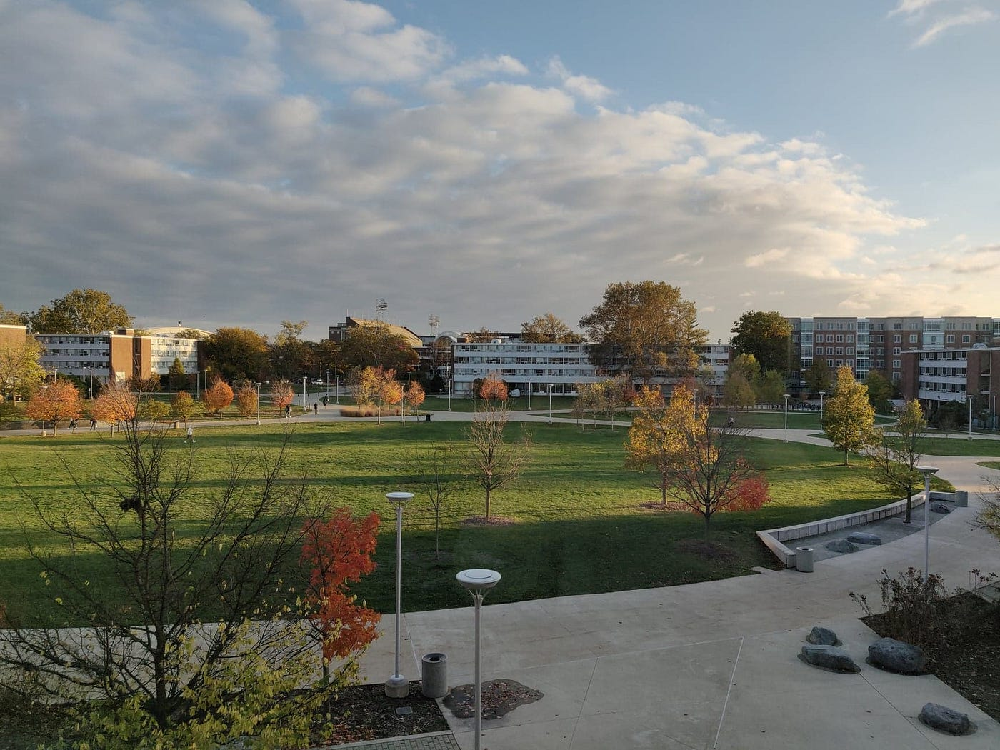

### An update

This Wednesday was my last day of class for the semester.

I’ve been working on a new personal project using Rust and WebAssembly which I’ve been looking forward to for a long time.

I’ve been back home for almost 3 weeks now and haven’t noticed a minute go by. My days have been quite unstructured, and although I liked the structure I had during the semester, I’ve appreciated the sense of freedom, and the lack of regard for my productivity.

### A reflection

I think I am living through one of the greatest times of my life right now. I actually said this to a couple of friends recently and they initially responded along the lines of, *“This? Are you fucking kidding me?”*

Looking at my life right now, I’m a first-year college student in a major that I like. I’m privileged enough to not have much financial liability at the moment, I don’t have much school work anymore, I get to exercise every day, and I’m working on a fulfilling personal project.

I would imagine that further into my adult life, if I were to be fortunate enough to retire early, this would be near what I’d choose to do. But it’s my actual life right now. What an absolute blessing.

It’s not to say that I don’t have any problems or things that get to me — I certainly do. But in comparison to the overall state of my life, these things are nothing. I would bet that many others (that means you too!) have things like mine that would show them really how wonderful their lives are right now, but it’s just hard to see the big picture.

### A thought

A lot of people go to the gym to be healthier, *get gains*, look better. But most of the time this is the wrong reason — or at least a reason that likely won’t sustain their habit in the long-term.

If you consume any sort of self-improvement content, then you’ve likely come across some rendition of the phrase “focus on the process.” I like this version the most because it’s the most straightforward, but maybe you’ve heard something cheesier like “the journey is the destination,” or something else about disregarding the results or output of the process in favor of the process itself.

My belief in this concept is very central to my mindset, and I’ve noticed that I’ve experienced the most raw, absolute pleasure from exercise ever since I began to unconsciously focus on the process. Rather than thinking of exercise as a means to a more aesthetic body or greater strength, I simply *loved* to exercise. It’s painful and exhausts my body, but it is just truly awesome. (I have so much more to say about exercise in general, but this is not just about exercise.)

For a bit now, I have been very actively disregarding the results entirely, thinking of them as a distraction, something that could poison my current mindset that I appreciate so much. However, recently, I must say, I have realized the tremendous value in achieving results with exercise, or in any domain.

It’s that the results make the process better.

When I do a little cardio leg circuit thing, and I finish off with the row machine and I’ve completely and utterly obliterated myself, I feel amazing. But *that feeling* is nothing in comparison to when Arnold Schwartzenegger has a really hard workout, or when Eliud Kipchoge ran a sub-two-hour marathon. When someone just learning how to code prints “Hello world” for the first time, it feels really cool, but it’s nothing compared to when I find the solution to a crucial bug in my latest project, and that’s nothing like what a much more experienced programmer experiences when they come up with a really elegant design for a complex system.

Aside from the pride and sense of fulfillment that comes from achievement, it’s the mental and physical stimulus, the warping engagement, the frustration, and the pain that come from the process — these all get better as you improve or progress in any craft.

And this is what makes *getting gains* in the gym actually mean anything to me.

### What is this?

So that concludes the first of what I’m calling my *Weekly*, a weekly article composed of just some sort of personal writing from yours truly. In the past, I’ve written articles on more personal topics as a last resort to keep up with a fading semblance of a weekly upload schedule, but I want to commit to doing something more structured and simple, something personal I can share on a consistent basis.

Nothing is set in stone right now except the general concept: personal topics, weekly. I might change the name, the format, etc. We’ll see.

As I focus more on uploading tech/programming content more regularly, I’ve wanted to keep a personal side of my writing. Not only is it a lot of fun to write about these topics, but also nobody is truly one-dimensional and I’m no exception. If I like to write about these topics, there isn’t a significant incentive for me to just stick to my niche or something, or at least I don’t care for any.

Looking back I kind of like what I’ve written as my thought for this week, and I think it might perform alright as a stand-alone article. But I’m keeping it within this piece because I feel that by tossing it out there, it may get lost in the sea of self-improvement articles that often actually induce more stress than inspiration. These things are personal to me, so I’m going to keep them in this sort of personal weekly thing. It’s a way of saying, this is not just something I came up with to write an article, but something that reflects my recent mode of thought, something I found interesting enough to share.

And that’s really what this is: documenting and sharing just a tiny bit of my life, once a week.

See you in the next one. I can’t wait.
