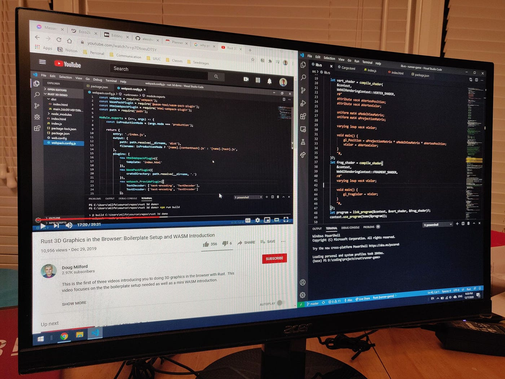

So maybe you’re learning to code and trying to navigate through the endless information there is for starting out, or maybe you’re an experienced programmer and you have grown to understand the faults of programming tutorials. For beginners, I want to show why you should consider following along with React’s tic tac toe tutorial, or a YouTube series on building a Twitter clone. As for other programmers, I have a feeling you will be picking up a new stack sometime in your career, so this may be helpful for you as well.

I’ll start off with a recap of what I understand to be the cons of programming tutorials and why so many people have started to leave them in the dust, for something else, i.e. \~project-based learning\~.

### Why programming tutorials are bad

Programming tutorials don’t teach you how to code. You might build a little familiarity with whatever language you’re using from coding along with a tutorial, but copying someone’s code, regardless of whether you use different variable names, will serve as little to no valuable practice coding. Because you aren’t figuring it out yourself, you aren’t exercising your mind to think algorithmically or design your program.

### Why project-based learning is good

Because these skills make up a large bulk of programming work, people usually turn to project-based learning because it does a much better job of helping you learn these skills. By throwing yourself headfirst into a project, you force yourself to figure things out on your own, and through doing so, you learn all the necessary skills and resources for a project. You build your confidence in your ability to code using your project’s tech stack, and all of this experience will serve you much better going into future projects and work experiences.

### Why programming tutorials are also good, but for different reasons

So first, I want to say, I actually agree with a lot of programmers on the things I just said. I think that projects are infinitely better than programming tutorials for actually learning and building confidence in your coding ability. But I also believe there’s merit in programming tutorials that gets overlooked because of this comparison.

This semester I spent some time exploring web development. I started out very interested in frontend development, and I wanted to learn one of the main frontend frameworks, React. They have a tutorial on their website where you build a simple tic tac toe web app.

After completing this tutorial, did I know React? No, not really. But I did know what components looked like, and I had an idea of their usage. I couldn’t build a controlled input off the top of my head, but I learned that concept, and when I worked on my own project in React later, I knew what to look up, and I had my working code to play around with.

<a href="https://www.datadriveninvestor.com/2020/12/01/how-to-build-a-twitter-scraping-app-with-python/" class="markup--anchor markup--mixtapeEmbed-anchor" data-href="https://www.datadriveninvestor.com/2020/12/01/how-to-build-a-twitter-scraping-app-with-python/" title="https://www.datadriveninvestor.com/2020/12/01/how-to-build-a-twitter-scraping-app-with-python/"><strong>How to Build a Twitter Scraping App with Python \| Data Driven Investor</strong>  <em>With about 6,000 tweets being sent out per second and 500 million posted per day, the average person could not even…</em>www.datadriveninvestor.com</a>

Programming tutorials can be helpful in the very beginning because they immediately familiarize you with working examples of code. It gets the ball rolling by providing you with a base of experience that provides evidence of how things are done, and things you know you can do.

A great data science YouTuber Ken Jee often recommends going on Kaggle and looking through other people’s code to familiar with common packages, tools, use cases, etc. You start to recognize patterns, and things start to connect and make sense subconsciously. This is a similar thing.

A lot of coding is looking up how to do things, and being resourceful with your search engine. I would say that the time spent working through a programming tutorial can be worth it because it can make you better at finding what you’re looking for online.

So programming tutorials aren’t so bad after all because you get a foundation, it helps you recognize bla bla bla. But why not just fork or clone someone’s code then?

You got me on that one. If you’re typing it out for yourself, you might get as much value as a tutorial would give you. That’s really up to personal preference, as is all of this really. Some people will like the brief understanding they might pick up on parts of the code while listening to a video before getting into it on their own, while others might find it more efficient for them to just jump straight into figuring it out for themselves. If something is well documented, just jumping in can be just as or even more effective.

There are different ways of learning and getting familiar with a language, and it is of course always the best option to just do whatever suits you personally, but I would say not to write off programming tutorials entirely because there’s more to them than people give it credit for.

#### Gain Access to Expert View — <a href="https://datadriveninvestor.com/ddi-intel" class="markup--anchor markup--h4-anchor" data-href="https://datadriveninvestor.com/ddi-intel" rel="noopener" target="_blank">Subscribe to DDI Intel</a>
