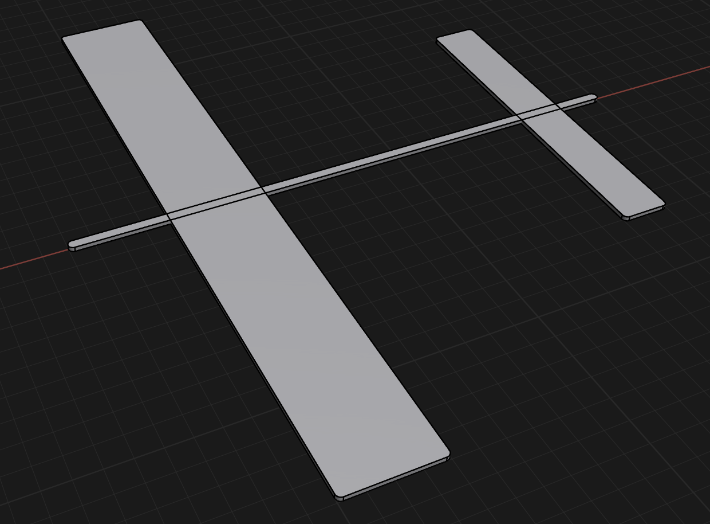

- Starting with a stick glider. My first design:
	- 
	- 14cm by 2cm front wing
	- 7cm by 1cm back wing
	- 12cm fusilage
	- 1mm width
	- Results: flew a couple meters, then took a steep nose dive or stall upwards.
	- Frankly this did slightly better than i thought, it actually glided a little bit.
- So I designed this as the quickest thing i could put together and test. Now I'm going into analysis mode of what actually goes into the design, how can i improve this?
	- Center of gravity (CG) is the core piece. Balancing it on my finger, the CG is a little behind the wing. Online I'm told apparently the best spot for the aircraft CG is 25-33% through the wing's chord (chord = front to back length). This should be simple to nudge in the right direction. The reasoning for the ideal spot is where the pitching force is net neutral, so that when it's flying straight, the aircraft is not being pitched up or down. This just tends to be roughly around the 25-33% chord spot. On gliders, I can adjust this by adding nose weight, moving the wings, increasing/reducing mass on front/back wings, etc. I'm gonna nudge it a little by adding some weight to the nose, and dropping some mass on the tail wing.
	- Also going to make the fuselage thicker since it was so floppy it bent after a few throws.
	- Vertical fin - stabilizes yaw
	- Several other mechanics that are interesting, but that i'll try out next time:
		- Dihedral - angling the wings up wards to stabilize horizontally (roll).
		- Pitch angle of wing and tail wing.
- Changes for stick glider v2
	- add nose weight - 5mm by 5mm by 3mm
	- Fuselage increase to 2mm in height
	- Main wing extend length forward by 2mm (22mm total chord)
	- Reduce span to 50mm on tail wing
	- Add vertical wing of 1cm by 1cm by 1mm thickness
- v2 results: basically the same. center of gravity didn't move much with all my changes. vertical fin didn't seem to do that much. changes on this scale might not take that much effect.

