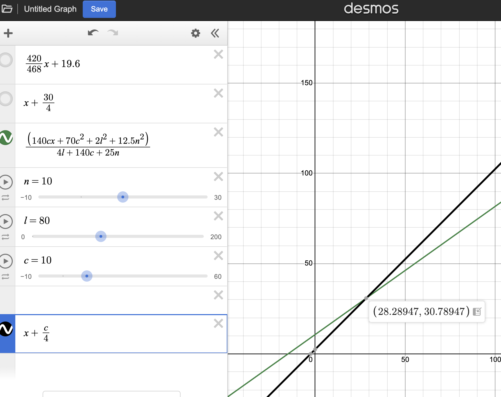
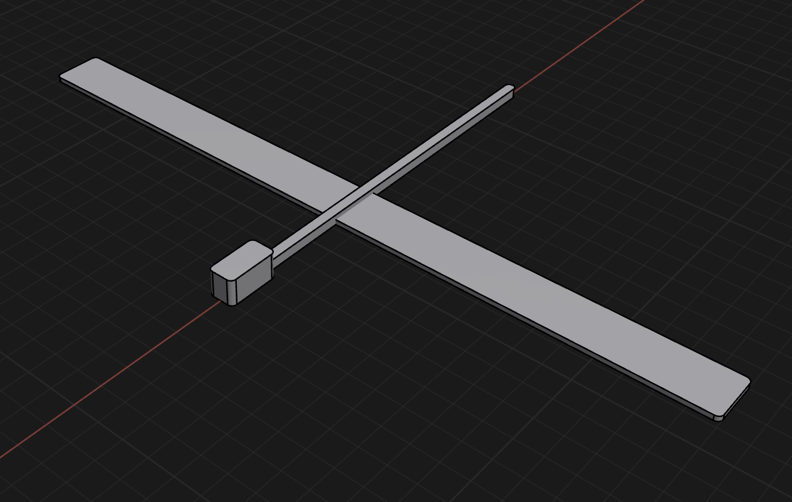

- v3 stick glider
	- extended front wing forward another 8mm
	- extended back wing and vertical fin forward by 1cm and vertical fin up by 5mm since these parts don't seem to be having that much effect. Back wing I'm unsure how much effect I should expect, but the vertical fin i feel like hasn't done much.
	- added more nose weight, i sorta wonder if all the other effects of a tail wing/vertical fin will only really be noticeable once center of gravity is tuned properly.
- v4 stick glider
	- i looked into what will actually make an impact at this scale.
	- learned about the reynolds number
	- Tried calculating the center of gravity to figure out where to place my wing. found with my dimensions i couldn't even place my wing at the front and get the quarter chord golden spot, I *have* to add a noseweight:
		- 
	- Really illuminating. I could have kept printing more and more designs without realizing this.
	- Design by math:
		- 
	- Results: basically no improvement. Dropped weight and had better center of gravity but now my wing area is much lower and probably doesn't have enough lift in general.

