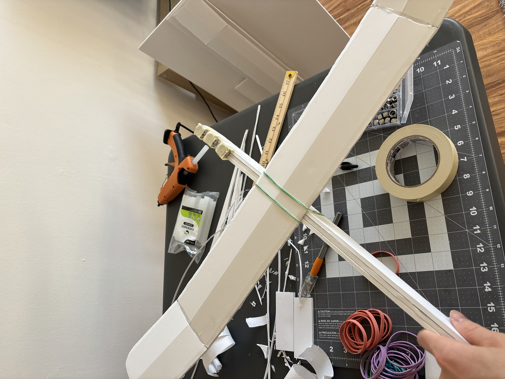

- Bought a bunch of materials from michael's and built the foam glider. It worked pretty well! could fly maybe up to 5-10ish meters and could glide pretty well if I threw it right. Had to do some tuning of the center of gravity, and it ended up being much heavier than the video (140g compared to 85g in the video, possibly because I got generic foam board and maybe used more hot glue), but it still worked pretty well.
- At some point I'd like to come back to this glider and make changes to the various features (dihedral, camber, weight, wingspan, tail/horizontal/vertical stabilizers) and see their affects to get a better intuition, but for now I think I want to get further along the airplane building stack before getting into nitty gritty design details.
- Some results!
- <video controls width="100%">
  <source src="IMG_3658.mp4" type="video/mp4">
</video>
- 

