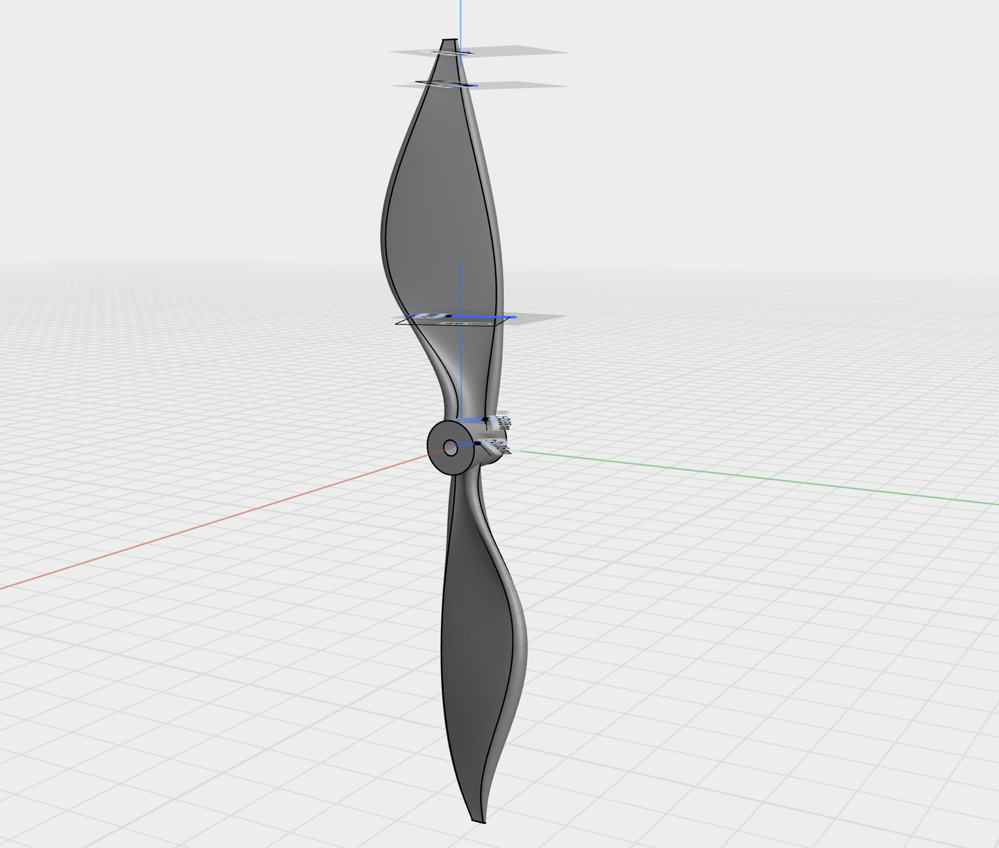

- My own propeller in shapr3d:
	- 
	- 
- Realized I'm actually hitting the limits of shapr3d with this. There isn't away to define a 3d spline, and use that as rails for a loft.
- I learned autodesk fusion 360 is free for personal use, and I started installing it, and it's at 54% "setting up" after like 15 min. That is so bad. Reminds me of visual studio 

