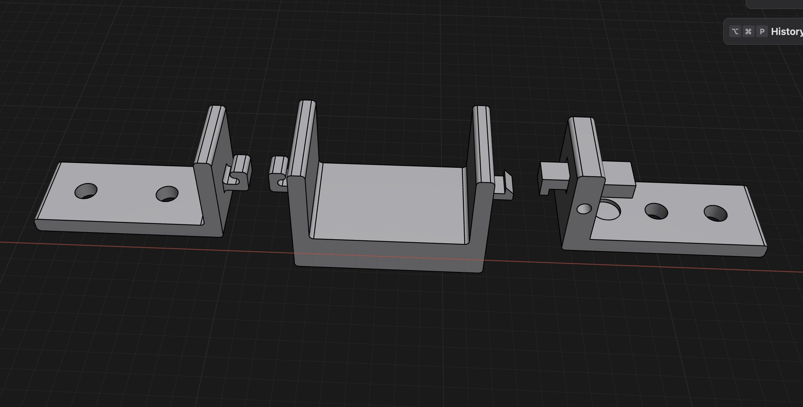

- Aluminum extrusion, springs, t-nuts and PETG obtained. Springs definitely will not stretch to expected length, but they might have the required force.
- Rudimentary launcher parts
	- 
	- left to right: front anchor -> spring -> sled -> hook/sear -> back anchor, which has a trigger, and a slight guide for a spring to keep tension on the trigger so the sled can click into place
	- <video controls width="100%">
  <source src="IMG_3748.mp4" type="video/mp4">
</video>

