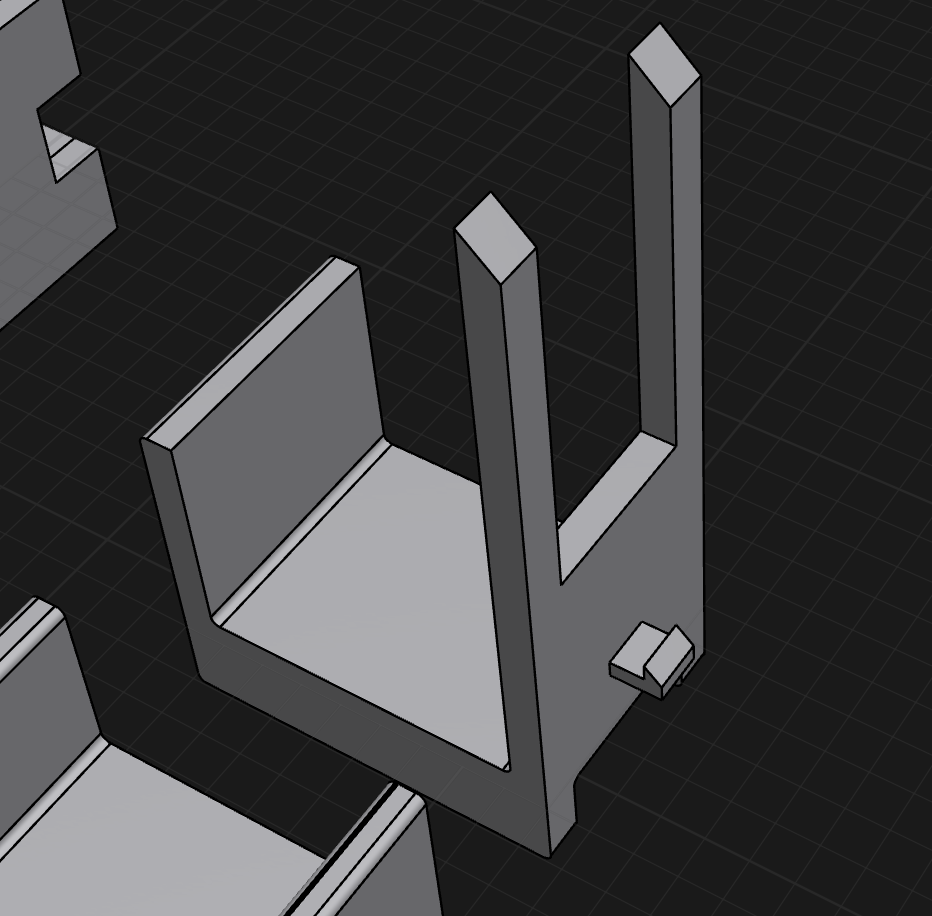
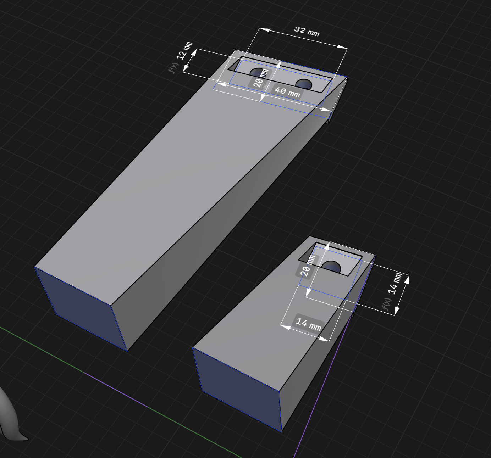
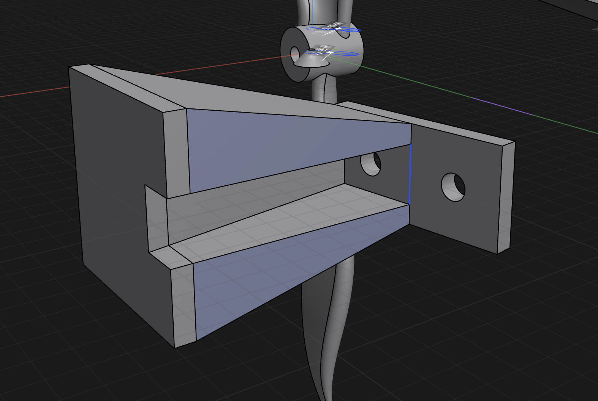
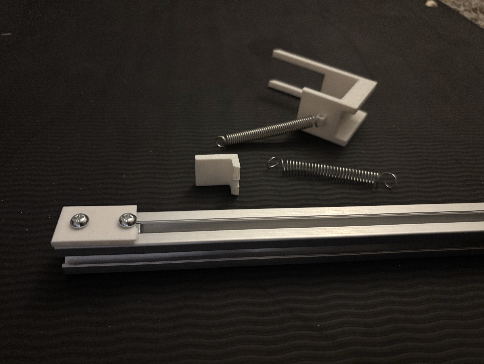

- I'm very satisfied with the basic mechanic of this launcher. There's things I can tighten up, but let's get this hauling my foam glider first. Going to print a holster for the glider, and some mounts to prop up the rail at an angle and stand on the ground.
	- Holster dimensions
		- Needs to hold base of aircraft above the launcher anchors (height 20mm).
		- Needs to have prongs that push the wings, which are ~40mm above base, say 50mm for a buffer.
		- Fuselage is about 20mm wide.
		- The one sorta tricky thing is that the horizontal stabilizer and the wings are on the same plane parallel to the launcher. So there's a risk the horizontal stabilizer will bump into my prongs. One solution would be to add some sort of bar going perpendicular through the fuselage, and the prongs can push that lower down. Another is to add a forward angle to my prongs so even if it gets bumped, hopefully the horizontal stabilizer slides over it.
		- Went for the basic wing prongs first:
		- 
	- Mounts
		- Connect via t-nut + m5 screw like anchors.
		- 5cm offset above the ground
	- Front mount
		- 70mm (400 * sin(10)) height above offset
		- 
	- Back mount
		- Just offset above ground - 5cm
		- 
- For the mounts, I'm trying out individual legs in the front, and a little pyramid thing in the back. Mainly just wanted something that'll give me roughly the angle I want, and this gave me a chance to tinker with some different geometries in cad. I'm realizing as I print/design these, the way I've set this up, on a flat surface, the angles have to be perfect, or the flat bottoms of my prints won't be exactly level with the floor. On grass or carpet it's probably not a big deal, but just noting. I wonder if I can do something to make things not require as much precision. I guess most furniture has this exact problem. I also definitely feel like I'm using too much material on these parts. I don't really care, and it's cheap, but something feels overkill. It'd be nice if I could cut the printing time, since for once it's actually sort of significant (50m for a leg).
- I broke my launcher. This is great! I'm actually forced to revise my designs beyond the braindead first ideas I had.
- 
- So I tested my sled with my actual glider. Couple notes:
	- I had already started noticing this, but the positioning of the hooks raised about 5mm up from the bottom of the anchors/sled puts a perpendicular force on exactly the place that snapped in half. Instead of an L-shape, I should probably try to just make the anchors as close to a flat slab as I can, so the force is tugging on the entire slab together. I had ordered a roll of PETG filament in case I needed a stronger material, but I think this can/should be solved in the structural design and not the material for now.
	- My first spring was far too weak. I moved the back anchor to the back of the extrusion, and the spring got warped. I tried a different spring, and that helped, but that still got a little warped on a full pull. This is not robust to many tries. I'm going to see if I can tune the anchor gap distance and the springs in the kit I got to see if I can get something okay with what I have, but it's not looking promising. Might need to really calculate the force I need and get something more specific from mcmaster.
	- Similarly, my springs are too weak to launch the weight of my glider. That being said, I did generally design this to launch something <100g, and my glider is 150g. But my glider maybe moved a foot at most.
	- My hook and sear works with small forces, but with forces needed to launch my glider even trivial distances, it sucks. Also with more tension, the friction between the hooks seems to want to tilt the sled a bit, though this could be more of an artifact of the hook placing. I need to find a way to make this more robust at greater forces.
- The fun is only beginning.

