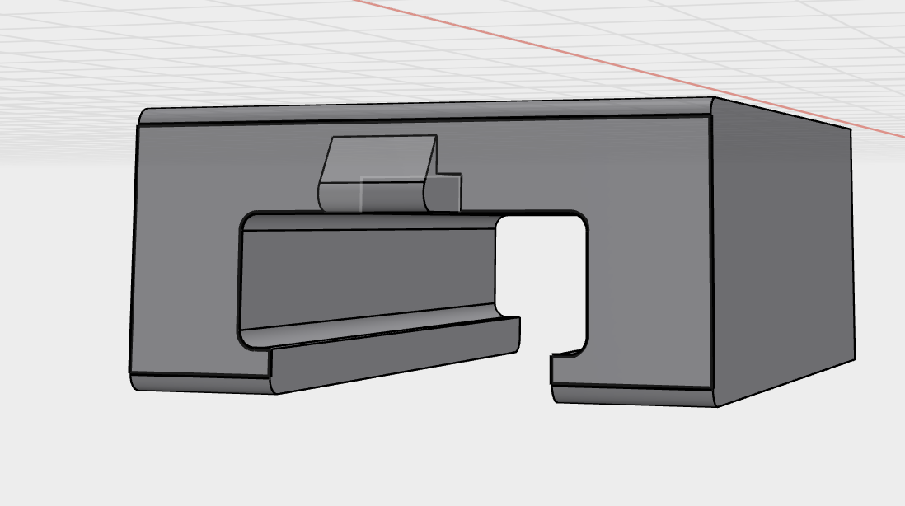
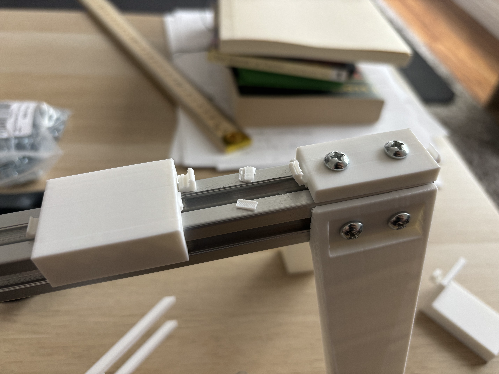
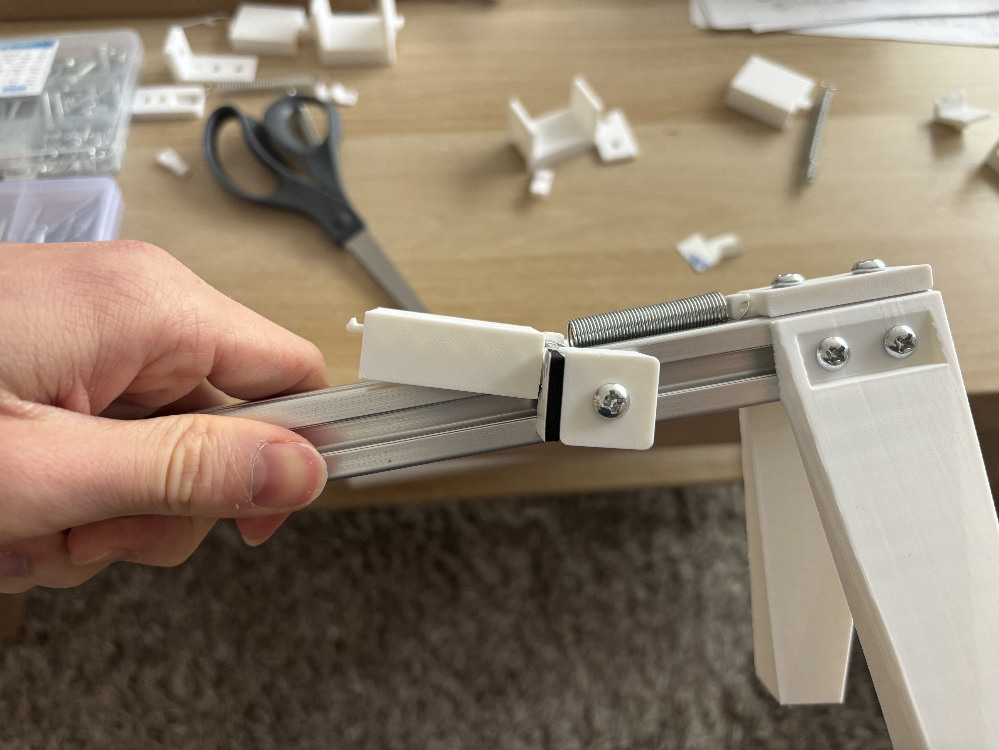
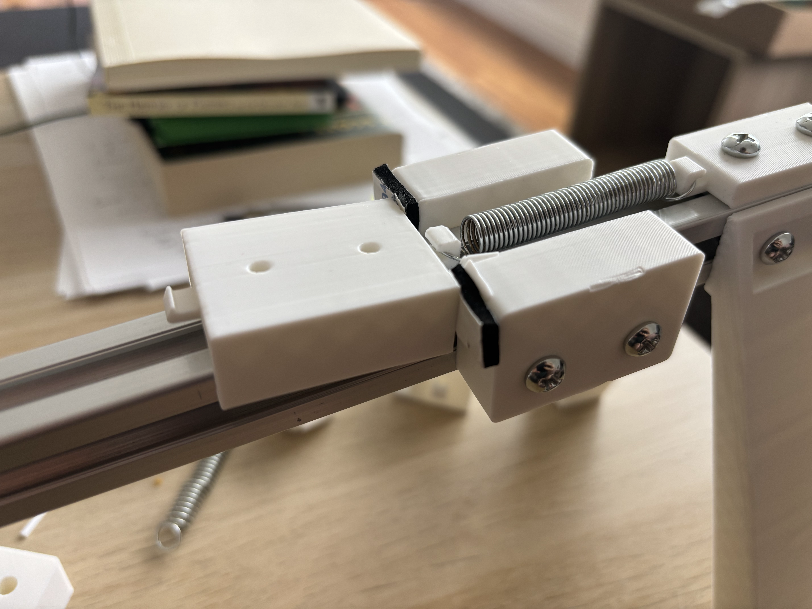
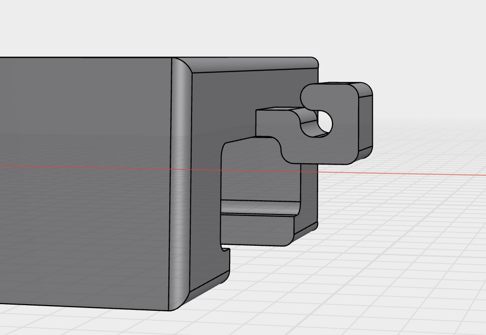
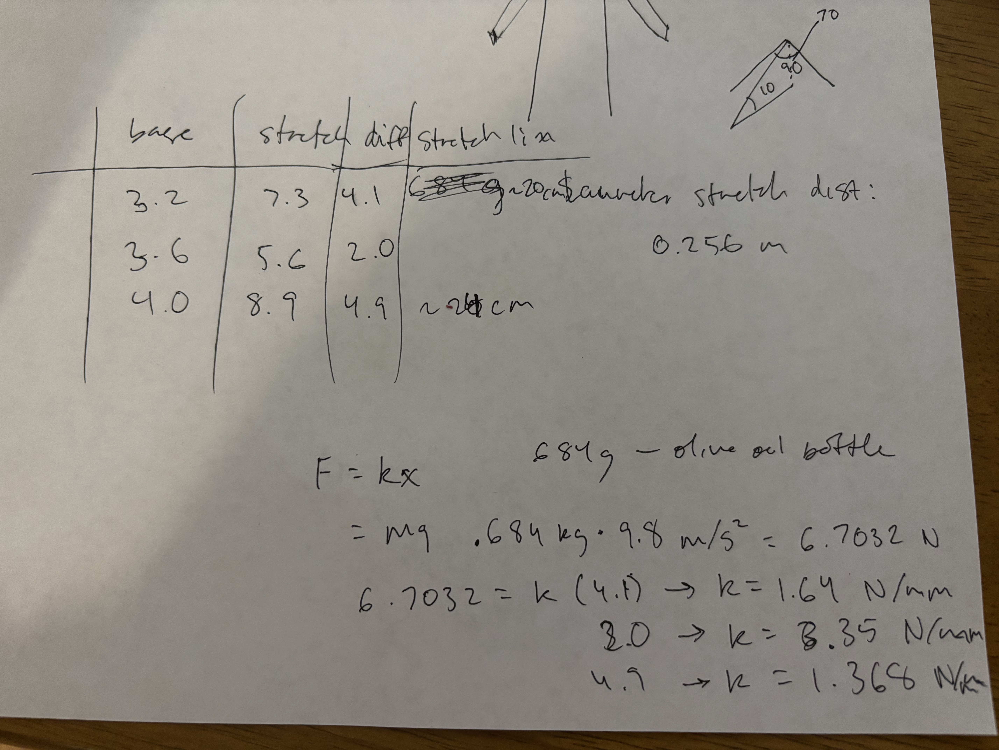
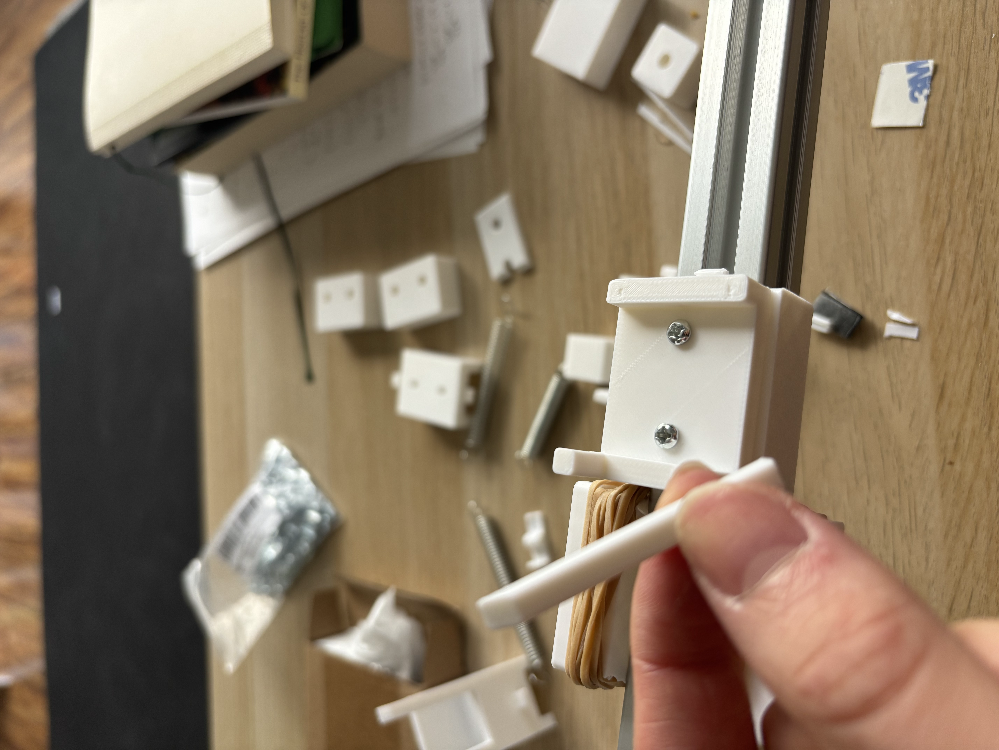

- Yea I'm not getting to the spring tuning quite yet. There were lots of new things to fix today, but by the end of it, I've gotten to a basic prototype.
- So I fixed the sear issue by adding an extra panel to the bottom of the sled to preventing it from tilting in pitch.
- 
- This worked pretty well. Next I found with repeated usage, the spring flies off often, and the sled would ram into the spring hook on the front anchor, which eventually led to it breaking.
- 
- So I added bumpers to stop the sled before the spring even loses full tension. Spring doesn't fly off, and sled doesn't smash hooks. Great...
- 
- The sled was tilting, for multiple reasons, and the rails on the bottom were breaking off. The first reason shown here is that the contact point is below the center of gravity/point where the sled is being pulled. And the bumpers only had 1 bolt, so they gave into the tilting (I knew I was sorta risking this). So I added another bolt to the bumpers and increased the height to make sure it covered the full front of the sides as contact points.
- 
- This helped, but it was still tilting. Not only that, but the command strips were not providing sufficient cushioning, and the plastic in the bumpers were getting smashed. For the tilting, as you can see in this picture, I tested cutting the command strips so the contact point was only at the top of the sides of the sled, but I realized that the reason for the tilting was because of the L shaped nature of the spring hook. So I fixed the hook so that the point where the spring tension force was being applied was aligned with where the plastic hook was pulling the rest of the sled.
- 
- This actually introduced a problem where the spring is now brushing the aluminum and it's eroding the material on the spring. I still need to fix this.
- As for the bumper cushioning, command strips were pretty bad at this job. They feel kinda cushioning in my hand, but they don't have the desired material properties at all. It's mostly just some foam, which provides slight air cushioning, but it collapses easily and doesn't recover. I swapped in rubber bands and that worked way better. The total impulse (force x time) is the same in each situation, but a good material like rubber can extend that time better, and it can store and release the energy with it's elasticity which further smoothens out the stress. This part seems to be all about reducing the peak stress on the contact point, since that's what really causes irreparable damage. After swapping in the rubber bands, things were fairly robust even on many repeated tests.
- <video controls width="100%">
  <source src="robust_ten.mp4" type="video/mp4">
</video>
- While things printed I had also taken some measurements and done some calculations to determine roughly the distance I should pull my spring and how much force it will be applying on initial release. This helped me figure out from my kit, which springs would work best for my launcher. I took an olive oil bottle and hung it from my spring, and measured the distance difference to get the spring constant and calculate force. And I sacrificed a few springs by stretching them to see at what distance they warped to get the rough elastic threshold. I want this to work consistently on many launches, so I was trying to operate around 80% of the threshold. Here's some chicken scratch:
- 
- I wanted to modularize the sled from the actual launch mount, so I added some holes in the sled for some m3 bolts to fit through. I printed mostly the same mount I had before. I gave it a test without the glider and the prongs flew off lol.
- 
- Re-printed with a gusset and it worked a little better. But I messed up the dimensions when I modified some things so the launch mount ended up being too big for my sled. I just taped it on instead of bolting it because I had run out of time in the day and wanted to just see if it could launch my glider. Need to fix this (easy fix).
- <video controls width="100%">
  <source src="tail_fail.mp4" type="video/mp4">
</video>
- I had called this out in a previous log, but the tail indeed got caught on the prongs lol. Once again, I didn't have time for a real solution, and I was antsy to just see if it could do anything, so I just took the tail off and removed some weights from the front as well to balance things slightly and...
- <video controls width="100%">
  <source src="small_success.mp4" type="video/mp4">
</video>
- Pretty cool! I measured this adapted glider and is between 90-100 grams, and it got launched about 1-2 meters. Haven't reached the goal yet but this is a great milestone!
- Side note: the launcher has some good sounds. Good click on pull back, and a good sound when releasing.
- Still sorta curious about the bumpers. I think they're good enough for now, but there are other improvements I was considering.
	- I noticed when the bumper was smashed, it was kind of hollow with some cross patterns. I think the orientation and settings of how I print these can change the interior structure to better withstand impact. But I didn't want to start there since I don't think the bumper itself should need to be super strong itself, i.e. spreading out the impulse should be simpler than requiring the bumper material to withstand more stress.
	- I wonder if I could make the bumper experience less impact by making a kind of rubber band net. That is, instead of wrapping the rubber right over the bumper edge, extrude into the bumper edge, and give space for the rubber band the stretch and push back on the sled before it actually hits the bumper itself. I figure the sides of the bumper holding the net would experience some extra forces, but maybe that'd be fine. I also think the contact of the sled on the bumper is the main source of noise right now, so I wonder if this would also make it quieter.
	- Another idea I had was the use magnets. I have these 5mm diameter neodymium magnets, and I was wondering if that would somehow make things better. If they're strong enough, it could possibly stop the sled with no contact at all.

