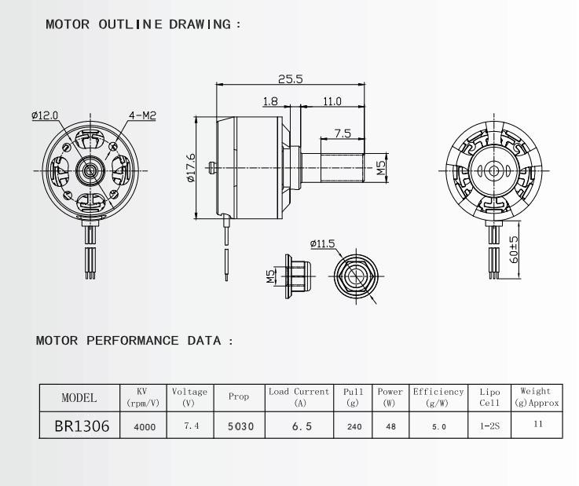

- I'm going to start by working on the power system, get something that should support the rough weight I expect for my aircraft, and then design the aircraft from there. I have a pretty broad goal, and I'm not going for optimal, so I mostly need something that works, so I think this is a fine place to start. Later as I learn more I can add more constraints that will become more challenging from a design perspective.
- supplies to get
	- motor - BR1306 1306-4000KV
		- i realized i do have a rough constraint: my aircraft needs to weigh roughly 150g or less so my launcher can get it in the air. This ended up ruling out some common hobby motors like the A2212 series which are like 50g+. I ended up getting this motor which is "mini." A lot of things were sold out online, wonder why. I found this on ebay for what seemed like a reasonable price - $12 + $6 shipping.
		- 
	- electronic speed controller (ESC) - Racerstar RS6A BLHeli_S
		- Apparently thrust at half throttle for my motor produces like 30-50g, so I shouldn't need anything beyond 6A to push to the 6.5 A load current anyway. This ESC is cheap and common.
		- Why do we need an ESC in general? Brushless motors require an extra signal to determine when to switch between 3 sections of the motor. Brushed motors do this switching (commutation) mechanically as different parts of the motor make contact as it spins. Brushless motors do this switching electronically either through sensors or from feedback of the back-EMF (electromagnetic force), which frankly I don't fully understand. The power/speed is determined by the average voltage applied via the PWM (pulse width modulation) signal as an input to the ESC, and the ESC adapts to the actual RPM of the motor in realtime.
	- battery - 3.7V (1S) 220mAh LiPo Battery 35C with JST-PH2.0
		- 35 C is the discharge rate multiplier. 35 C \* 0.220 A = 7.7 A, so it's beyond my current rating for my ESC and motor at full throttle, and for 10 seconds -> 7.7 \* 10s / (3600 s/hr) = 0.021 A = 21 mAh per test, so like 10 tests before recharge. That seems fine.
	- multimeter - just bought some common one from amazon.
- questions
	- what is S when it says 1S 2S etc.?
	- how does throttle play into this?

