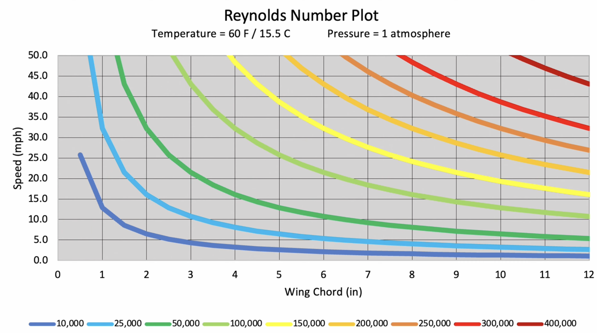

- So i've ordered parts of my power system, what's next?
- re-describing the problem here: i want to make an aircraft, that can be launched at some roughly known velocity from my launcher, using an electric propulsion system, can stay in the air for at least 10 seconds. For it to get in the air reasonably from my launcher, it probably needs to be <150g. The propulsion system needs to keep it in the air, i.e. it needs to at least cancel out drag, and it probably needs to be able to accelerate to a certain cruise velocity.
- I'd like to see if I can get away with just a single static power for this project, but we'll see.
- I still need to design the propeller, and the air craft.
- Propeller
	- This will be important for measuring the thrust of my power system, so I should probably do this sooner?
	- I previously copied a propeller from a video, and it probably meets some basic requirements of what I'd need here, but I'd like to better understand what goes into the design of a propeller. Examples:
		- Number of blades
		- Length of blade/diameter/radius of propeller
		- Pitch angle of each blade
		- Width of blade and various points
		- Curve of the blade, does it stick straight out or does the leading edge have a width difference
		- Material
		- How to calculate the forces it will need to withstand/reason about the design and material regarding this
- Aircraft
	- General ideation
		- Materials - PLA, lightweight PLA, PETG, balsa wood, tissue paper/tin foil/plastic wrap for wing covering to reduce weight, carbon fiber rods. Not sure yet.
		- Low wing vs. high wing - high wing gives you a pendulum affect when rolling, i.e. if you roll, the weight of the fuselage pulling down naturally tends back towards center. This seems desired for my setup where it's really just meant to fly straight. I wonder if I can simplify things and leave no dihedral and rely purely on this to start.
		- Empennage design - conventional low tail, raised T shape, V shape. Conventional seems most common, but also there's downwash from the wing that changes the angle of attack of the horizontal stabilizer. People use the raised T shape commonly to avoid this. It risks deep stalls (need to more deeply understand why), but that's not much of a concern with this model airplane. Leaning towards the T shape, but if it adds meaningful complexity to the process I'll fallback on the conventional tail.
		- Motor position - front (pull) or back (push). Front seems simpler/more common.
		- What should I make it out of?
			- I need to get some input
			- Options on my mind that don't sound too complicated
				- Carbon fiber tubes for lightweight structure
				- 3d printed frame but some sort of wrap
			- This was a really interesting [video](https://www.youtube.com/watch?v=q6YIdY0WnOY). The way he just curved the foam board seemed really clean.
			- Plan from here: carbon fiber rod for main fuselage, foam board with packing tape for wing, horizontal/vertical stabilizer, foam board tube for holding some electronics, 3d print specific shapes for reinforcements or mounting electronics.
			- For this, i need to get a couple things
				- depron foam board, or at least dollar tree board which seems significantly lighter than what i have currently
				- tape
				- carbon fiber rod
	- There's a bunch of different design choices and parameters, but which ones actually matter? How can I start making the broad sweeping choices, then narrow further onto the details?
		- [How to Design Model Airplanes that Fly - Crash Course](https://www.youtube.com/watch?v=CXvHv2EXcF8)
			- Wing cube loading - weight / wing area^1.5 - grams/square decimeters (1/10 meter). Lower number is slower/floatier, higher is fast/heavy. My initial glider had something like 130 g / (75 cm * 10 cm / 100cm^2/decimeter^2) = 130/7.5^1.5 = 6.33. I felt my glider was a little fast/heavy, so I'm going to put the rough number of 4 in my head when I'm designing, but we'll see how that feels. I'm not totally certain
			- Center of gravity
			- Tail volume
- Notes
	- Look into simulation software
	- Something that's coming up again: reynold's number. What is that again?
		- [Video](https://www.youtube.com/watch?v=Qi24jgFQEZw)
		- 
		- Example reynolds numbers ^^. At my level Something in the 10-25k range is probably fit. Commercial planes have reynolds numbers in the millions.

