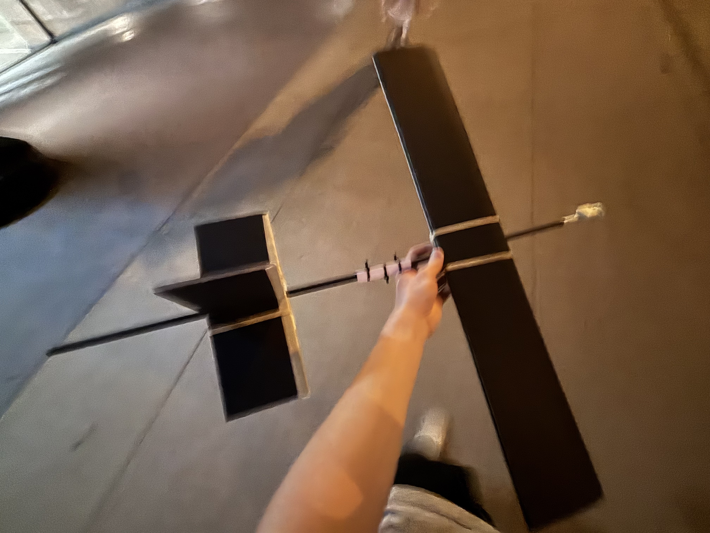
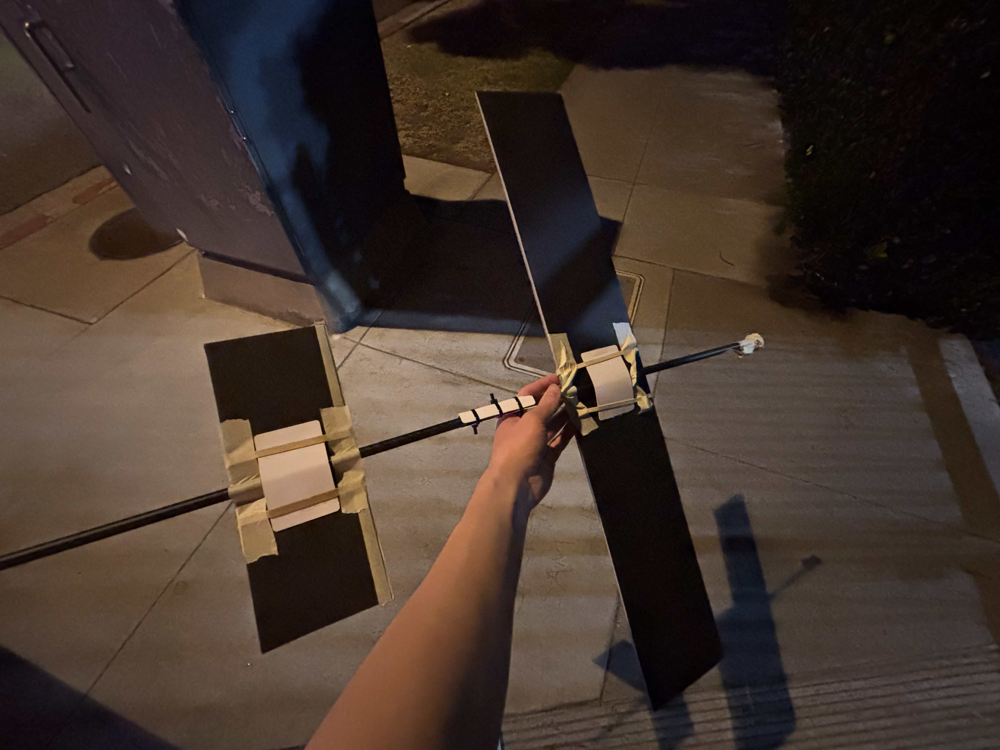

- Finished some construction of a first draft glider with my new materials--mainly, adam's readi board, carbon fiber rods, and plastic cards--and did a brief test flight! I already knew my center of gravity was too far behind my center of lift, but it still got some smooth gliding before eventually pitching up too much and falling on itself. There's definitely a bunch of critical improvements I can make in the construction process, but I just hacked things together with my hot glue and tape and got some test data on the concept. Happy with the results, now to iterate.
- Results
	- 

	- 

	- <video controls width="100%">
  <source src="carbon_glider1.mp4" type="video/mp4">
</video>
- Couple ideas for what I want to improve:
	- The wings and tail are really loose in the roll axis. I wonder if I could 3d print some sort of attachment that can clamp down on the carbon fiber without damaging it, so I can tighten up the structure for flight, but still adjust and disassemble as needed.
	- Right now, I'm not thinking about accessibility of materials or reproducibility. I just want to make something solid with whatever resources available. I still want something roughly simple, and I don't want to go over the top to achieve absolutely optimal performance, but I'm happy to use 3d printed things over more foam board or plastic cards.
	- The center of gravity needs to be fixed. Right now I could just keep adding quarters to the front of the fuselage...but it requires a surprising amount of weight. The wing is already so much heavier than the tail, but we still need more weight in the front. I could reduce the weight of the tail. Hmm, I could move both the wing and tail back even more. Okay, just gave an initial shot and this helps a lot. Might also try and reduce the weight of the tail somehow as well. Also, I haven't added the propeller or electronics that will all sit at the front, so we'll see.

