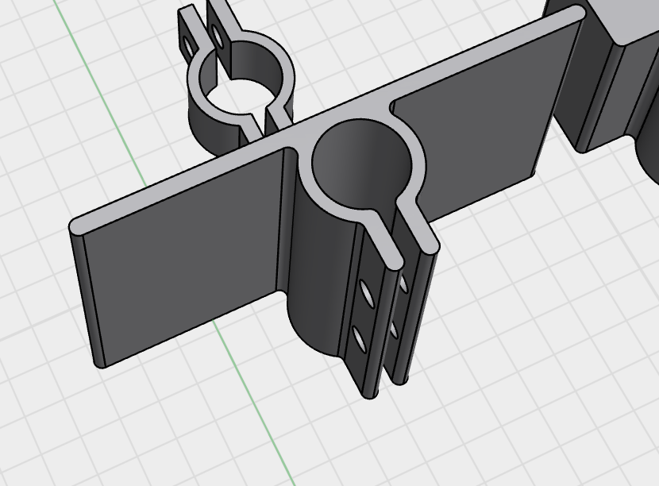
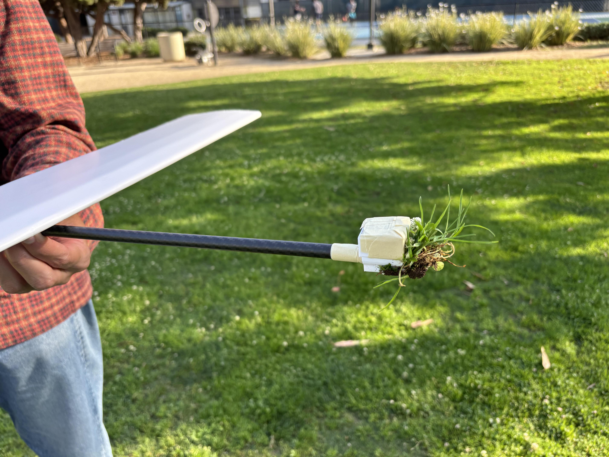

- Made a couple changes. I figured out a clamping mechanism that works pretty well.
	- 
- I can use basica m3 nuts/bolts to tighten this along the fuselage, and use tape or hot glue to attach the flat platform to the wing. I started with tape because I wanted it to be a little easier to take a part. Tape worked alright.
- For no good reason, but some curiosity, I ended up using wings + tails I had made with my heavier foam board. I made a full glider and now added an attachment (same clamp mechanic) to hold some quarters at the front a bit better. The results were okay.
- <video controls width="100%">
  <source src="heavy_glider.mp4" type="video/mp4">
</video>
- 
- We experimented with different throwing power, angles, etc. Mostly, it nose dived a lot. We made a bunch of fixes on the fly to prevent the glider from breaking in like 4 different places every time it nose dived. But the root cause feels like, it just shouldn't be nose diving as much...right...?
- My ideas for why it's behaving the way it is:
	- From the video above (and other tries not captured here), we can see it can catch wind a little bit. But soon after, it just starts nose diving. My thinking is, at a certain speed it can generate enough lift to keep the nose up, but soon enough, it loses that speed due to drag and it has no other options. So even though the center of gravity is balanced with the center of lift, it just can't maintain the speed. Maybe it's because it's too heavy generally that I need to throw it at a faster speed, and it just inevitably can't maintain that speed...? Maybe rebuilding with my lighter foam board will help.

