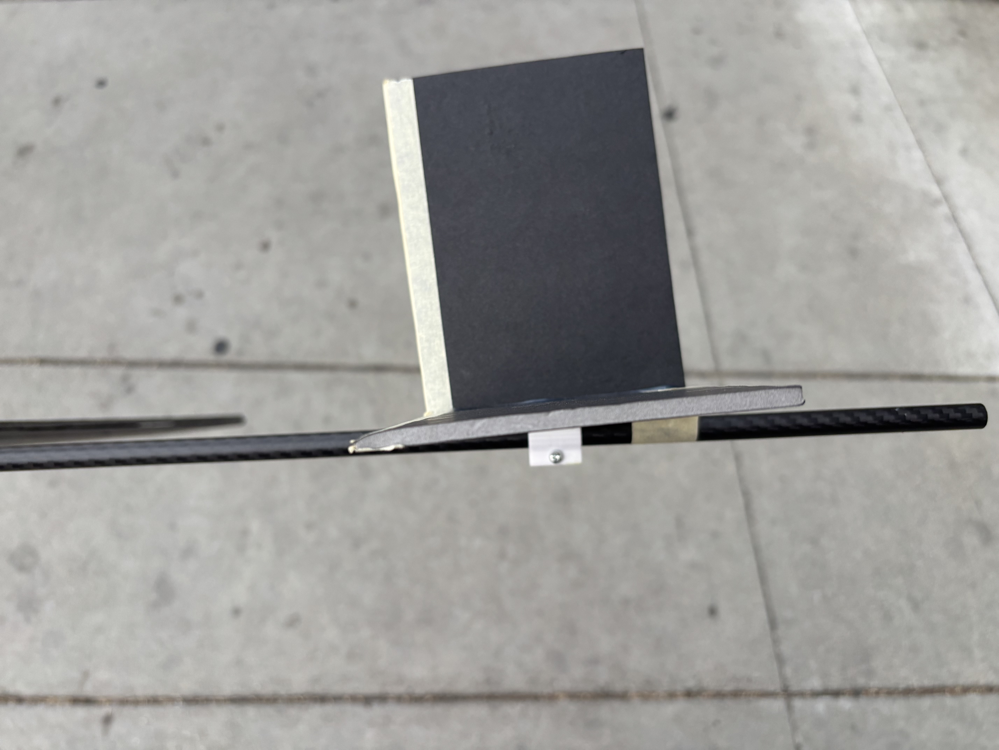

- Learned a bunch today. I rebuilt my plane with my lighter foam, and this time it took less overall weight to balance my center of gravity. I had some decent throws that looked like they glided well, but it still had a really common tendency to nosedive, even if it got some nice airtime.
- <video controls width="100%">
  <source src="carbon_glider2.mp4" type="video/mp4">
</video>
- I didn't feel right about this. Is this design somehow just flawed? Could this be too heavy still, or the drag be too high to maintain the proper speed?
- After some more discussion/research, I came to the (in hindsight, obvious) idea that this pitch instability is not because of the speed/weight, and more because of an issue with the horizontal stabilizer. After switching to the construction using the clamps, my wing and tail were floating slightly above the fuselage, and there was some looseness. I thought this was fine at first but realized this was an issue. I made 1 key change and 1 accidental but also helpful change that made it really "glide" as I wanted.
- Mainly, I shoved a piece of foam under the back of the horizontal stabilizer to make it tilt down. Turns out this is really essential! It makes sense now that to balance the front weight, the lift from the wing doesn't do anything. With properly balanced center of gravity, the lift from the wing just pushes the whole aircraft upward, it theoretically shouldn't have any impact on pitch. The horizontal stabilizer is the exact opposite! Giving it a slight incline means in straight and level flight, it'll be pushing more down on the tail, which exactly how we can counteract the nose dive tendency. The accidental thing that seemed to have helped is I hot glued the clamp to the wing, which made it wiggle less in both roll and pitch axes which I think has been having a bigger impact on it's stability than I realized.
- 
- This video is a short throw but it shows the really nice gliding behavior.
- <video controls width="100%">
  <source src="short_nice_glide.mp4" type="video/mp4">
</video>
- This one I threw it up a little too much but it still got a decent glide and some nice airtime.
- <video controls width="100%">
  <source src="glide_good_airtime.mp4" type="video/mp4">
</video>
- Very satisfied with this development. I feel more closure about what I was getting wrong with this design, and I feel better about moving on to powered flight now that I found this key issue. Ideally I can make a sweet glider, and adding just a little bit of power can just keep it going straight instead of descending.

