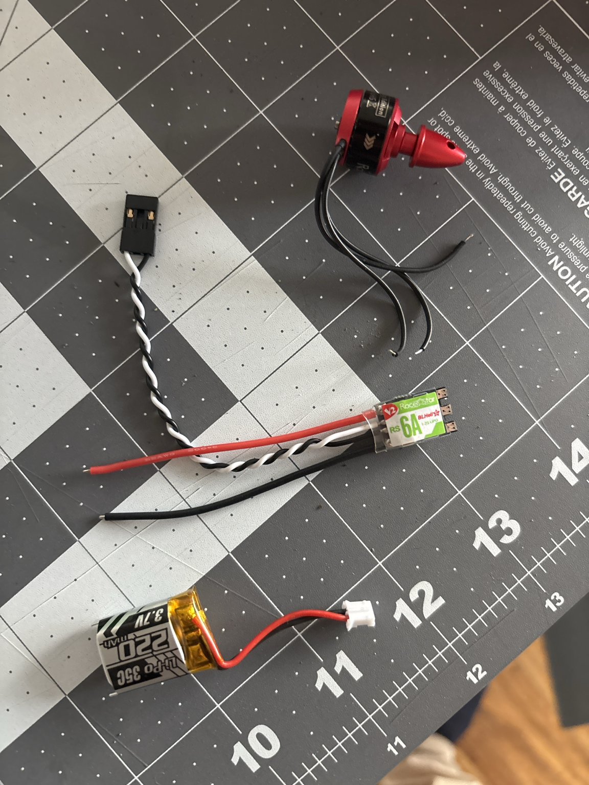

- My ESC came after I'd forgotten to actually press confirm. Turns out I'm missing a couple things.
- 
- I have a motor, ESC and battery, and a lafvin nano (basically arduino nano, not shown in the picture).
- My ESC has bare power wires, while my battery has a JST-PH connector. It makes sense for my battery to have a specific connector, since it's rechargeable. I can't just solder the battery to my board or something, it'll be single-use then. So I need to buy some JST-PH adapters and solder them to my ESC wires.
- My microcontroller needs power too. It expects 5V while my battery supplies 3.3V. So either I need to get a microcontroller that takes 3.3V or I need to get a voltage booster. First though, I did some basic calculations, and my microcontroller takes way less power than the motor (duh), so my battery size is just fine. Anyway, I bought both a Seeed Studio XIAO RP2350 (would've preferred the more tride and true 2040 but that wouldn't ship for another week or two), and I bought a voltage booster. We'll see how they turn out.
- In the meantime I feel a bit more confident in my ability to make a decent airframe. I need to figure out 2 things still outside just getting the power system to run as intended. I need to make a propeller that will work with this motor, and I need to make a new airframe design with some sort of avionics bay.

