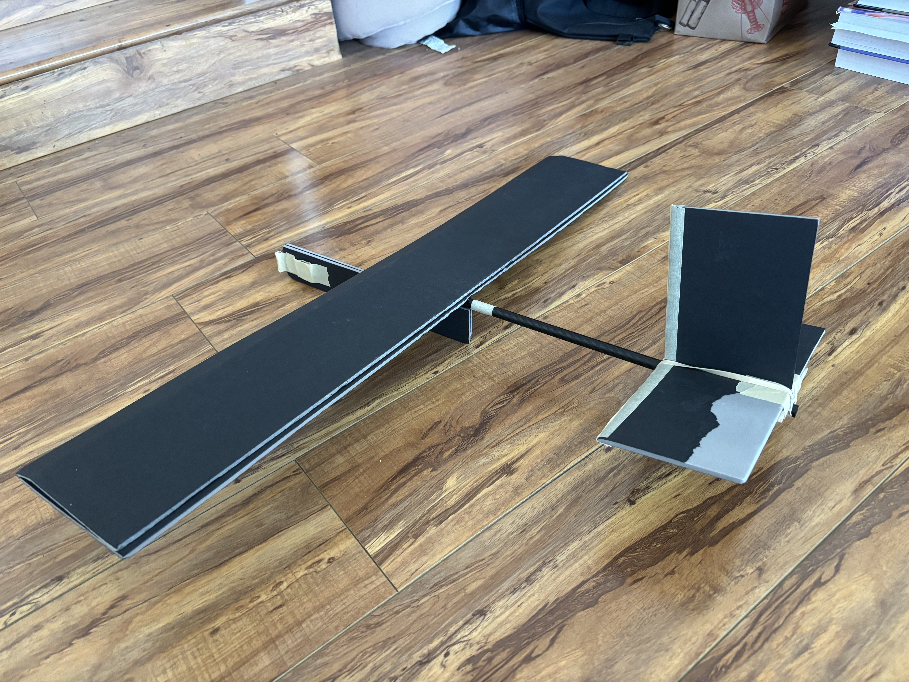
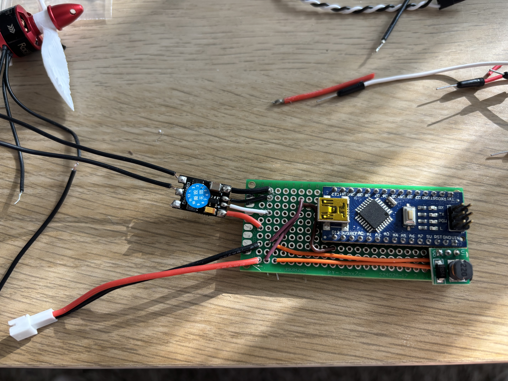
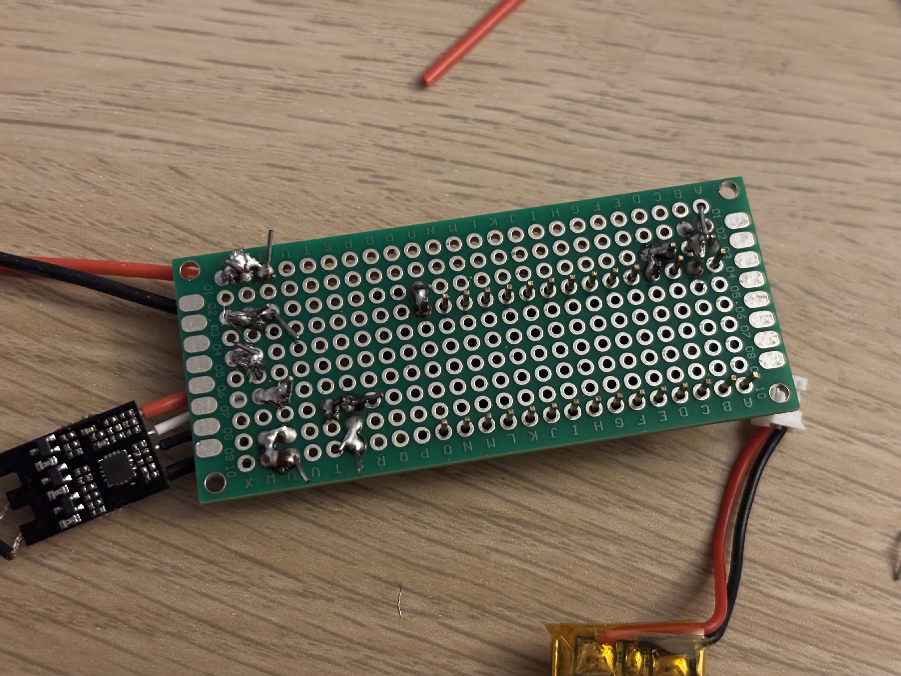

- Happy memorial day!
- So how do I actually make this work for real?
	- Write code to make it run how I intend for flight, basically just go ~half throttle for 10-15s and stop.
	- Need to connect all the components in the power system together in a clean way that will be sturdy enough for flight. I have some prototype boards I bought a long time ago that might be good for this.
	- Need to make a new airframe where I can mount electronics reliably.
- Let's start with the components.
	- My lafvin nano is quite large for these boards. My seeed studio chip is much smaller, and it'd mean I can ditch the voltage booster as well. If I do this, I should probably test this on the breadboard again first.
	- Just noticed my seeed studio chip takes 3.3V but my battery supplies 3.7V. This is apparently just fine, since there's a voltage regulator on the chip. 4.3V is the max. Need to use the BAT- and BAT+ pins instead of the 3.3V. Hmm, this means more soldering.
	- Okay I have a rough idea of how this needs to happen now looking at the board and drawing things out. I think the code should be fine to finish after connection now that I can run things at all. The airframe should be fine to support whatever configuration as long as it doesn't have super wonky dimensions.
	- Desired behavior: I should be able to flip a switch to turn things on to trigger the flight sequence. This needs to be relatively accessible from the outside and easy to do. I do not have a switch, so getting one might take another order. I wonder if it'd be fine to just plug in the JST-PH connector for the battery as my switch. As long as I include enough delay between powering on and needing me to launch the aircraft, I think it should be fine. Just need to make sure I can easily reach this.
	- General idea:
		- Solder microcontroller (+ voltage booster if needed) onto the prototype board. Solder the input wires on the ESC onto the board. Solder wires connecting to a female JST-PH connector to the board. Connect data pin to signal on the microcontroller to the ESC. Connect positive battery to microcontroller and ESC. Connect ground everywhere. Plug in the battery to the JST-PH to start.
	- Oh hmm, I need to check if the microcontroller and the ESC are okay to power on at exactly the same time. I remember reading the ESC needed to be receiving signal from the microcontroller immediately on powering up to initialize.
		- Done. It works great.
- Let's think about the airframe at least a little bit before I get things fully in-place with the power system.
	- I need to make the glider very aerodynamically sound, so that it does not nosedive and crash onto the motor/propeller. I should make sure the motor/propeller mount are strong, so we have somewhat of a fighting chance on a crash, but ideally we never have to test that too badly. Before adding in the electronics, I'll definitely test fly this with placeholder weight.
	- Idea right now: Single carbon fiber tube to connect the tail and the wing. Foam square tube to hold electronics. Maybe it can be something slimmer, since the electronics should be pretty flat. I wonder if I can make things simpler by not having a full fledged enclosure. Electronics would just be a flat slab attached to the side of some foam board...
- Weights of components
	- Battery: 6g
	- Lafvin nano: 5g
	- Seeed studio xiao: 3g
	- Motor + propeller: 14g
	- ESC: 5g
	- Prototype board: 4-7g
	- Total: 32-37g
	- This should be fine. This is roughly equivalent to 5-6 quarters and I had put maybe 5-6 way out at the tip of the fuselage. Not super far off. Fuselage will likely be slightly lighter now due to not using the second carbon fiber tube. We'll see how the center of gravity will need to be adjusted here.
- Built the airframe. Dropped one of two carbon fiber tubes from the fuselage, added just 2 layers of foam board about 4cm wide so I can attach the electronics. Flew it in the park by itself. The wind really gets in the way, but I can get some decent throws occasionally. Good enough for testing, but the stakes will be higher for crashes once I add the propeller. I also just hot glued the wing onto the carbon fiber rod. Simple, and works great structurally. Not too hard to take apart either, though it rips some paper off the wing. Rubber band for the tail stabilizers so I could iterate on the required incline. Hot glued the foam fuselage too.
- 
- The incline of my launcher is an issue. These gliders want to be launched straight, and I don't think that's going to change with power. I did a peripheral launch holding the launcher straight, and the aircraft glided beautifully in my living room. So the power is just fine, but the incline is an issue. I thinking I can just print new legs to be level, and even if it launched close to the ground, theoretically my aircraft should just glide straight with power so it should maybe be fine. Also, This foam fuselage actually made for a great little grip to mount to the launcher adapter. Hooray.
- Soldered everything together. Did a pretty shitty job. I can solder a single joint great. But connected too joints I struggle with. Definitely made tons of noob mistakes, and I look forward to looking back on this first prototype board with endearing embarrassment. The circuit is a mess, and I yolo'd the whole microcontroller onto the board because I have 3 more of them. Took me really long to solder the whole thing, and the tips of my fingers are sore from bending so many pointy edges. Pushing the fraying wires through the board holes was probably the most frustrating part. I really look forward to figuring out better ways of doing all this.
- 
- 
- To my surprise, it actually sorta worked first try after I fixed a slipping ground cable in the JST-PH socket. After all the work to just get this soldered, I was relieved. Also, in this video I realized, my ESC actually does beep when arming. Never realized, it was just a bit quiet.
- <video controls width="100%">
  <source src="flight_board_prototype_test.mp4" type="video/mp4">
</video>

