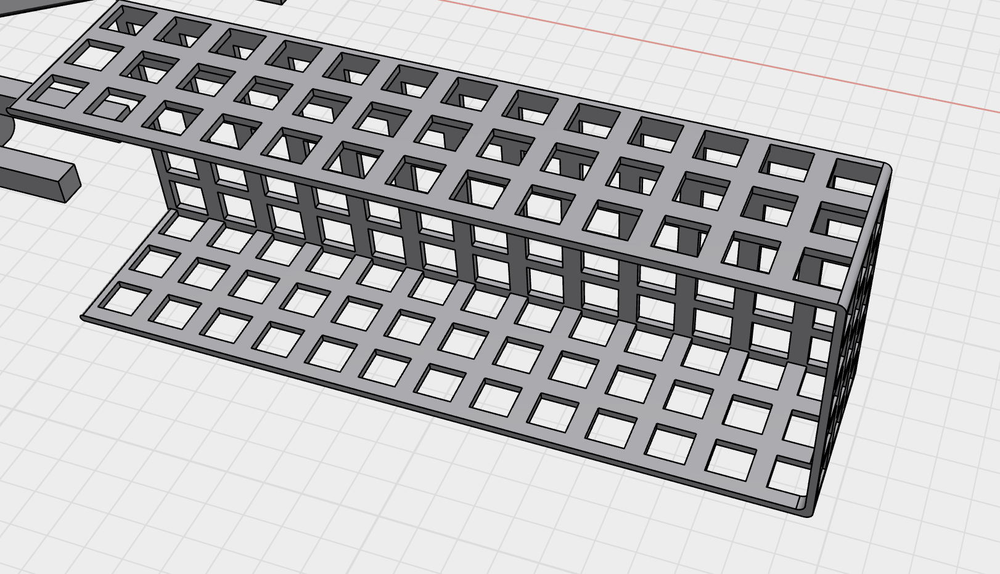

- I fixed the solder joint. Got some good techniques from [this video](https://www.youtube.com/watch?v=6rmErwU5E-k).
- I got a construction going.
- 
- I made a sort of net pattern to reduce the weight of the holster of the electronics. At first it was solid and 3mm thick and it weighed 22g. That was too much. This is now about 5g, good enough. I probably could even suffice printing a flat panel and screwing it in (just got some m2 screws today) but this feels slightly more robust.
- Here's the full thing put together on the frame. I left holes to make plugging/unplugging the battery easier and it works like a charm.
- <video controls width="100%">
  <source src="power_on_airframe.mp4" type="video/mp4">
</video>

