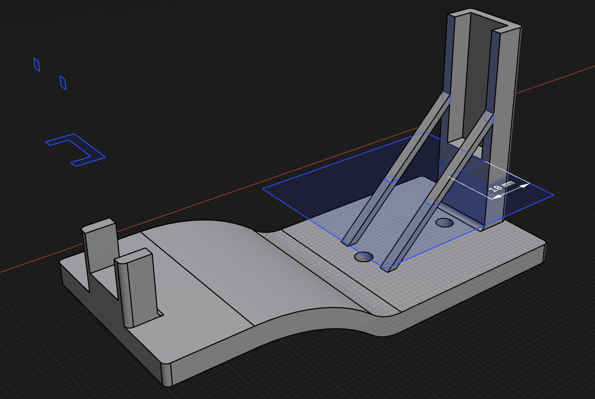

- Things left to do:
- Print the other launcher leg.
- Print the propeller, slightly bigger (3.5in instead of 3in) just in case the power makes a difference. Also, I realized my motor is blowing forward. I already soldered 2 of the 3 motor wires together so I can't switch the wires to reverse the rotation. So I need to mirror the propeller.
- Print a new launch adapter. The current one extends too far out the back that it blocks the trigger. And it needs to lift higher off the launcher so the propeller has room to spin as it launches.
	- 
	- This thing is way too fancy now lol. Sometimes I feel like 3d printing spoils me...
- Clean my living room to prepare for a small test flight.
- Modify the code to spin for longer. This will be for final launch. It's a bit annoying I taped everything together, because it makes plugging in a usb cable require taking apart half the power box.
- So I got it all ready and I did not hold my launcher in place so it didn't get a strong enough throw and it just fell down.
- <video controls width="100%">
  <source src="powered_flight_test1.mp4" type="video/mp4">
</video>

